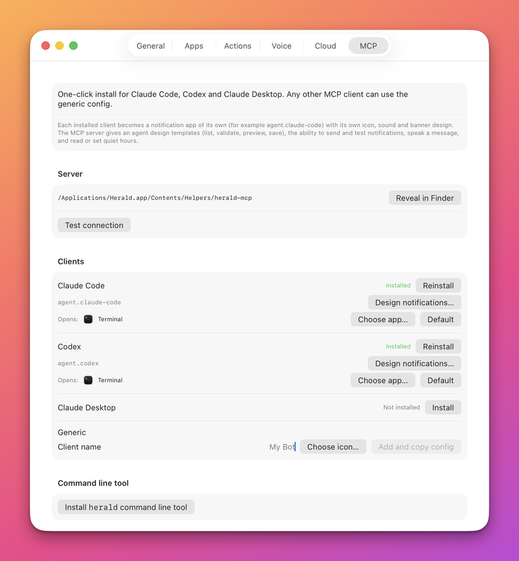

# Agent quick start

This is the shortest path from nothing to an agent that can put a banner on your screen. It is for an agent, or for the person who sets one up, on a Mac where Herald is installed. You will install the MCP server in your agent's client, confirm it is connected, send a notification, and ask a question and read the answer. Everything stays on this Mac.

## Before you start

- Herald is installed and running, with the bell in the menu bar. See [Install Herald](install.md).
- Your agent runs on this Mac: Claude Code, Codex, Claude Desktop, or another MCP client. An agent that runs in the cloud uses the relay instead; see [Cloud](CLOUD.md).

## Steps

1. Click the Herald bell, choose **Settings**, and open the **MCP** tab.

   

   The tab lists Claude Code, Codex, Claude Desktop and Generic.

2. Press **Install** on the row of your client. The row's status changes to **Installed** and a green message says which file or command Herald used.

   For another client, type its name in the **Generic** row, press **Add and copy config**, and paste the config into that client.

3. Restart the client so that it loads the server.

4. Ask the agent to call `herald_status`. It answers `"running": true` and the port. If it does not, see [If it does not work](#if-it-does-not-work).

5. Ask the agent to send a notification. The agent calls [`send_notification`](reference/mcp/notifications.md#send_notification). It does not need to name an app, because the install gave it one. The app ids are in [Agents as issuers](MCP.md#agents-as-issuers).

   ```json
   {"title": "Build finished", "body": "214 tests passed.", "status": "done", "project": "herald"}
   ```

   A banner appears with the agent's name and icon. The tool returns `{"sent": true, "id": "...", "app": "agent.claude-code"}`.

   The `status` field takes `done`, `failed`, `waiting` or `question`.

6. To ask you something, the agent sends a persistent notification with an `id`, then waits for the reply with [`wait_for_reply`](reference/mcp/notifications.md#wait_for_reply).

   ```json
   {"title": "Which branch?", "body": "main or release/2?", "status": "question", "persistent": true, "id": "q-branch"}
   ```

   ```json
   {"notificationId": "q-branch", "timeoutSeconds": 120}
   ```

   The banner shows **Reply**. Press it, type an answer and send. The tool returns `{"replied": true, "reply": {"text": "release/2", ...}}`. If you do not answer in time it returns `{"replied": false, "timedOut": true}`; the agent calls it again to keep waiting.

7. To say something aloud without a banner, the agent calls [`speak`](reference/mcp/notifications.md#speak) with a sentence of text.

   ```json
   {"text": "The build finished. All tests passed."}
   ```

   Herald speaks it with its local voice. Nothing leaves the Mac.

## Check that it works

Step 5 is the check: a banner on screen with the agent's name and icon. The same notification is in **History**, which you open from the bell menu.

## What to do next

| I want to | Go to |
|---|---|
| Change how the agent's banners look, or add buttons such as an Apple Shortcut. | [Connect an agent](MCP.md#a-worked-session) |
| See every tool and its arguments. | [MCP server reference](reference/mcp/README.md#tool-index) |
| Send notifications from a script instead of an agent. | [Send your first notification](getting-started.md) |
| Reach this Mac from an agent in the cloud. | [Cloud](CLOUD.md) |

## If it does not work

| Symptom | Cause | Fix |
|---|---|---|
| The tools do not appear in the client. | The client was not restarted, or it could not start the server. | Restart the client. In **Settings > MCP**, press **Test connection**: it shows **OK** and the tool count when the server starts. |
| A tool says `Herald is not running or not reachable`. | Herald.app is not running. | Start Herald, then call the tool again. |
| The row says **Client not found**. | Herald did not find the client on this Mac. | Install the client, or use the **Generic** row. |
| The tool says `sent` but no banner appears. | The agent's app is muted, or quiet hours silence banners. | Open **Settings > Apps**, select the agent's app and turn off **Mute banners**. |
| `send_notification` refuses a button. | A button carried a shell `command` and `allowCommandButtons` was not set. | Use a URL or callback button instead. See [`send_notification`](reference/mcp/notifications.md#send_notification). |

## Related

- [Connect an agent](MCP.md) for the full install, a worked design session and agent identity.
- [MCP server reference](reference/mcp/README.md) for conventions and the tool index.
- [Notification tools](reference/mcp/notifications.md) for the tools used above.
- [Troubleshooting](troubleshooting.md) for problems that are not specific to agents.
