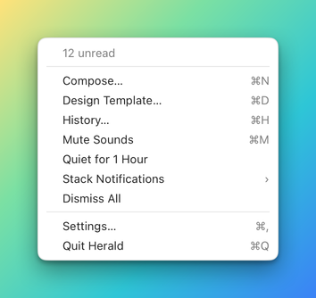
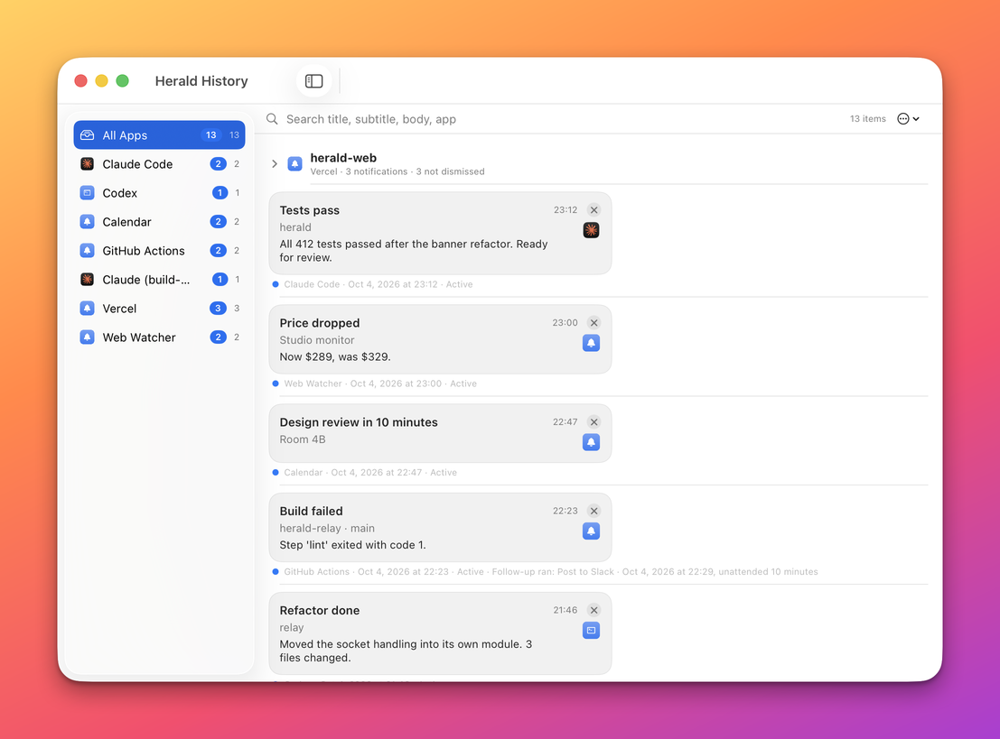
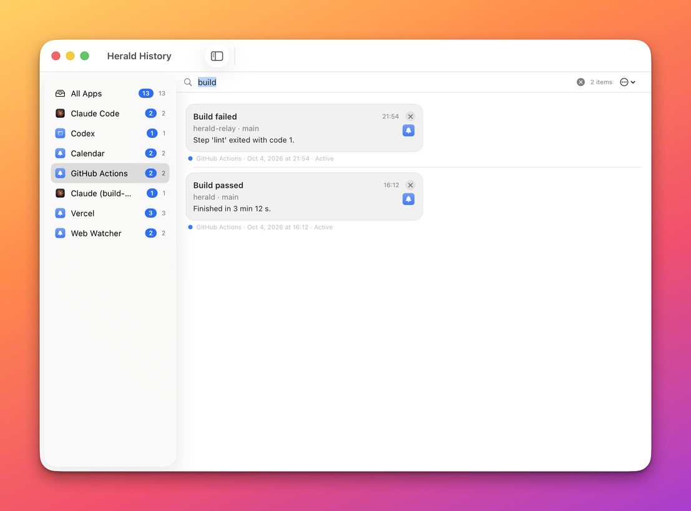
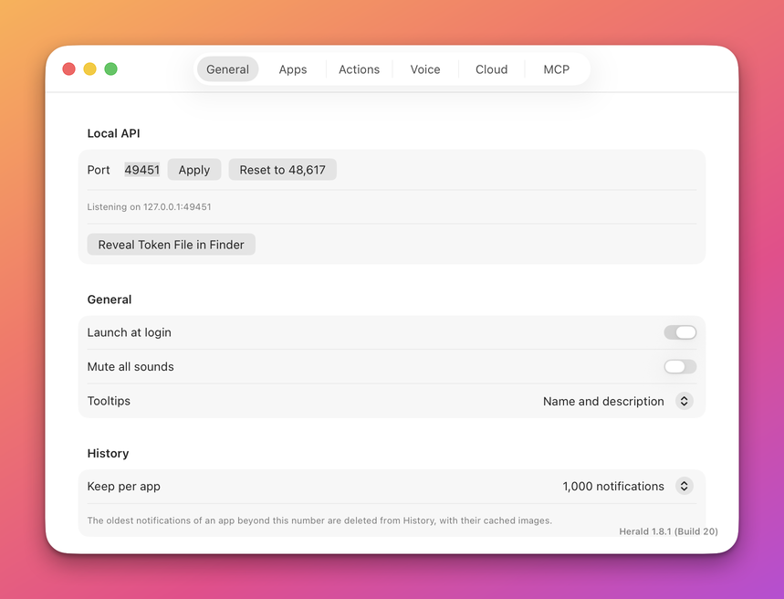
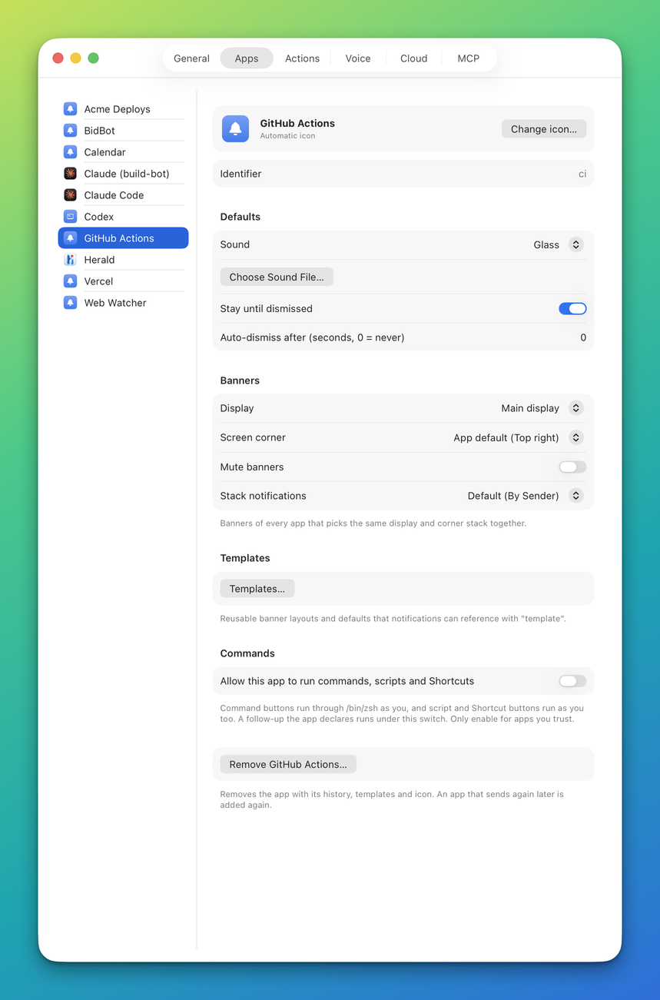
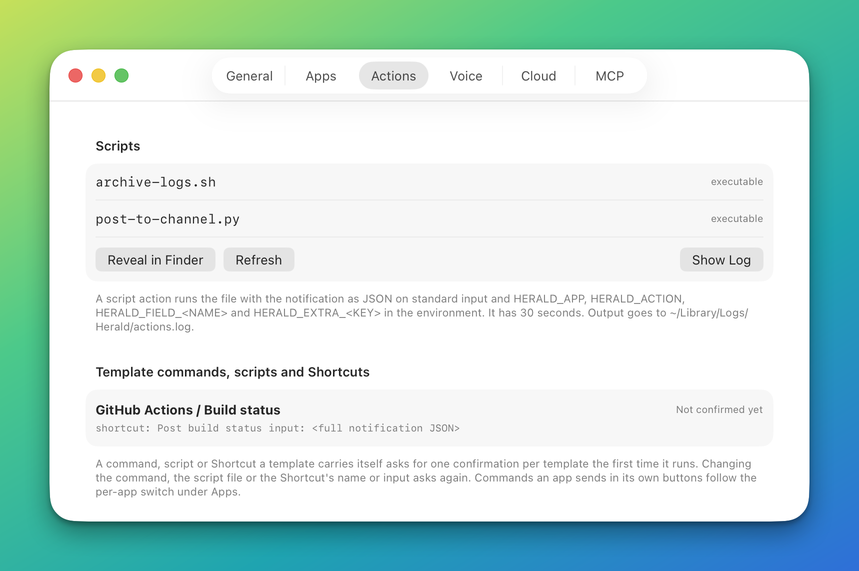
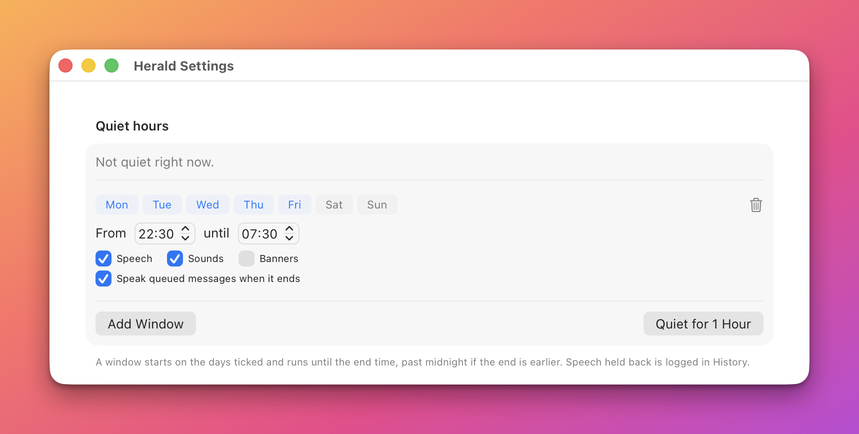
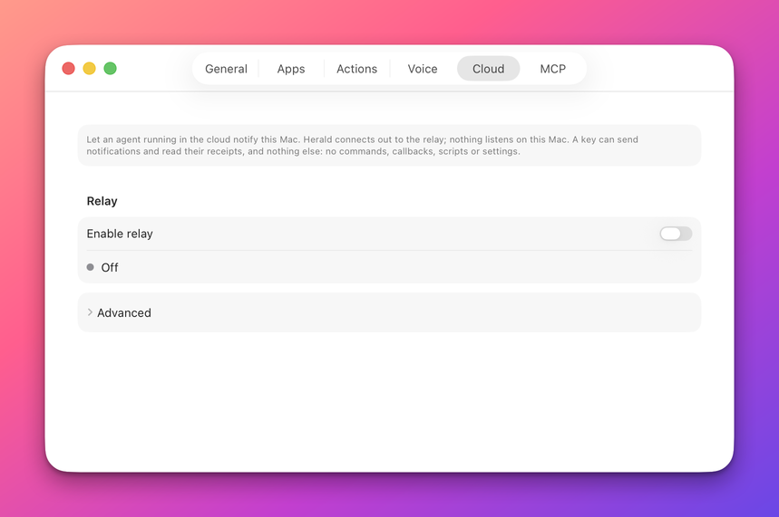

# The Herald app

Herald has no Dock icon. You use it through a bell in the menu bar, a History window and a Settings window, plus the
Designer where you lay out banners. This page tours everything except the Designer: each item of the menu, the History
window, and every control on every Settings tab. For the Designer see [Design a banner](AUTHORING.md). It is for anyone
who uses Herald day to day and wants to know what a control does.

## Concepts

- An **app** is whatever sends notifications to Herald: a script, a program, an AI agent. Each has an id such as
  `example.bidbot`. Herald adds an app to its list the first time the app sends something.
- A **banner** is the window that appears on screen. **History** is the permanent list of every notification.
  [How banners behave](reference/banners.md) describes the life of a banner.
- Most settings are global. A few are per app and live on the **Apps** tab.
- Every setting here has an equivalent in the [HTTP API](reference/api/settings.md), the
  [command line](reference/cli.md#herald-settings) and the [MCP server](reference/mcp/apps-and-settings.md), so a script
  or an agent can change it too.

## The menu bar menu

Click the bell in the menu bar to open the menu. The bell shows the number of notifications you have not dismissed next
to it, and is drawn dimmer while sounds are muted.

| Item | What it does | Key |
|---|---|---|
| **N unread** or **No unread notifications** | Shows how many notifications still have a banner you have not dismissed. It is a label and does nothing when chosen. | None. |
| **Compose...** | Opens the Designer in quick-send mode, where you write a notification and send it to Herald. | N |
| **Design Template...** | Opens the Designer, where you lay out banners. | D |
| **History...** | Opens the History window. | H |
| **Mute Sounds** | Silences the sound of every notification from every app. A check mark shows it is on. | M |
| **Quiet for 1 Hour** | Starts a one-hour quiet period that silences speech and sounds but still shows banners. | None. |
| **Quiet until TIME** and **Resume Now** | Replace **Quiet for 1 Hour** while a quiet period is active. The first is a label, and **Resume Now** ends the quiet period. | None. |
| **Stack Notifications** | Opens a submenu to choose how banners fold together: **By App**, **By Issuer**, **By Sender** or **Never**. | None. |
| **Dismiss All** | Closes every banner on screen. The notifications stay in History. | None. |
| **Settings...** | Opens the Settings window. | Comma |
| **Quit Herald** | Quits Herald. Nothing can send notifications until you open it again. | Q |

The **Stack Notifications** choice is the default for every app. An app can choose its own level under
[Apps](#apps). [Stacking](reference/stacking.md) explains the four levels. [Quiet hours](reference/quiet-hours.md)
explains windows and the one-hour quiet period.

## Quick send

**Compose...** opens the Designer window in **Quick send** mode. Use it to send one notification of your own by hand:
to try an app's template with real text, to test a button, or to build a request that you then copy into a script.
Nothing is stored until you press **Save as Template...**.

The form has these sections, from the top. A live preview of the banner, in light and dark, sits beside it.

| Section | Control | What it does |
|---|---|---|
| **Notification** | **App** | The app id the notification is sent as. Type any id, or use the arrows to pick an app Herald knows. |
| **Notification** | **Template** | The template that draws the banner. **None** uses no template. The list holds the templates of the chosen app. |
| **Notification** | **ID** | An optional id. Sending again with the same id replaces the banner instead of adding one. |
| **Content** | **Title**, **Subtitle**, **Body** | The text of the banner. The body accepts `[text](url)` links. |
| **Content** | **Image**, **Browse...** | A file path, an https URL or a `data:` URI. **Browse...** chooses an image file. |
| **Content** | **Click URL** | The link that opens when the banner is clicked. |
| **Buttons** | **Add Button** | Adds a row with a **Label**, an **Action** (**Open URL**, **Callback** or **Command**) and a **Style** (**Default**, **Destructive** or **Cancel**). |
| **Behavior** | **Sound** | **App default**, **None**, one of the Mac's sounds, or **Custom file...**. The play button plays the choice. |
| **Behavior** | **Stay on screen** | **Default**, **Until dismissed** or **Auto-dismiss**. |
| **Behavior** | **Auto-dismiss after** | The seconds before the banner closes. Empty uses the default. |
| **Behavior** | **Snooze menu** | Adds the snooze menu to the banner. |
| **Behavior** | **Add to Reminders button** | Adds a button that creates a reminder. It shows **Reminder title** and **Reminder due date**. |
| **Behavior** | **Priority** | **Default**, **Low**, **Normal** or **High**. |
| **Metadata** | **Key**, **Value**, **Add Row** | Extra fields sent with the notification. Each key fills the `{placeholder}` of the same name in a template or in the text above. |
| **Look** | **Design Template...** | Switches to design mode for the same app, because the look of a banner comes from its template. |

A **Callback** button also takes a **Callback URL** and a **Payload**, which must be valid JSON. A **Command**
button takes a shell command and runs only if the app is allowed to run commands. The line at the bottom shows the
first problem with the form, or the result of the last action.

The action bar at the bottom of the window has these buttons.

| Button | What it does |
|---|---|
| **Clear** | Empties the form. |
| **Copy as...** | Copies the request the form would send, as code. The menu offers **curl**, **Swift (HeraldClient)**, **Python (herald.py)**, **Node (herald.js)** and **herald CLI**. |
| **Save as Template...** | Opens **Save as Template**, where you name the template. It needs an app and a title. |
| **Send Now** | Sends the notification. The status line reads **Sent "TITLE" (ID)**. It is disabled while the form has a problem. Command-Return does the same. |

The saved template holds the look, text, buttons and behavior for the app. `{placeholders}` stay as typed and metadata
rows are not saved. If a template with that name exists, the sheet warns that it will be replaced. [Design a banner](AUTHORING.md#10-send-a-test)
covers the design mode of the same window, and the [Notifications API](reference/api/notifications.md#post-v1notify)
documents the request that **Send Now** makes.

## History

History is the list of every notification Herald has shown, newest first. A closed banner is never lost: it is here.
Open it with **History...** in the menu. The window is called **Herald History**.

### The app list

The list on the left chooses what you see.

- **All Apps** is the first row and is selected when the window opens. It shows every notification of every app.
- Each app below it has its icon and name. Select one to see only its notifications.

Each row ends with two numbers. The grey one is how many notifications are stored. The blue one, which appears only when
it is not zero, is how many of them are not dismissed yet. Pausing on the blue number says "not dismissed".

Right-click a row for **Export JSON...**, which saves that app's notifications to a file, or **Clear NAME History**,
which asks before it deletes them. Right-click **All Apps** for **Export JSON...** of everything. History keeps the
newest notifications of each app up to the limit you set with [**Keep per app**](#general).

### Search

The search field at the top searches the title, the subtitle, the body and the app's id and name of the notifications in
view. Type several words and each of them must match. The search ignores case and accents and covers every app when
**All Apps** is selected. The number at the right of the field is how many notifications match.

| Key | What it does |
|---|---|
| Command-F | Moves the cursor to the search field. |
| Escape | Clears the search. Pressed again with the field empty, it leaves the field. |

The cross inside the field clears the search too. When nothing matches, the window says **No matches** and offers
**Clear Search**.

### Reading a row

Each row draws the notification as its banner looked, with a line under it.

| You see | It means |
|---|---|
| A blue dot at the start of the line. | The notification is not dismissed: its banner is still up, hidden or snoozed. |
| The app name and a date and time. | The app that sent it and when Herald delivered it. |
| **Active**. | The banner is still on screen. |
| **Dismissed**. | You or the sender closed the banner without using a button. |
| **Opened**. | A click on the banner or on the row opened its link. |
| **Timed out**. | The banner closed itself after its timeout. |
| **Used** and a label, such as **Used Archive**. | You pressed the button with that label. |
| A clock and **Snoozed until** a time. | The banner is hidden and will return at that time. |
| A note after the status. | Extra detail from an action, such as an app that could not be found. |
| A speaker icon, the spoken text and a length. | The notification was spoken. The speaker plays it again. |

Two or more notifications of one app that were sent with the same `group` fold into one row with a name, a count and a
chevron. Click it to open or fold the group. Right-click it for **Dismiss N Not Dismissed**, which closes the banners
that are still up, or **Delete Group**.

### Working with notifications

Click a row to select it. Hold Command or Shift to select several, even across apps. A click also acts like a click on
the banner: it opens the notification's link, and it closes the banner if it is still up. A notification that is already
dismissed only opens its link. Right-click for the menu.

| Item | What it does |
|---|---|
| **Open** | Opens the notification's link without closing its banner. It appears only when the notification has a link. |
| **Re-show as Banner** | Sends the notification through Herald again, as a new banner with its sound. |
| **Dismiss** and **Dismiss N Items** | Closes the banner of the selected notifications. They stay in History. |
| **Delete** and **Delete N Items** | Removes the selected notifications from History and closes their banners. Deleting cannot be undone. |
| **Clear NAME History...** | Deletes every notification of that app after you confirm in **Clear History**. |
| **Export JSON...** | Saves the selected notifications as a JSON file named `herald-history-NAME.json`. |

The Delete key deletes the selected rows. The circled dots menu at the top right of the window has **Export JSON...** for
what is in view and **Clear NAME History...** for the selected app. [History API](reference/api/history.md) gives a
program the same list, search, re-show, delete and export.

## Settings

Open Settings with **Settings...** in the menu or Command-comma. It has six tabs, in this order: **General**, **Apps**,
**Actions**, **Voice**, **Cloud** and **MCP**. Changes apply at once. There is no Save button.

## General

The **General** tab holds the local API, a few global switches and the History limit.

| Control | What it does |
|---|---|
| **Port** | The port the local API listens on. It takes a number from 1024 to 65535. The default is 48617. |
| **Apply** | Restarts the local API on the port you typed. A number outside the range is refused with a beep and the old port stays. |
| **Reset to 48617** | Puts the port back to the default and restarts the local API. |
| The line under the buttons | Says **Listening on 127.0.0.1:PORT**, or why the server could not start. It is red when it is not listening. |
| **Reveal Token File in Finder** | Shows the file that holds the API token. Programs send the token to prove they run as you. |
| **Launch at login** | Starts Herald when you log in. |
| **Mute all sounds** | Silences the sound of every notification from every app. It is the same switch as **Mute Sounds** in the menu. |
| **Tooltips** | Chooses what a tooltip says: **Name only**, or **Name and description**, the default. |
| **Keep per app** | How many notifications History keeps for each app: 100, 250, 500, 1000, 2500, 5000 or 10000. Lowering it below what is stored asks first, in **Delete older history?**, and then deletes the oldest. |
| The version label | At the bottom right. Click it to copy the installed version and build. |

Each control has a setting key, documented in [Settings API](reference/api/settings.md#setting-keys).

## Apps

The **Apps** tab lists every app that has sent a notification, and lets you set how each one behaves. A new app appears
after its first notification. Until then the tab says **Apps appear here after their first notification.**

Select an app to see its page. It has these parts, from the top.

| Control | What it does |
|---|---|
| The icon and name | Shows the app's icon and name. The line under the name says **Your icon** or **Automatic icon**. |
| **Change icon...** | Opens a file picker to choose a picture for this app. |
| **Remove** (next to the icon) | Appears only when you chose an icon. It goes back to the app's own icon or the automatic one. |
| **Identifier**, **Bundle ID**, **Callback URL** | Read-only facts the app registered. **Bundle ID** and **Callback URL** appear only when the app gave them. |
| **Sound** | The sound this app's notifications play unless a notification names its own. **none** is silent. Choosing a sound plays it once. |
| **Choose Sound File...** | Uses an audio file of yours as the app's sound. |
| **Stay until dismissed** | Keeps the app's banners on screen until they are closed. When off, banners close after the timeout. |
| **Auto-dismiss after (seconds, 0 = never)** | Seconds before a banner closes itself. With **Stay until dismissed** off and `0`, Herald uses 8 seconds. |
| **Display** | The screen this app's banners appear on: **Main display** or one of your connected displays. |
| **Screen corner** | The corner for this app's banners: **Top right**, **Top left**, **Bottom right** or **Bottom left**. The first choice, **App default**, follows the corner the app registered with, or top right. |
| **Mute banners** | Hides this app's banners. Its notifications still reach History, as not dismissed, and sounds follow the sound setting. |
| **Stack notifications** | How this app's banners fold together. **Default** follows the menu's choice. |
| **Templates...** | Opens the template editor for this app's banner designs. |
| **Allow this app to run commands** | Lets banner buttons from this app run shell commands as you. Turning it on asks first. |
| **Allow callbacks to HOST** | Appears only for an app whose callback address is not on this Mac. Callback buttons send their data there only after you allow it. |
| **Remove NAME...** | Deletes the app. See [Remove an app](#remove-an-app). |

Three rules apply to these controls.

- The sound, **Stay until dismissed** and **Auto-dismiss** controls set what a notification gets when it does not say
  otherwise. A notification's own fields win. [Notifications API](reference/api/notifications.md#post-v1notify) lists them.
- A command button runs only if the app also asked for command access when it registered. When you allow it but the app
  never asked, the page says **Confirmed, but the app has not requested command access.**
- Confirming command access happens only here or in the banner's own question, never through the API.

Each control has a per-app setting key, documented in [Apps API](reference/api/apps.md#per-app-setting-keys).

### Template editor

**Templates...** opens a window titled **Templates** with the app's name. It edits the simple, form-based
templates of one app. A template made on the Designer grid can be opened in the Designer from here.

| Part | What it does |
|---|---|
| The list on the left | Shows the app's templates. **New** starts a template. |
| **Name**, **Layout** | The template's name, and its layout: **Image left**, **Image right**, **Hero (image on top)** or **Compact (one line)**. |
| **Accent color** | Turns on an accent color, with a color well and a **Hex** field. |
| **Show subtitle**, **Show body**, **Show time**, **Body lines** | Choose which parts show, and how many body lines show before the text is cut. |
| **Content** | **Title**, **Subtitle**, **Body**, **Image** and **Click URL**, written with `{name}` placeholders. |
| **Buttons** | The template's buttons. |
| **Behavior** | Sound, stay-on-screen, auto-dismiss, snooze, priority and reminder settings. See the list below. |
| **Open in Designer** | Opens a saved grid template in the Designer. It appears only for templates that use the grid. |
| **Delete**, **Duplicate**, **Save** | Remove, copy or store the template. **Save** also answers to Command-S once something changed. |

The **Behavior** section has **Sound**, **Stay until dismissed**, **Auto-dismiss after (s)**, **Snooze menu**,
**Priority**, **Reminder title** and **Reminder due (ISO 8601)**. The three-way controls offer **Inherit**, **On** and
**Off**. The preview on the right draws the template with the app's last notification. [Templates](TEMPLATES.md)
explains what a template is.

### Change an app's icon

1. Select the app and press **Change icon...**.
2. Choose a picture in the file picker titled **Choose an icon for NAME**.

   The icon changes everywhere at once: in banners, in History and in this list, and the line under the name reads
   **Your icon**. Herald stores a 256 pixel copy in its support folder, so you can move or delete the original.

3. To undo it, press **Remove** next to the icon. The app goes back to its own icon, or an automatic one.

If the file is not a picture, Herald says **That file is not an image Herald can use.**

### Remove an app

Removing an app deletes it from Herald with its History, templates, manifest and icon. Herald asks first, and the deletion
cannot be undone. An app that sends again later is added again, as a new app. The built-in Herald app cannot be removed.

1. Select the app and press **Remove NAME...** at the bottom of its page. Or right-click the app in the list and choose
   **Remove NAME...**.
2. Read the question **Remove NAME from Herald?** and press **Remove**.

For a cloud connector that is still approved, the question has two buttons instead of one. A connector is an agent such as
ChatGPT that reaches this Mac through the relay, and its app id starts with `cloud.`.

| Button | What happens |
|---|---|
| **Remove and Revoke** | Revokes the connector's approval on the relay, then deletes the app. The connector cannot send again. |
| **Remove Only** | Deletes the app but leaves the connector approved. The app appears again with the connector's next notification. |
| **Cancel** | Does nothing. |

The text under the button tells you which case you are in. [`DELETE /v1/apps/{id}`](reference/api/apps.md#delete-v1appsid)
and the `delete_app` tool do the same removal for a program.

## Actions

The **Actions** tab is where you see and control the two places where a banner button runs code on your Mac: script
files, and commands that a template carries.

| Control | What it does |
|---|---|
| The script list | Lists the files in Herald's scripts folder. Each says **executable**, **runs with** an interpreter, or **not runnable (chmod +x)**. When empty it says **No scripts yet.** |
| **Reveal in Finder** | Opens the scripts folder in Finder. |
| **Refresh** | Reads the folder again. |
| **Show Log** | Shows the log file, `~/Library/Logs/Herald/actions.log`, in Finder. |
| A template row | Names an app and a template, and lists the commands, scripts or Shortcuts that template carries. |
| The status on a row | **Confirmed**, **Changed since confirmed**, **Not confirmed yet** or **Template removed**. |
| **Revoke** | Removes your confirmation, so the next press asks again. It appears on rows that have one. |

A script action runs a file from the scripts folder with the notification as JSON on standard input, and has 30 seconds.
A command, script or Shortcut that a template carries asks once per template, the first time it runs. Changing the
command, the script file or the Shortcut's name or input asks again. Commands an app sends in its own buttons follow the
**Allow this app to run commands** switch under [Apps](#apps) instead. [Actions](reference/actions.md) explains the
approvals, and the list of approvals is also available as
[`GET /v1/actions/approvals`](reference/api/apps.md#get-v1actionsapprovals).

## Voice

The **Voice** tab chooses how Herald speaks notifications aloud, which apps may speak, and when Herald stays quiet.
Speech is made on your Mac. No text or audio leaves it.

| Control | What it does |
|---|---|
| **Engine** | **Kokoro (local, natural)**, **System voice** or **Off**. Off silences all speech. |
| The Kokoro status | Says **Kokoro is installed**, or **Kokoro is not installed** and what is missing. Shown when the engine is Kokoro. |
| **Show in Finder** | Opens the folder where the Kokoro files live. |
| **Use existing installation at ~/.claude/tts** | Appears when a compatible installation is found. It links the files already there and copies nothing. |
| **Download Kokoro (about 340 MB)** | Downloads the voice models and builds a Python environment for them. A progress bar and the checksums of the files appear. |
| **Cancel** | Stops a download in progress. |
| **Voice** | The default voice. With the System engine, **System default** uses the Mac's own voice. |
| **Speed** | A slider from 0.5 to 2.0, shown as a multiplier such as 1.00x. |
| **Test text** and **Speak** | Speaks the text you type, so you can hear the voice and speed. Shown unless the engine is Off. |

The last part of the tab, **Speak per app**, has one row for each app.

| Control | What it does |
|---|---|
| The app's name (a switch) | Lets that app's notifications be spoken. |
| **Urgent can break quiet hours** | Lets a notification with priority `urgent` from this app be spoken during quiet hours. |
| The voice menu | Picks a voice for this app, or **Default voice**. |

The setting keys are in [Settings API](reference/api/settings.md#setting-keys) and
[Apps API](reference/api/apps.md#per-app-setting-keys). [Voice](VOICE.md) is the task guide and [Voice reference](reference/voice.md)
describes the notification fields.

### Quiet hours

**Quiet hours** sits in the middle of the Voice tab. A window is a time of day, on chosen days, when Herald holds back
speech, sounds, banners or any mix of them.

| Control | What it does |
|---|---|
| The status line | Says **Not quiet right now.**, or **Quiet until TIME** with **Resume Now**, which ends the quiet period at once. |
| **Mon** to **Sun** | Choose the days the window starts on. All days are on until you turn some off. |
| The bin icon | Deletes the window. |
| **From** and **until** | The start and end times. A window whose end is earlier than its start runs past midnight. If they are equal, the row says **Start and end must differ**. |
| **Speech**, **Sounds**, **Banners** | Choose what the window silences. |
| **Speak queued messages when it ends** | Speaks a summary of what was held back when the window ends. It needs **Speech** on. |
| **Add Window** | Adds a window. |
| **Quiet for 1 Hour** | Starts a one-hour quiet period now that silences speech and sounds. It is disabled while one is active. |

Speech held back is recorded in History. [Quiet hours](reference/quiet-hours.md) explains how windows combine, and
[`PUT /v1/settings/quiet-hours`](reference/api/settings.md#put-v1settingsquiet-hours) sets them from a program.

## Cloud

The **Cloud** tab connects Herald to a relay in your own Cloudflare account, so an agent that runs in the cloud, such as
ChatGPT, can notify this Mac. Herald connects out to the relay, and nothing listens on the Mac. A key or connector can
send notifications and read receipts, and nothing else. [Cloud agents](CLOUD.md) explains the relay and the setup in
full, step by step, and [How the relay works](cloud/how-it-works.md) covers security and limits.

While the relay is off, the tab shows an explanation, the **Relay** section and **Advanced**. The **Relay** section
holds these controls.

| Control | What it does |
|---|---|
| **Enable relay** | Turns the relay on. The first time, it opens a sheet that deploys the relay. After that it pairs this Mac. |
| The status line | Shows whether Herald is connected, with the time it was **last seen**. |
| **Reconnect** | Reconnects to the relay now. |
| **Try again** and **Turn off anyway** | Appear after a failure. |
| **Connector URL** and **Copy** | The address an agent connects to. It appears once a relay is deployed. |
| **Update the relay** | Appears when a newer relay is bundled with Herald. It needs the Cloudflare token. |

The first time, the sheet sends you to Cloudflare to create a token, takes the token you paste, and deploys the
relay; [Cloud agents](CLOUD.md#steps) walks through it. Turning the switch off asks **Turn the relay off?**. **Turn off**
then unpairs this Mac and revokes every key and connector. The relay stays in your Cloudflare account.

Once paired, the tab adds more sections. Each is explained in a guide.

| Section | What it shows | Guide |
|---|---|---|
| **Relay** | The switch, the status and the connector address. | [Cloud agents](CLOUD.md) |
| **Connect an agent** | Ready-made instructions for ChatGPT and for Claude Code or Codex, each with **Copy instructions**, and **Create a key and copy the config**. | [Connect an agent](cloud/connect-agent.md) |
| **Connector approvals** | Requests from a connector, each with **Approve** or **Deny**, and the connected connectors, each with **Revoke**. | [Connect ChatGPT](cloud/connect-chatgpt.md) |
| **Reply subscriptions** | The agents that are told the moment you reply, each with **End**. | [Reply events](cloud/reply-events.md#see-and-end-subscriptions-on-the-mac) |
| **Agent keys** | Your keys, with a **Key name**, an **Agent** menu and **Create key**. **Design...** and **Revoke** act on a key. | [Connect an agent](cloud/connect-agent.md) |
| **Usage today** | How much of the relay's daily budget has been used, with **Refresh**. | [How the relay works](cloud/how-it-works.md) |
| **Last relay items** | The last notifications that arrived through the relay and what became of them. | [Cloud agents](CLOUD.md#check-that-it-works) |
| **Advanced** | Every setting of the relay, a custom domain, the paired Macs, and the buttons to redeploy, pair, unpair and delete it. | [Advanced settings](cloud/operating.md#advanced-settings) |

In **Agent keys**, the **Agent** menu offers **Claude**, **Codex** or **Other**. A new key is shown once, with
**Copy connector config** and **Done**. **Design...** opens the Designer on that agent's banner.

The relay's own routes are in [Cloud relay API](reference/api/relay.md), and the tools an agent uses to set it up are
in [MCP relay tools](reference/mcp/relay.md).

## MCP

The **MCP** tab installs Herald's MCP server into the AI tools on this Mac, so an agent can design banners and send
notifications. [Herald MCP server](MCP.md) is the task guide and [MCP tools](reference/mcp/README.md) lists every tool.

| Control | What it does |
|---|---|
| The server path | Shows where the bundled `herald-mcp` program is. |
| **Reveal in Finder** | Shows that program in Finder. |
| **Test connection** | Starts the server, asks for its tools and reports how many it found. |
| **Claude Code**, **Codex**, **Claude Desktop** | One row for each client, with its status and an install button. |
| **Install** and **Reinstall** | **Install** adds the server to that client. **Reinstall** replaces an existing entry. |
| The agent's app id | For example `agent.claude-code`. Each installed client becomes an app of its own, with its own icon, sound and banner design. |
| **Choose...** | Appears when no icon was found for the client, to pick one. |
| **Design notifications...** | Opens the Designer on this agent's banner. |
| **Opens:** | The application that the banner's **Open** button brings to the front. **Choose app...** picks another, and **Default** goes back to the usual one. |
| **Client name** | For any other MCP client, the name it will use. Its notifications arrive as `agent.NAME`. |
| **Choose icon...** | Picks an icon for that client. Without one, Herald uses a symbol. |
| **Add and copy config** | Adds that client as an app and copies the configuration to paste into it. |
| **Install `herald` command line tool** | Copies the `herald` tool to `/usr/local/bin`. It asks for an administrator password only if that folder is not writable. |

The status of a client row says **Installed**, **Not installed** or **Client not found**, and a line under the row
reports what Herald changed. The **Opens:** row sets a per-app setting, listed in
[Apps API](reference/api/apps.md#per-app-setting-keys).

A program can read the install state and install the server with the [Setup API](reference/api/setup.md).

## Related

- [Install Herald](install.md): put the bell in your menu bar.
- [Send your first notification](getting-started.md): fill History for the first time.
- [How banners behave](reference/banners.md): what the banners you see on screen do.
- [Design a banner](AUTHORING.md): the Designer, which this page does not cover.
- [Settings API](reference/api/settings.md) and [Apps API](reference/api/apps.md): the keys behind every Settings control.
- [Troubleshooting](troubleshooting.md): fixes for common problems.
