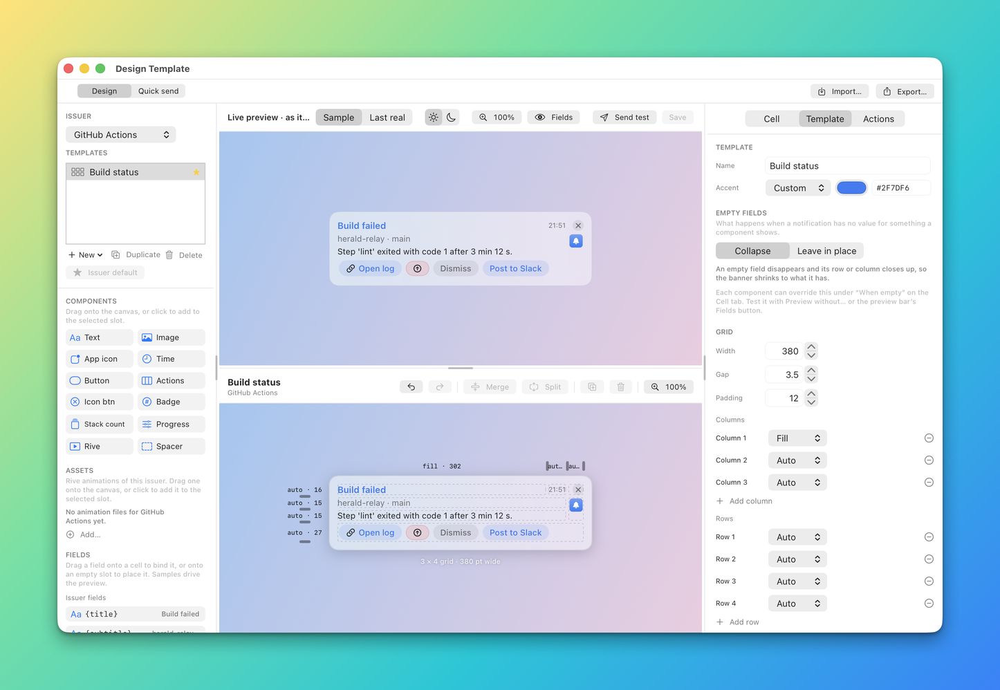
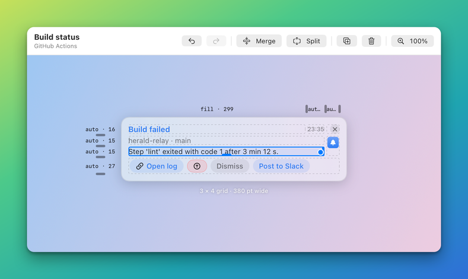
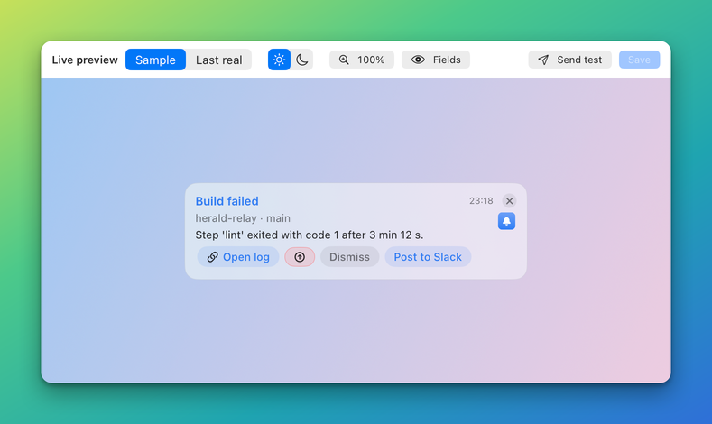

# Design a banner in the Designer

The Designer is Herald's visual editor for banners. You lay out a template on a grid, bind components to the
data an app sends, add buttons, watch a live preview and send a test banner to your screen. At the end of this
guide you have a saved template that an app can name in its notifications.

## Before you start

- Herald is running. The Designer is part of the app.
- You know which app the template is for. The Designer lists every app Herald knows. An app that has
  published a [manifest](reference/manifests.md) shows its own fields and buttons in the palette. An app
  without one only offers the standard fields.
- Optional: read [Templates](TEMPLATES.md) for what a template is and how Herald picks one.

## Steps

### 1. Open the Designer

Click the Herald icon in the menu bar and choose **Design Template…**. The window is called **Design
Template**.

Other ways in: **Compose…** in the same menu opens the window in **Quick send** mode, and its
**Design Template…** button switches to design. In **Settings > Apps > Templates…**, the template editor
has **Open in Designer**.

### 2. Learn the parts of the window

The window has three columns and a bar across the top. The figure shows them, and the list below it names
them in the order of the numbers.


1. **Mode bar.** The **Design** and **Quick send** switch, and the **Import…** and **Export…** buttons for
   template bundles.
2. **Issuer and templates.** The **Issuer** menu picks the app. The **Templates** list shows its saved
   templates. **New**, **Duplicate** and **Delete** manage them, and **Set as issuer default** makes the
   chosen one the template used when a notification names none.
3. **Palette.** The rest of the left column: **Components**, **Assets**, **Fields** and **Actions**. You
   drag from here onto the grid.
4. **Live preview.** The banner drawn exactly as a delivery draws it, over a desktop-like backdrop. Its
   header holds the **Sample** and **Last real** switch, the light and dark switch, **Fields**, the
   problems button, **Send test** and **Save**.
5. **Editor bar.** The template name and whether it is saved, undo and redo, **Merge**, **Split**, duplicate
   and delete for the selected component, and the zoom control.
6. **Grid canvas.** The grid at real banner width, with every slot visible. This is where you place and
   select cells.
7. **Inspector.** Three tabs, **Cell**, **Template** and **Actions**, that edit whatever is selected.

The two dividers between the columns, and the one between the preview and the grid, can be dragged. The
window remembers the sizes.

### 3. Choose the app and start a template

1. Choose the app in the **Issuer** menu.
2. Press **New**. Choose **Blank 3 × 4 grid** to start from nothing, or a copy of one of the four built-in
   layouts, for example **From “Image left”**. Starting from a layout gives you a banner that already works.
3. Open the **Template** tab in the inspector and type a **Name**. Notifications ask for the template by
   this name.

The editor bar shows **Not saved yet** until you save.

### 4. Place a component from the palette

Components are the pieces a banner is made of. The **Components** section of the palette lists them.


1. Drag a component chip onto an empty slot of the grid. Or select a slot and click the chip.
2. The component appears in its cell and the live preview redraws.

The twelve chips are the Designer names in the table of [Components](reference/components/README.md#the-components).
That table says what each one draws and links to its properties.

The **Fields** section lists the data the app can send, grouped as **Issuer fields**, **Standard**,
**Seen in notifications**, **Extra (yours)** and **Custom**. Each shows a sample value. Drag a field onto a
component to bind it, or onto an empty slot to place a component that shows it. The **Add** box adds a
custom field name such as `customer.name`. See [Bindings and tokens](reference/bindings.md) for where each
group comes from.

### 5. Select a cell

Click a cell on the grid. The inspector switches to the **Cell** tab.


The **Cell** tab has these parts:

| Part | What it does |
|---|---|
| Header | The component, the cell's id and its row, column and span. |
| **Position and span** | **Row** and **Column** move the cell. **Rows** and **Columns** make it cover more slots. A cell can only grow into empty slots. Rows and columns are numbered from 1 here. |
| **Align** | A 3 × 3 pad that picks where the component sits inside a larger cell. |
| **Padding** | Space between the cell edge and the component. |
| **Component** | The type menu and the component's own properties. |
| **When empty** | **Template**, **Collapse** or **Keep space**: what the component does when the notification has no value for it. |
| **Symbol** | For **App icon**, **Button**, **Actions**, **Icon btn** and **Badge**: an SF Symbol. See step 8. |

Shift-click several slots to select them together. At the bottom of **Position and span**, the buttons
**Split**, **Duplicate** and **Delete** act on the selected cell.

### 6. Use the inspector tabs

The **Template** tab edits the whole template.



| Section | What it holds |
|---|---|
| **Template** | **Name** and **Accent**, the colour that tints accent-coloured components. |
| **Empty fields** | **Collapse** removes an empty field and closes its row or column. **Leave in place** keeps the space so every banner has the same layout. See [Collapse semantics](TEMPLATES.md#collapse-semantics). |
| **Grid** | **Width**, **Gap** and **Padding**, then one size row for each column and each row, and **Add column** and **Add row**. |
| **Text** | **Body lines**, the line limit for body text that sets none of its own. |
| **Checks** | Problems the checker found. Click one to select the cell it names. |

The **Actions** tab edits the banner's buttons.


| Section | What it holds |
|---|---|
| **Buttons** | Every button the issuer sends and every one you added. For an issuer button you can rename it, hide it, restyle it, move it up or down and reset it. For yours you can edit or delete it. |
| **Add your own** | One button for each kind: **Run Apple Shortcut**, **Run script**, **Run shell command**, **Open link**, **Call back the issuer** and **Snooze**. |
| **Extra data** | Your own key and value pairs. Every action receives them, and a binding reads one as `{extra.key}`. |

### 7. Edit the grid



- **Merge cells.** Shift-click the empty slots to join, then press **Merge** in the editor bar, **Merge
  slots** in the inspector, or **Merge Selected Slots** in the context menu. **Split** reverses it.
- **Resize a span.** Drag the handle on a selected cell to make it cover more or fewer slots.
- **Move a cell.** Drag it to a free slot to move it, or onto another cell to swap their components.
  Dropping a component from the palette on a filled cell replaces that cell's component.
- **Change a row or column size.** Click the size label above a column or beside a row and choose
  **Auto (fit the content)**, **Fill (share what is left)** or **Fixed at N pt**. Drag the edge of a track to
  set an exact size. Or edit the sizes in the **Template** tab under **Grid**.
- **Add or remove tracks.** **Add column** and **Add row** are in the **Grid** section. Each size row has a
  remove button. A grid has between 1 and 12 rows and columns.

The label under the canvas gives the columns first, then the rows, and the banner width. A grid with 4 columns
and 3 rows that is 400 points wide reads `4 × 3 grid · 400 pt wide`. The field limits are in
[Grid, cells and layout](reference/grid-and-layout.md).

### 8. Pick a symbol

A symbol is an SF Symbol, an icon from the system. Components that can carry one have a **Symbol** section.

1. In the **Symbol** section, type a name such as `bell.badge` in the **Name** field, or press the button
   beside it to browse.
2. Choose **Browse in a sheet** to open the browser over the Designer, or **Browse in a floating panel** to
   keep it beside the window.


3. Search by name or keyword, for example `bin`, `mail` or `alert`. The sidebar offers **All symbols**,
   **Recents**, **Favourites** and categories. The slider changes the grid size.
4. Select a symbol to preview it with the weight, mode and colours of the **Symbol** section.
5. Press **Use symbol**, or double-click a symbol, to apply it. The star adds it to **Favourites**, and the
   copy button copies its name.

Back in the **Symbol** section you can set **Weight**, **Scale**, the placement of the icon relative to the
label, the colour mode and an optional effect. A name Herald cannot find shows the message "Not an SF Symbol
on this Mac" and the component keeps its normal look. The keys are in [Symbols](reference/symbols.md).

### 9. Watch the live preview

The preview above the grid redraws with every edit.



- **Sample** fills the banner from the manifest's example values. **Last real** uses the newest actual
  notification of the app.
- The sun and moon switch draws the banner in light or dark appearance.
- **Fields** opens a list of the fields the template uses. Untick one to see the banner without it and to
  watch what collapses. The button then reads, for example, `1 absent`.
- A red or orange badge with a number lists the problems. Click one to select the cell it concerns.
- The zoom control scales the preview from 50% to 300%.

Animations and symbol effects run in the preview.

### 10. Send a test

Press **Send test** in the preview header. Herald shows the banner on your screen through the normal delivery
path, with the preview data. You can send before you save. The Designer writes the unsaved draft to a scratch
template called `_designer-test` and sends that. The status line reads **Sent test banner**. If the
template has an error, the button reports **Fix first** and the first problem instead.

To send a one-off notification of your own with your own title, body and buttons, switch the mode bar to
**Quick send**.


Every control of the form, **Copy as…** and **Save as Template…** are described in
[Quick send](APP.md#quick-send). The **Look** section holds **Design Template…**, which returns to design mode for the
same app.

### 11. Add an action

An action is a button on the banner. It can open a link, run a script, a shell command or an Apple
Shortcut, call back the app, or snooze. Actions are the subject of [Actions](ACTIONS.md). This step shows
how to add one in the Designer.

1. Open the **Actions** tab. Under **Add your own**, press the kind you want, for example **Open link**.
   The palette's **Add action…** menu offers the same kinds, plus **Dismiss**.
2. The **Add action** form opens.


3. Type the **Label**. The button beside it inserts a field, so a label can be `Open {bid}`.
4. Choose what the button **Shows**: **Text**, **Icon and text** or **Icon only**. An icon button gets a
   default symbol that you can change in the **Symbol** section lower in the form.
5. Check **Does this** and fill in the details for that kind, for example the address under **Link**.
6. Pick a **Button style**: **Normal**, **Prominent**, **Destructive** or **Quiet**. A destructive button
   asks for confirmation before it runs.
7. Press **Save**. The form refuses to save until it is complete and names what is missing. The
   button's id comes from the label. **Advanced** shows it, and rules and button cells use it to refer to
   the button.
8. Place the button on the banner. Add an **Actions** cell to show every button, or a **Button** cell, set **Runs**
   to **Listed** and choose the action. An action is drawn in one cell only.

A command, a script or a Shortcut that you add runs only after the user confirms it once for the template.

#### The look of each button

Every row on the **Actions** tab has its own **Shows** menu and an **Icon** button. They apply to that
button alone, not to the rest of the row:


- **Text** shows the label.
- **Icon and text** shows an icon beside the label. **Change icon** opens the **Symbol** panel for it.
- **Icon only** shows just the icon. The label becomes optional: in the form it is used only as the tooltip,
  so an icon-only action needs no label.

For a button the issuer sent, you cannot edit the button itself, so Herald stores your icon choice as an
**action rule**: an entry in the template's `actionRules` that matches the button's id and sets its
`symbol`. The reset arrow on the row removes the rule and restores the issuer's own look. For a button you
added, the symbol is saved with the button. The rule fields are in [Actions](reference/actions.md).

The **Shows** choice of an **Actions** cell, **Both**, **Issuer** or **Mine**, is a different setting. It
decides whose buttons the cell lists.

### 12. Save the template

Press **Save** in the preview header, or ⌘S. The editor bar changes from **Not saved yet** or
**Unsaved changes** to the app name. To make this the template the app's notifications use when they name
none, press **Set as issuer default** in the left column.

Keyboard shortcuts:

| Shortcut | Does |
|---|---|
| ⌘S | Save. |
| ⌘Z and ⇧⌘Z | Undo and redo. |
| ⌘D | Duplicate the selected component. |
| ⌘⌫ | Delete the selected component. |
| ⌘+, ⌘− and ⌘0 | Zoom the pane under the pointer in, out and back to 100%. |

## Check that it works

Send a real notification that names the template, from your app or with the CLI. The banner should match the
preview.

```sh
herald notify --app example.bidbot --title "Bid accepted" --template bid-won
```

Or press **Send test** again. If you closed the window with unsaved changes, Herald asks whether to save.

## If it does not work

| Symptom | Cause | Fix |
|---|---|---|
| **Send test** is dimmed. | No app is chosen, or a test is already being sent. | Choose the app in **Issuer** and wait for the first test to finish. |
| **Send test** says "Fix first". | The template has an error. | Open the problems button, click the problem and fix that cell. |
| **Save** is dimmed or refuses the name. | The name is empty, starts with `.` or `_`, or contains `/` or `:`. Or another template already has the name. | Choose another name in the **Template** tab. |
| A cell will not grow. | The slots around it are taken or it is on the grid edge. | Delete or move the neighbouring cell, or add a row or column. |
| The banner has no buttons. | The template has no **Actions** or **Button** cell, or the buttons are hidden. | Add an **Actions** cell. On the **Actions** tab, show hidden buttons with the eye icon. |
| A field shows blank in the preview. | The field is unticked in **Fields**, or **Sample** has no value for it. | Press **All present**, or switch to **Last real**. |
| The icon does not appear. | The symbol name is not an SF Symbol on this Mac. | Pick the symbol in the browser instead of typing it. |
| The **Template** tab says "Changed on disk while you were editing." | The template file changed outside the Designer. | Press **Reload** in the **Template** tab, or keep editing and save over it. |

## Related

- [Templates](TEMPLATES.md): what templates are, how a notification picks one, and sharing bundles.
- [Grid, cells and layout](reference/grid-and-layout.md): the fields behind the grid and cell controls.
- [Bindings and tokens](reference/bindings.md): the fields in the palette and where their values come from.
- [Components](reference/components/README.md): the properties in the **Component** section.
- [Symbols](reference/symbols.md): symbol names, weights, modes and effects.
- [Actions](ACTIONS.md): the kinds of buttons and what they run.
- [The app](APP.md): the menu, History and Settings.
