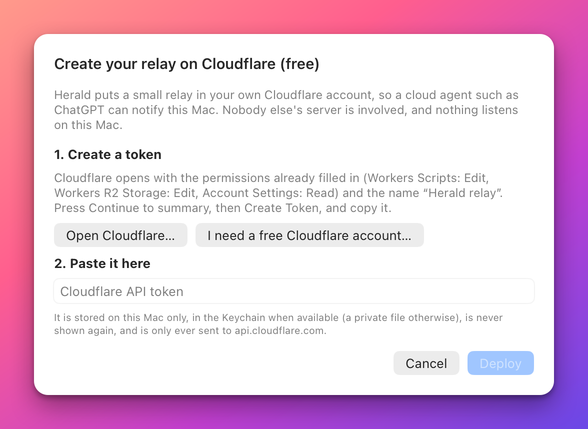

# Cloud relay

The cloud relay lets an agent that runs in the cloud, such as ChatGPT, Claude or a build server, put a
notification on your Mac. This page explains what the relay is and walks you through setting it up. It is for
anyone who wants notifications from something that does not run on their own Mac. When the relay is running,
continue with one of the [connection guides](#connect-an-agent-next).

## What the relay is

A cloud agent cannot reach your Mac, and you would not want it to. Your Mac sits behind a router and has no
address the internet can call.

The **relay** solves this with a mailbox in the middle. It is a small program that Herald installs in your own
Cloudflare account. An agent puts a notification into the mailbox. Herald keeps one outgoing connection open
to the relay, takes the notification out, and shows it like any other.

```text
cloud agent ──HTTPS──▶ relay ◀──one outgoing connection── Herald
                       in your Cloudflare account          on your Mac
                       holds a mailbox for your Mac
                       receipts and replies travel back the same way
```

Three properties follow from this design:

- **Nothing listens on your Mac.** Herald calls out; nobody calls in.
- **The relay is yours.** It runs in your Cloudflare account, on the free plan. No server of anyone else is
  involved and there is no shared relay.
- **An agent can only notify.** It can send text, see whether you saw it, and read your reply. It cannot run a
  command, open a file or change a setting.

The details of the design, the security model and the limits are in
[How the relay works](cloud/how-it-works.md).

## Before you start

- Herald is installed and running. See [Install](install.md).
- You have a Cloudflare account, or are willing to create one. The free plan is enough, and Herald links you
  to the sign-up page.

## Steps

1. Open **Settings > Cloud** from the bell menu.

   You see the **Relay** section with the **Enable relay** switch off.

   

2. Turn on **Enable relay**.

   A sheet opens, titled **Create your relay on Cloudflare (free)**.

   

3. Under **1. Create a token**, press **Open Cloudflare…**.

   Your browser opens Cloudflare's page for creating an API token, with the name "Herald relay" and the needed
   permissions already selected. If you have no account, press **I need a free Cloudflare account…** first.

4. On the Cloudflare page, press **Continue to summary**, then **Create Token**, and copy the token.

   Cloudflare shows the token once.

5. Back in Herald, paste the token into **Cloudflare API token** under **2. Paste it here**, and press
   **Deploy**.

   The sheet lists each step as Herald does it: it checks the token, finds your account, creates storage for
   voice replies, uploads the relay, switches on its address, waits until it answers, and pairs this Mac. If a
   step fails, the sheet shows Cloudflare's message and a **Retry** button.

6. When the sheet says **Your relay is online. Close this to connect an agent.**, press **Done**.

   The switch is on, and the status reads **Online**. The **Connector URL** is your relay's address followed
   by `/mcp`, with a **Copy** button.

   

## Check that it works

Open **Advanced** at the bottom of the Cloud tab and press **Test connection**. Herald sends a notification
through the relay and back to itself. A banner titled **Relay test** appears briefly, and the result line says
that a test notification went through the relay and was shown on this Mac.

## Connect an agent next

The relay is ready, and no agent is connected yet. Pick the guide that matches your agent.

| Your agent | Guide | How it signs in |
|---|---|---|
| Claude Code, Codex, a script, or any client that can send a header | [Connect an agent with a key](cloud/connect-agent.md) | An agent key you create and paste. |
| ChatGPT, or any client that signs in with OAuth | [Connect ChatGPT](cloud/connect-chatgpt.md) | It asks, and you approve on your Mac. |
| An agent that cannot open a browser | [Connect an agent without a browser](cloud/device-flow.md) | It prints a code, and you approve on your Mac. |
| An OpenAI dot that should wake when you reply | [Reply events](cloud/reply-events.md#connect-an-openai-dot) | A plugin registered with its host. |

## The Cloudflare token

Herald needs the token to act in your Cloudflare account. It is stored on this Mac only, sent only to
`api.cloudflare.com`, and never shown again or returned by any API. **Forget token** under **Advanced** deletes
it.

The token page asks for nine permissions. Three are needed to deploy the relay:

| Permission | Why Herald needs it |
|---|---|
| Workers Scripts: Edit | To upload the relay, switch on its address and set its variables and secrets. |
| Workers R2 Storage: Edit | To create the storage bucket for voice replies and its expiry rule. |
| Account Settings: Read | To find your account id. |

Six more are used only if you later give the relay a [custom domain](cloud/custom-domain.md):

| Permission | Why Herald needs it |
|---|---|
| Zone: Read | To list your domains. |
| DNS: Edit | So that Cloudflare can create the DNS record. |
| Workers Routes: Edit | To attach the relay to the hostname. |
| Zone Settings: Edit | To read the domain's settings. |
| Config Settings: Edit | To switch off the browser check for the relay's hostname. |
| Zone WAF: Edit | To add a narrow rule for the relay's hostname. |

A token without the six still deploys the relay. You can narrow the token to one account on Cloudflare's page.

## Turn the relay off

Turning **Enable relay** off unpairs this Mac. Herald asks first, because unpairing revokes every agent key
and connector: each agent has to be connected again if you turn the relay back on.

The relay program stays in your Cloudflare account. To remove it as well, use
**Advanced > Delete relay from Cloudflare…**. See [Operate the relay](cloud/operating.md#delete-the-relay).

## If it does not work

| Symptom | Cause | Fix |
|---|---|---|
| The sheet stops at a step with a message from Cloudflare. | The token lacks a permission, or sees several accounts. | Read the message. Create a new token from the pre-filled page, or enter the account id under **Advanced**. |
| The status stays **Offline** and keeps retrying. | The Mac has no network. | Herald retries by itself and reconnects at once when the network returns. |
| The status reads "the relay rejected this Mac's token". | The pairing was removed or the relay was reset. | Turn **Enable relay** off and on, or press **Reconnect**. |
| The status reads `Relay offline — limit reached`. | A daily limit of the free plan was reached. | It clears at midnight UTC. See [limits](cloud/how-it-works.md#limits). |

More symptoms, including what agents see, are in [Operate the relay](cloud/operating.md#if-it-does-not-work).

## Related

- [How the relay works](cloud/how-it-works.md): the design, the security model and the limits.
- [Operate the relay](cloud/operating.md): update, advanced settings, several Macs, delete.
- [Cloud relay API (local)](reference/api/relay.md): do everything on this page from a script.
- [MCP relay tools](reference/mcp/relay.md): let a local agent set the relay up for you.
- [Relay API](reference/relay-api.md): what the relay serves to cloud agents.
