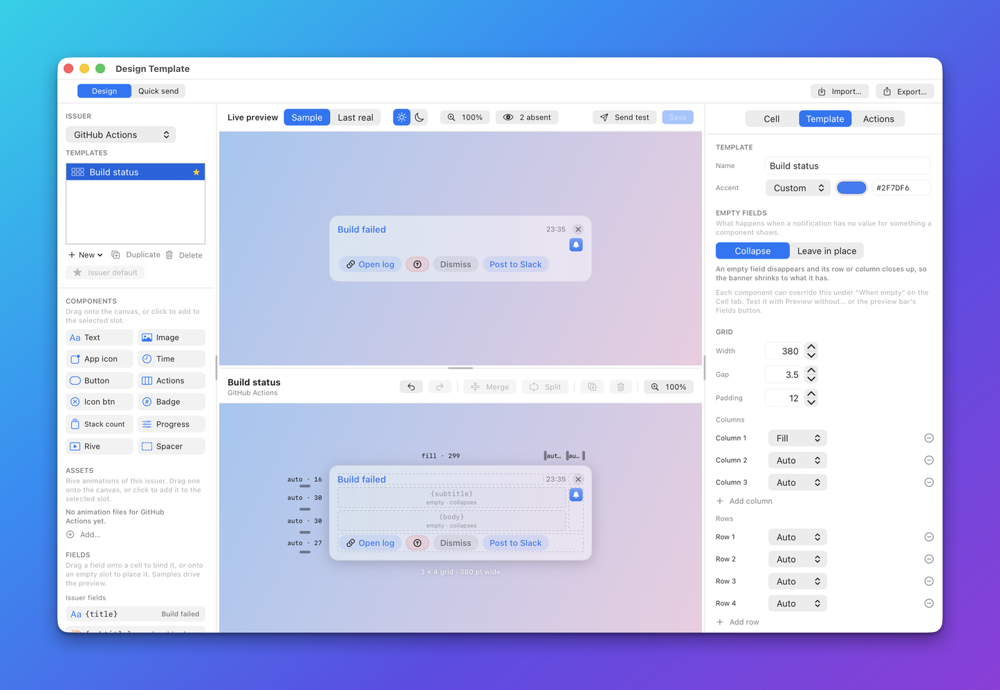

# Templates

A template is a saved banner design for one app. It decides where the title, the picture, the count and the
buttons go, and what happens when some of that data is missing. This guide explains what templates are for,
how a notification picks one, and how to build one step by step, preview it and share it. It is for app
developers and for agents that design banners. For every field of the JSON, see
[Grid, cells and layout](reference/grid-and-layout.md).

## What a template is and why you want one

Without a template, Herald draws every notification with a built-in layout: an optional picture, a title, a
subtitle, a body and the buttons. That is enough for plain messages. A template lets one app give each kind
of event its own look, for example a bid that was won, a bid that was lost and a deadline that is close,
without sending layout details in every notification.

A template has three parts:

- **A layout.** A grid of rows and columns, with components such as text, images, badges and buttons placed
  in its cells. See [Grid, cells and layout](reference/grid-and-layout.md).
- **Bindings.** Each component reads data through `{token}` placeholders, so the same template shows the
  right values for every notification. See [Bindings and tokens](reference/bindings.md).
- **Defaults and rules.** Default sound and behaviour, `extra` values, and rules that hide, relabel or add
  buttons. See [Action rules](reference/actions.md).

A template is stored on the Mac, one file per template, and a notification asks for it by name:

```json
{"app": "example.bidbot", "title": "Bid accepted", "template": "bid-won", "client": "Acme Corp"}
```

You can write templates three ways: in the [Designer](AUTHORING.md), with
[`PUT /v1/templates`](reference/api/templates.md#put-v1templates), or with the MCP tool `put_template`. All
three store the same JSON and run the same validation.

## The built-in layouts

Four layouts exist without being saved. Each is a grid template, 380 points wide. A notification that names
no template is drawn with one of them. Pick one with the notification's `layout` field, or name one
directly, for example `"template": "builtin.hero"`.

| Name | Looks like | Notes |
|---|---|---|
| `builtin.imageLeft` | A square picture on the left, text on the right. | The default. |
| `builtin.imageRight` | The same, mirrored. | |
| `builtin.hero` | The picture across the top at 16:9, then the text. | |
| `builtin.compact` | One line: app icon, title, time and a close button. | No picture, subtitle or body. |

All four draw the title, the subtitle, the body, the time, the app icon, a close button and the action row.
They collapse what is missing: without a picture there is no picture column, without a subtitle no subtitle
row, without buttons no button row. A notification can tune them with fields that show or hide parts, limit the
body lines and set the accent colour. Those fields are in the
[Notifications API](reference/api/notifications.md#post-v1notify).

The built-ins are also starting points. The MCP tool `get_template` returns any of them as editable JSON,
and in the Designer **New** offers a blank 3 by 4 grid or a copy of each layout. Names that start with
`builtin.` are reserved, so save your copy under your own name.

## How a notification picks its template

Herald chooses the template when the notification arrives:

1. If the notification has a `template`, Herald looks for a saved template of that name for the same app.
   A `builtin.` name selects the built-in template.
2. If the notification names none, and the app's manifest has a `defaultTemplate` that exists as a saved
   template, Herald uses that. The Designer's **Set as issuer default** button sets it.
3. Otherwise Herald uses a built-in layout, chosen by the notification's `layout` field, or `imageLeft`.

| Situation | Result |
|---|---|
| The named template does not exist, and the notification has a `title`. | The banner is drawn as sent, without the template. Herald logs the missing name. |
| The named template does not exist, and the notification has no `title`. | The request fails with status `400`: the title is required. |
| The notification sets a field the template also sets, such as `sound` or `buttons`. | The notification wins. The template only fills what the notification leaves out. |
| The notification sends `"buttons": []`. | No buttons, even if the template defines some. |

Names are matched per app. A template saved for `example.bidbot` is never used for another app.

## Build a template step by step

This walk-through builds a banner for BidBot's "Bid accepted" event. BidBot sends these fields: `title`,
`bid`, `amount`, `client` and `image`. The steps show the cells you add. The complete template is at the end
of the section.

### Step 1: a grid and a title

Start with a grid: 3 rows and 3 columns. The first column is a fixed 72 points for a picture, the middle
column takes the leftover width, and the last column fits its content. Add one cell that shows the title.

```json
{
  "name": "bid-won",
  "app": "example.bidbot",
  "grid": {
    "rows": 3, "cols": 3,
    "rowSizes": ["auto", "auto", "auto"],
    "colSizes": [72, "fill", "auto"],
    "gap": 8, "padding": 14, "width": 400
  },
  "cells": [
    {"id": "title", "row": 0, "col": 1,
     "component": {"type": "text", "binding": "{title}", "style": "title", "maxLines": 2}}
  ]
}
```

Rows and columns are counted from 0, so `"row": 0, "col": 1` is the top row, middle column. The template is
valid at this point and shows only the title.

### Step 2: a picture and a second line

Add the picture in the first column. It spans two rows, so it stands beside both text lines. Add the bid
reference under the title. It spans the middle and last columns.

```json
{"id": "img", "row": 0, "col": 0, "rowSpan": 2,
 "component": {"type": "image", "binding": "{image}", "fit": "cover", "cornerRadius": 10}}
```

```json
{"id": "bid", "row": 1, "col": 1, "colSpan": 2,
 "component": {"type": "text", "binding": "{bid}", "style": "subtitle", "maxLines": 1}}
```

### Step 3: an amount badge

Put the amount in the last column of the top row, aligned to the top right corner of its cell.

```json
{"id": "amount", "row": 0, "col": 2, "align": "topTrailing",
 "component": {"type": "badge", "binding": "{amount}", "color": "#2E7D32"}}
```

### Step 4: the buttons

Add the action row at the bottom, under the text columns. `merged` shows the app's own buttons and the ones
you add with rules. `maxVisible` puts any more behind a `+N` menu.

```json
{"id": "buttons", "row": 2, "col": 1, "colSpan": 2,
 "component": {"type": "actions", "source": "merged", "layout": "row", "maxVisible": 3}}
```

The button row does not span column 0. That matters in the next step.

### Step 5: decide what happens when data is missing

BidBot does not always send an image or an amount. By default (`collapseEmpty` is `true`) an empty component
disappears and a row or column with nothing left closes up. Without an image, the 72 point column and its gap
vanish and the text starts at the left edge. This is what you want for the picture. For the amount badge you
might prefer a stable layout, so you set `emptyBehavior` on that one cell to `keep`:

```json
{"id": "amount", "row": 0, "col": 2, "align": "topTrailing",
 "component": {"type": "badge", "binding": "{amount}", "color": "#2E7D32", "emptyBehavior": "keep"}}
```

The next section describes the rules in full.

### The finished template

Add a default sound and an `accentColor`, and the template is complete:

```json
{
  "name": "bid-won",
  "app": "example.bidbot",
  "collapseEmpty": true,
  "accentColor": "#2E7D32",
  "sound": "Glass",
  "grid": {
    "rows": 3, "cols": 3,
    "rowSizes": ["auto", "auto", "auto"],
    "colSizes": [72, "fill", "auto"],
    "gap": 8, "padding": 14, "width": 400
  },
  "cells": [
    {"id": "img", "row": 0, "col": 0, "rowSpan": 2,
     "component": {"type": "image", "binding": "{image}", "fit": "cover", "cornerRadius": 10}},
    {"id": "title", "row": 0, "col": 1,
     "component": {"type": "text", "binding": "{title}", "style": "title", "maxLines": 2}},
    {"id": "amount", "row": 0, "col": 2, "align": "topTrailing",
     "component": {"type": "badge", "binding": "{amount}", "color": "#2E7D32", "emptyBehavior": "keep"}},
    {"id": "bid", "row": 1, "col": 1, "colSpan": 2,
     "component": {"type": "text", "binding": "{bid}", "style": "subtitle", "maxLines": 1}},
    {"id": "buttons", "row": 2, "col": 1, "colSpan": 2,
     "component": {"type": "actions", "source": "merged", "layout": "row", "maxVisible": 3}}
  ]
}
```

### Save, preview and use it

Save the JSON as `bid-won.json`. The shell examples use `$HERALD` and `$TOKEN`, defined in
[Connect](reference/api/README.md#connect). Storing a template validates it first. An error is reported with
the cell id and the property path.

```sh
curl -s -X PUT "$HERALD/v1/templates" \
  -H "Authorization: Bearer $TOKEN" -H "Content-Type: application/json" \
  -d @bid-won.json
```

```json
{"ok": true}
```

Render it before you send anything. The reply is a PNG. Fields you leave out of `data` show how the banner
collapses:

```sh
curl -s -X POST "$HERALD/v1/preview" \
  -H "Authorization: Bearer $TOKEN" -H "Content-Type: application/json" \
  -d '{"template":"bid-won","app":"example.bidbot","appearance":"dark",
       "data":{"title":"Bid accepted","bid":"BID-4021 Brand refresh"}}' -o preview.png
```

Then use it from a notification:

```sh
curl -s -X POST "$HERALD/v1/notify" \
  -H "Authorization: Bearer $TOKEN" -H "Content-Type: application/json" \
  -d '{"app":"example.bidbot","title":"Bid accepted","bid":"BID-4021 Brand refresh",
       "amount":"$4,200","template":"bid-won"}'
```

## Collapse semantics

Notifications do not always carry every field. A template decides what a missing field does to the layout:
the space it would have used can close up, or it can stay as a blank. This section explains the rules
completely.



### Empty components

A component is **empty** when it has nothing to show for this notification. For a bound component that means
every token in its binding is absent. A binding with no token is plain text and is empty only when it is
blank. The details of tokens are in [Bindings and tokens](reference/bindings.md#empty-values).

| Component | Empty when |
|---|---|
| `text` | Every line is blank or has only absent tokens. A line of plain text always counts as content. |
| `image` | The binding has no value, or the file cannot be read, or the download fails. |
| `badge`, `progress` | Every token in the binding is absent. |
| `timestamp` | It has a binding and every token in it is absent. With no binding it shows the delivery time and is never empty. |
| `stackBadge` | The banner is not part of a stack of two or more. |
| `button`, `iconButton` | The action it points to is not in the list: hidden by a rule, not sent by the app, or drawn in another cell. A button with its own inline action is never empty. |
| `actions` | None of the actions assigned to it exist. A notification with an **Add to Reminders** button keeps it alive. |
| `rive` | It names no animation. |
| `issuerIcon`, `spacer` | Never. They read no data. |

### Collapse or keep

When a component is empty, one of two things happens. The choice is made at two levels:

1. **The template default**, `collapseEmpty`. `true` means collapse, `false` means keep. The default is `true`.
2. **The component**, `emptyBehavior`: `collapse` or `keep`. When set, it overrides the template default for
   that component only.

An empty component that **collapses** is not drawn. An empty component that **keeps** is drawn as blank, and
its cell holds its space so the layout does not move.

```json
{"id": "subject", "row": 1, "col": 1, "colSpan": 2,
 "component": {"type": "text", "binding": "{subject}", "style": "subtitle", "emptyBehavior": "collapse"}}
```

In the Designer, the **Template** tab has **Empty fields** with **Collapse** and **Leave in place**. Each
component's **Cell** tab has **When empty** with **Template**, **Collapse** and **Keep space**.

### Rows and columns

Collapsing a cell can empty a whole row or column. Herald decides this for each row and column:

1. A cell is **live** when it is not collapsed. A cell that spans several tracks counts for every track it
   covers.
2. A row or column that has at least one live cell stays at its normal size.
3. A row or column that cells cover, but none of them live, collapses to zero size, and its gap disappears.
4. A row or column that no cell covers at all collapses only when `collapseEmpty` is `true`. With `false`
   it keeps its size.

So `emptyBehavior: "keep"` on one component keeps the tracks that component covers alive for every
notification, even when the template collapses. And `collapseEmpty: false` keeps every track, including
tracks no cell uses, so every banner has the same shape.

### Worked example

This template has 3 rows and 3 columns, and `collapseEmpty` is `true`. The picture covers rows 0 and 1 of
column 0. The title is at row 0, column 1. The amount badge is at row 0, column 2 and is set to `keep`. The
bid text covers row 1, columns 1 and 2. The buttons cover row 2, columns 1 and 2.

```json
{
  "name": "bid-won",
  "app": "example.bidbot",
  "collapseEmpty": true,
  "grid": {
    "rows": 3, "cols": 3,
    "rowSizes": ["auto", "auto", "auto"],
    "colSizes": [72, "fill", "auto"],
    "gap": 8, "padding": 14, "width": 400
  },
  "cells": [
    {"id": "img", "row": 0, "col": 0, "rowSpan": 2,
     "component": {"type": "image", "binding": "{image}", "fit": "cover"}},
    {"id": "title", "row": 0, "col": 1,
     "component": {"type": "text", "binding": "{title}", "style": "title"}},
    {"id": "amount", "row": 0, "col": 2,
     "component": {"type": "badge", "binding": "{amount}", "emptyBehavior": "keep"}},
    {"id": "bid", "row": 1, "col": 1, "colSpan": 2,
     "component": {"type": "text", "binding": "{bid}", "style": "subtitle"}},
    {"id": "buttons", "row": 2, "col": 1, "colSpan": 2,
     "component": {"type": "actions", "source": "merged"}}
  ]
}
```

| Notification | Empty cells | What closes up |
|---|---|---|
| Everything present. | None. | Nothing. |
| No `image`. | `img` | Column 0 is covered only by `img`, so it collapses with its gap. The text moves to the left edge. |
| No `bid`, image present. | `bid` | Nothing. The image still covers row 1, so row 1 keeps the height the image needs. |
| No `bid` and no `image`. | `bid`, `img` | Row 1 and column 0. The buttons sit directly under the title. |
| No `amount`. | `amount` | Nothing. The badge cell is drawn blank and keeps its space, because it is set to `keep`. |
| The app sent no buttons. | `buttons` | Row 2 collapses. The banner is shorter. |
| Only a title. | `img`, `bid`, `buttons` | Rows 1 and 2, and column 0. Column 2 stays because `amount` keeps it alive. The banner is the title plus its padding. |

Without `"emptyBehavior": "keep"` on the badge, a missing `amount` would also collapse the badge cell. Column 2
would still stay whenever the bid text or the buttons are present, because they span it.

With `collapseEmpty` set to `false` and no `emptyBehavior` anywhere, every banner has the shape of the first
row of the table: nothing moves, and missing fields leave blanks. A grid with a fourth row that no cell
covers behaves like this: with `collapseEmpty: true` the row collapses and leaves no stray gap. With `false`
it stays at its size.

### Buttons and the confirmation question

While a banner asks an inline confirmation, such as "Run Delete?", every `actions` and `button` cell is
treated as empty and collapsed, whatever its `emptyBehavior`. The question takes the place of the row. Icon
buttons stay, because the user can always close the banner.

### Testing it

In the Designer, the preview bar's **Fields** button and each cell's **Preview without** checkbox mark fields
as absent so you can watch what collapses. Over HTTP, leave keys out of `data` in
[`POST /v1/preview`](reference/api/templates.md#post-v1preview).

## Preview a template

Three tools render the real banner, with the same collapsing and layout a delivery uses:

| Tool | Use it to |
|---|---|
| The Designer's live preview | See every edit at once, in light or dark, with sample data or your last real notification. See [Design a banner in the Designer](AUTHORING.md). |
| [`POST /v1/preview`](reference/api/templates.md#post-v1preview) | Get a PNG for a saved template or a template object you send inline, at a scale from 1 to 3. |
| The MCP tool `render_preview` | Let an agent look at the picture and fix what it sees. |

The `data` argument takes one of three things:

- A notification-shaped object.
- `"sample"`, to use the manifest's sample values.
- `"last"`, for the newest real notification.

Add `stackCount` to see the banner as the top of a stack. Layout is the same in light and dark, so check both mainly
for colours.

## Share a template as a bundle

A **bundle** is one file with the extension `.heraldtemplate`. It is a zip archive that holds the template
and the Rive animations it plays, so a template with animations moves between Macs in one piece.

| File in the archive | Holds |
|---|---|
| `bundle.json` | The format name and version, the template name and app, and the animation file names. |
| `template.json` | The template, exactly as Herald stores it. |
| `assets/<file>.riv` | Each Rive file the template plays. |

To export in the Designer, press **Export…** in the bar at the top, choose where to save, and the file is
written. To import, press **Import…**, or drop a `.heraldtemplate` file on the Designer window. Herald tells
you which app the template is for and which animations it carries. If the bundle is for another app, a
checkbox imports it for the app you are designing instead. If a template with that name exists you choose
**Keep Both**, which saves the import as `name 2`, or **Replace**.

Over HTTP and MCP:

- Export: [`GET /v1/templates/export`](reference/api/templates.md#get-v1templatesexport), or the MCP tool
  `export_template_bundle`.
- Import: [`POST /v1/templates/import`](reference/api/templates.md#post-v1templatesimport), or the MCP tool
  `import_template_bundle`.

What a bundle does and does not carry:

- Rive files go in the bundle. On import Herald copies them into the app's assets folder. A file that is
  already there with the same content is reused. A different file with the same name is saved under another
  name, and the template is updated to match.
- A fixed picture chosen in an `image` component stays on the original Mac. The bundle keeps the path, so
  choose the picture again after importing elsewhere.
- Script files and Apple Shortcuts are not in the bundle. Herald warns about each one on export. The
  Shortcut must exist on the other Mac, and a script must be in its scripts folder.
- A bundle is untrusted input. Herald validates the template, caps the number and size of entries before
  unpacking, and ignores anything that is not the fixed layout above. A bundle may hold at most 32
  animation files of 10 MB each and 64 MB in total, and `template.json` may be at most 2 MB.

## Related

- [Design a banner in the Designer](AUTHORING.md): build the same template with the mouse.
- [Grid, cells and layout](reference/grid-and-layout.md): every field of the template, the grid and the cell.
- [Bindings and tokens](reference/bindings.md): how `{token}` placeholders get their values.
- [Components](reference/components/README.md): the properties of each component.
- [Actions](ACTIONS.md): the buttons a banner shows and the rules that change them.
- [Follow-ups](reference/actions.md#follow-ups): the `followUp` a template can carry.
- [Templates API](reference/api/templates.md): store, preview, export and import over HTTP.
