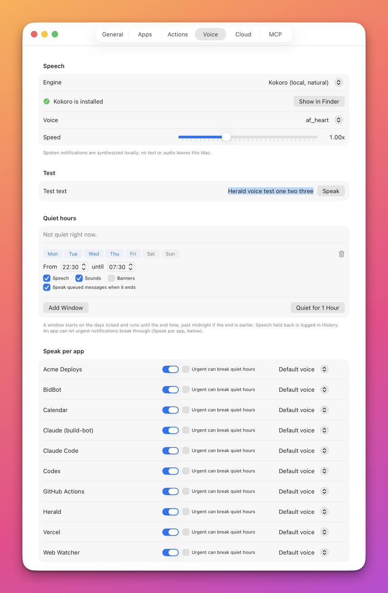
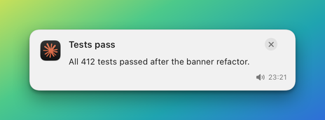

# Make Herald speak

Herald can read a notification aloud or play a recorded voice message, so you hear an event without looking at the
screen. By the end of this guide you will have chosen a voice engine, optionally installed the Kokoro neural
voice, and sent a spoken notification, a voice-only one, and one with its own voice. Everything runs on the Mac:
no text or audio is sent anywhere.

## Before you start

- Herald is running and you can open **Settings** from its menu.
- For the examples below, define the connection variables once. They are explained in
  [Connect](reference/api/README.md#connect).

  ```sh
  D="$HOME/Library/Application Support/Herald"
  HERALD="http://127.0.0.1:$(cat "$D/port")"
  TOKEN="$(cat "$D/token")"
  ```

## Steps

### Choose an engine

1. Open **Settings > Voice**. The **Speech** section is at the top.
2. Choose an engine in the **Engine** menu.

   

   | Engine | What it is |
   |---|---|
   | **Kokoro (local, natural)** | A neural voice that sounds natural. It needs a one-time download. |
   | **System voice** | The built-in macOS voices. It works at once and is the default. |
   | **Off** | Nothing is spoken. Recorded audio messages still play. |

3. Choose a **Voice**. With the system voice the menu lists the installed English voices, and **System default**
   uses the voice set in macOS. With Kokoro it lists the model's voices, such as `af_heart`, `af_bella`,
   `af_nicole`, `am_michael`, `bf_emma` and `bm_george`.
4. Drag **Speed** between 0.5x and 2.0x. The current value shows beside the slider.
5. Type a sentence in **Test text** and press **Speak**. You hear it even when Herald is muted. If nothing
   plays, the reason shows in red under the field.

If you only want the system voice, you are done with setup. Go on to [Send a spoken
notification](#send-a-spoken-notification).

### Install Kokoro

Choose **Kokoro (local, natural)** as the engine. A status row shows **Kokoro is installed**, or **Kokoro is not
installed** with what is missing. When it is not installed you have two ways to get it.

1. If you already have a Kokoro setup in `~/.claude/tts` (with `kokoro-v1.0.onnx`, `voices-v1.0.bin` and a
   `venv` folder), press **Use existing installation at ~/.claude/tts**. Herald links those files into its own
   folder. Nothing is copied or changed in the source. The status row turns to **Kokoro is installed**.
2. Otherwise press **Download Kokoro (about 340 MB)**. Herald downloads the two model files from the
   kokoro-onnx release on GitHub, shows a progress bar, then builds a Python environment with `uv`, or with
   `python3` and `pip` when `uv` is not installed. The status row turns to **Kokoro is installed** when it is
   done.

You can press **Cancel** during the download. Starting again continues from the bytes already on disk. When
the files are in place Herald shows the SHA-256 of each one so you can compare it with the release. **Show in
Finder** opens the folder.

The first Kokoro request after you start Herald loads the model and takes a few seconds. After that the voice
stays loaded and answers fast. An agent can start the same installation with the
[`install_voice`](reference/mcp/apps-and-settings.md#install_voice) tool or
[`POST /v1/voice/install`](reference/api/setup.md#post-v1voiceinstall).

### Send a spoken notification

Add `--speak` to a notification. Herald shows the banner and reads the title, then the body.

```sh
herald notify --app example.bidbot --title "Bid accepted" \
  --body "Your bid of \$4,200 on the Acme RFP was accepted." --speak
```

The banner appears and at the same moment you hear "Bid accepted. Your bid of $4,200 on the Acme RFP was
accepted." A small speaker control sits beside the banner's time. Press it to hear the message again.



To say something different from what the banner shows, give the text, voice, speed and language yourself:

```sh
herald notify --app example.bidbot --title "Bid accepted" \
  --speak-text "Good news. The Acme bid was accepted." --voice af_bella --speed 1.1 --lang en-us
```

The same notification over HTTP:

```sh
curl -s -X POST "$HERALD/v1/notify" \
  -H "Authorization: Bearer $TOKEN" -H "Content-Type: application/json" \
  -d '{"app":"example.bidbot","title":"Bid accepted","speak":{"text":"Good news. The Acme bid was accepted."}}'
```

### Send a voice-only notification

Use `herald speak`, or `presentation: "voice"`, when you want to be heard and not seen: no banner and no chime.
The text still goes to History, marked read, so you can search it later.

```sh
herald speak --app example.bidbot --text "Deploy finished."
```

Over HTTP this is [`POST /v1/speak`](reference/api/notifications.md#post-v1speak):

```sh
curl -s -X POST "$HERALD/v1/speak" \
  -H "Authorization: Bearer $TOKEN" -H "Content-Type: application/json" \
  -d '{"app":"example.bidbot","text":"Deploy finished."}'
```

To play a recording instead of synthesised speech, send `audio` with a file path or `https` URL:

```sh
herald notify --app example.bidbot --title "Voice note" --audio ~/note.wav --presentation voice
```

> [!NOTE]
> A voice-only notification is never lost. If Herald is muted, the app's **Speak** switch is off, or speech
> cannot play, Herald shows it as a normal banner instead.

### Give one app its own voice

1. In **Settings > Voice**, scroll to **Speak per app**. Apps appear here after their first notification.
2. Use the switch with the app's name to allow or forbid speech for that app. An app with the switch off is never
   spoken, whatever it sends.
3. Use the menu on the right of the row to pick a voice for that app. **Default voice** follows the voice from
   the **Speech** section.

A voice named in the notification itself wins over the app's voice. The per-app options can also be set by an
agent; see the [apps API](reference/api/apps.md#put-v1appssettings).

## Check that it works

Press **Speak** in **Settings > Voice** and listen. Then run the `herald speak` command above. You hear the text
and a new entry appears in **History**, already marked read, with a speaker control and the spoken text under it.

## If it does not work

| Symptom | Cause | Fix |
|---|---|---|
| Nothing is spoken and no error shows. | The engine is **Off**, or Herald is muted. | Choose an engine in **Settings > Voice**, and turn off **Mute Sounds** in the menu. |
| A voice-only notification appeared as a banner. | It could not be heard: mute, the app's **Speak** switch, the engine or a read error. | Fix the cause. The banner is the safety net, not a fault. |
| The **Speak** test shows "Kokoro is not installed". | The model files or the Python environment are missing. | Press **Download Kokoro** or **Use existing installation**. |
| The Kokoro download stops with a red message. | No `uv` or `python3` was found, or the download failed. | Install `uv` (for example with Homebrew), then press **Download Kokoro** again. It resumes. |
| The first spoken message after launch is slow. | Kokoro is loading its model. | Wait a few seconds. Later messages are fast. |
| Speech is silent at night. | A [quiet hours](reference/quiet-hours.md) window is active. | Press **Resume Now** in the menu, or change the window. History shows `suppressed: "quiet-hours"`. |
| `400 invalid voice`. | The voice name has a space or a character outside letters, digits, `_`, `-` and `.`. | Use the model id, for example `af_heart`. |
| The speaker control replays nothing. | The engine is **Off** and the audio file was removed. | Choose an engine again. Herald re-synthesises the text. |

## Related

- [Voice reference](reference/voice.md): the `speak`, `audio` and `presentation` fields, engines and behaviour.
- [Quiet hours](reference/quiet-hours.md): keep Herald quiet on a schedule.
- [Notifications API](reference/api/notifications.md#post-v1speak) and
  [`herald speak`](reference/cli.md#herald-speak): send speech from code.
- [Setup API](reference/api/setup.md): check and install Kokoro from an agent.
