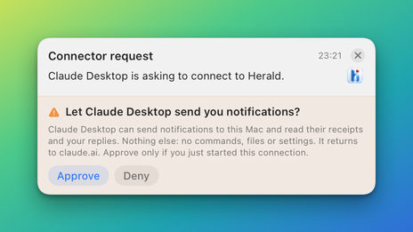

# Connect ChatGPT

This guide connects ChatGPT to your relay as a **connector**. ChatGPT signs in with OAuth and has no field for
a pasted key, so the connection is approved on your Mac. At the end, ChatGPT can send you a Herald notification
and read your reply.

The same steps work for any client that connects to an MCP server with OAuth, including custom connectors in
Claude. A client that can send a header can use a [key](connect-agent.md) instead; both get the same access.

## Before you start

- Your relay is set up and **Settings > Cloud** shows **Online**. See [Cloud relay](../CLOUD.md).
- Herald is running on the Mac you want to notify.
- Copy the **Connector URL** from **Settings > Cloud**. It is your relay's address followed by `/mcp`.

## Steps

1. In ChatGPT, open **Settings > Connectors** and choose to create a custom connector.

   The labels vary with your plan. If you see no option to create one, turn on **Developer mode** under
   **Advanced** first.

2. Fill in the connector:

   | Field | Value |
   |---|---|
   | Name | `Herald` |
   | MCP server URL | The **Connector URL** you copied. |
   | Authentication | OAuth. Leave the client id and client secret empty. |

   ChatGPT registers itself with your relay, so there is nothing to type for the client.

3. Press **Connect**.

   A page from your relay opens in the browser. It says that ChatGPT wants to connect to Herald, what it would
   be allowed to do, and which Mac will be asked.

4. On your Mac, a banner asks **Let ChatGPT send you notifications?** Press **Approve**.

   

   The browser page continues by itself and returns to ChatGPT.

5. Back in ChatGPT, the connector is connected and lists four tools. Ask it to "send me a Herald notification
   saying hello".

   A banner arrives on your Mac from the app `cloud.chatgpt`.

### If you missed the banner

Open **Settings > Cloud > Connector approvals**. The request is listed there with **Approve** and **Deny** and
a 6-digit code. Either press **Approve**, or type the code on the browser page. Five wrong codes deny the
request.

A request that nobody answers expires after 10 minutes. **Deny**, from the banner, from Settings or from the
page, sends ChatGPT back with an error and creates nothing.

## Check that it works

The connector is listed under **Connector approvals** as connected, and under **Agent keys** as a connector.
After the first notification, **Last relay items** shows it.

## What a connector can and cannot do

A connector has the same narrow access as an agent key.

| It can | It cannot |
|---|---|
| Send notifications with text and presentation choices. | Run commands, scripts or Shortcuts. |
| Read the receipts of what it sent. | Add buttons that call a server, show files or play audio. |
| Wait for your reply to what it sent. | Read your History or another agent's notifications. |
| Ask whether your Mac is online and in quiet hours. | Change settings, quiet hours or keys. |
| Subscribe to be told when you reply. | Approve anything for itself. |

Mute and quiet hours still apply on the Mac.

**The approval is yours, on the Mac.** A request cannot be approved from the web page alone. It needs the
banner or Settings on the paired Mac, or the 6-digit code that only Herald shows. The request shows the name
the client registered with and the site it returns to, so a look-alike name still shows its real address. At
most 3 requests wait at once, and 12 an hour.

**The connection is durable.** It works until you revoke it. Its tokens do not expire and are never replaced,
so a connector is never dropped because time passed or because it refreshed or retried. Connecting the same
connector again replaces its earlier connection.

## Revoke a connector

Press **Revoke** beside the connector under **Connector approvals** or **Agent keys**. Its tokens stop working
at once, and ChatGPT's next call is refused until you connect it again.

To also remove the connector's app and History from Herald, remove the app in **Settings > Apps**. For a
connector that is still approved, Herald offers **Remove and Revoke**, which does both. See
[The Herald app](../APP.md#remove-an-app).

## If it does not work

| Symptom | Cause | Fix |
|---|---|---|
| The page says "Pair Herald first". | The relay has no paired Mac. | Check that **Settings > Cloud** shows **Online**, then connect again. |
| The page waits and no banner shows. | Herald is not running or not online, or banners are muted. | Use the 6-digit code from **Connector approvals**. |
| "approvals are already waiting". | Three requests are open. | Answer or deny them in **Connector approvals**, or wait 10 minutes. |
| The request goes to the wrong Mac. | Several Macs are paired with the relay. | Follow the link to the other Mac on the page. See [several Macs](operating.md#several-macs). |
| ChatGPT gets `401` later. | The connector was revoked. | Connect it again. |
| The connector stopped working after you moved to a custom domain. | A connector is bound to the address it was added with. | Add the connector again with the new **Connector URL**. |

## Related

- [Connect an agent without a browser](device-flow.md): for agents that cannot open the approval page.
- [Reply events](reply-events.md): let the connector be told when you reply.
- [Relay API: OAuth endpoints](../reference/relay-api.md#oauth-endpoints): the protocol behind these steps.
- [`GET /v1/relay/connectors`](../reference/api/relay.md#get-v1relayconnectors): list connectors and waiting requests from a script.
