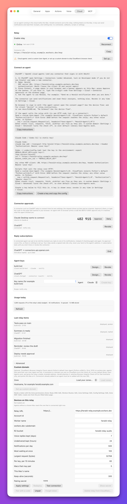

# Use a custom domain

Your relay's default address ends in `workers.dev`. Cloudflare runs a browser check on every `workers.dev`
address, and that check rejects some programs before their request reaches your relay. This page explains the
problem, the one-line fix that solves it for most agents, and how to give the relay an address on your own
domain when you want the check gone.

It is for you if a cloud agent gets error 1010 from your relay, or if you want the relay on a stable address
that you own.

## The problem: error 1010

A cloud agent calls your relay and gets `403` with **Error 1010**, and a message that the site owner has
banned access based on the browser's signature.

This is Cloudflare's **Browser Integrity Check**. It looks at the `User-Agent` header and rejects values it
considers automated, including the default of Python's `urllib`, which is `Python-urllib/3.x`. The request is
stopped at Cloudflare, so the relay never sees it. On a `workers.dev` address the check cannot be switched
off.

## The simple fix: send your own User-Agent

Any other `User-Agent` value passes: the defaults of curl, `requests` and `aiohttp`, a missing header, or a
name of your own. For most agents this is the whole fix.

```python
import urllib.request

req = urllib.request.Request(
    "https://herald-relay.example.workers.dev/v1/notify",
    data=b'{"title": "Build finished"}',
    headers={
        "User-Agent": "Herald-Agent/1.0",
        "Authorization": "Bearer hrk_...",
        "Content-Type": "application/json",
    },
)
urllib.request.urlopen(req)
```

The instructions Herald gives for cloud agents already carry this advice. Set up a custom domain only if you
cannot control the agent's `User-Agent`, or if you want your own address.

To see whether the check is active on your relay's address, run **Test connection** under
**Settings > Cloud > Advanced**. The result says so when it is.

## Before you start

- Your relay is set up. See [Cloud relay](../CLOUD.md).
- You have a domain in the same Cloudflare account as the relay.
- Your Cloudflare token includes the six zone permissions listed in
  [The Cloudflare token](../CLOUD.md#the-cloudflare-token). A token created from Herald's pre-filled page has
  them. If yours does not, create a new token from that page and paste it.

## Steps

1. Open **Settings > Cloud > Advanced** and find **Custom domain**.

   

2. Press **Load zones**.

   The **Zone** menu fills with the domains your token can see.

3. Choose a zone. Herald suggests a hostname such as `herald.example.com`. Change it if you like.

4. Press **Set up custom domain**.

   Herald redeploys the relay and then does four things in your Cloudflare account, naming each step:

   | Step | What happens |
   |---|---|
   | Attach the custom domain | Cloudflare creates the DNS record and a certificate for the hostname. |
   | Switch off the browser check | A rule turns Browser Integrity Check off for this hostname only. |
   | Skip the security challenge | A second, narrow rule skips the security-level challenge for this hostname. |
   | Check Bot Fight Mode | Herald reads the setting and warns you if it is on. |

   Then it waits until the new address answers. The certificate can take a minute or two; press **Retry** if
   the wait times out.

5. Herald now uses the new address. The **Custom domain** section shows both: the **workers.dev address**
   and the **Custom address (canonical)**.

   This Mac stays paired, and agent keys work on both addresses.

6. Add any OAuth connector again with the new **Connector URL**.

   A connector such as ChatGPT is bound to the address it was added with, so the existing one keeps pointing
   at the old address.

## Check that it works

Run **Test connection** again. The result reports no active browser check.

## Bot Fight Mode

If Bot Fight Mode is on for the domain, Herald tells you. On Cloudflare's free plan no rule can bypass it, so
it can still challenge cloud agents. Turn it off in the Cloudflare dashboard under **Security > Bots**. This is
a warning, not a failure: the custom domain is still set up.

## Go back to workers.dev

Press **Use workers.dev again** under **Custom domain**. Herald points this Mac back at the `workers.dev`
address. The hostname, the DNS record and the rules stay in your Cloudflare account; delete them there if you
want them gone.

## If it does not work

| Symptom | Cause | Fix |
|---|---|---|
| "Token is missing Zone permissions". | The token was created without the six zone permissions. | Create a new token from the pre-filled page and paste it. |
| The step that waits for the custom domain times out. | The certificate is not ready yet. | Wait a minute and press **Retry**. |
| A connector stopped working. | It is bound to the old address. | Add it again with the new **Connector URL**. |
| Agents are still challenged on the custom domain. | Bot Fight Mode is on for the domain. | Turn it off in the Cloudflare dashboard. |

## Related

- [`GET /v1/relay/zones`](../reference/api/relay.md#get-v1relayzones): list your domains from a script.
- [Relay setting keys](../reference/api/relay.md#relay-setting-keys): set `customDomain` from a script.
- [`relay_zones`](../reference/mcp/relay.md#relay_zones): let a local agent set up the domain.
- [Operate the relay](operating.md): the other advanced settings.
