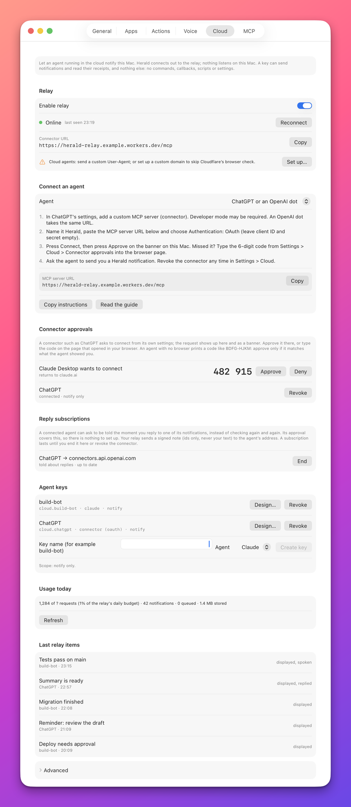

# Reply events

A cloud agent that asks you a question needs your answer. It can keep asking the relay whether you replied, or
it can subscribe once and be called the moment you do. This page explains reply subscriptions, shows where you
see and end them on the Mac, and walks through connecting an OpenAI dot, an always-on cloud agent that wakes
only when its host is called.

It is for people who build or run a cloud agent. If your agent only sends notifications and never waits for an
answer, you do not need this page.

## Polling and subscribing

There are two ways for an agent to get your reply.

| Way | How it works | Good for |
|---|---|---|
| **Polling** | The agent calls `wait_for_reply`, which holds the request open until you answer or a timeout passes. | An agent that is running anyway while it waits. |
| **Subscribing** | The agent gives the relay a web address. The relay calls that address when you reply. | An agent that is not running while it waits, and must be woken. |

A subscription is the MCP Events mechanism, protocol version `2026-07-28`. The event is named
`notification.reply`.

## What a reply event carries

The event fires once per notification, the first time you answer it, whether you typed or recorded. It fires
only for notifications sent by the same connector that subscribed.

The event carries ids, never your answer:

```json
{"notificationId": "question-17", "id": "r_13cb91ec8efd0eab", "kind": "text"}
```

| Field | Type | Description |
|---|---|---|
| `notificationId` | string | The id the agent gave the notification. |
| `id` | string | The relay's delivery id. |
| `kind` | string | `text` for a typed reply, `voice` for a recorded one. |

The agent then reads the answer itself, with `get_receipt` or `wait_for_reply`. Your words therefore travel
only over the agent's own authenticated connection, not to a callback address.

## Nothing to approve

You approved the connector when it connected. That approval is what authorises its subscriptions: there is no
code, no password and no second question on the Mac.

A subscription is as durable as the connection. It does not expire and needs no renewing. It ends when the
agent unsubscribes, when you end it in Settings, or when you revoke the connector. A connector may hold up to
5 subscriptions.

## See and end subscriptions on the Mac

**Settings > Cloud > Reply subscriptions** lists every subscription: which connector, which host it calls, and
whether anything is waiting to be delivered. Press **End** to stop one. The connector stays approved and may
subscribe again.



The path of the callback address and its secret are never shown, in Settings or through any API. From a
script, use [`GET /v1/relay/events`](../reference/api/relay.md#get-v1relayevents).

## How an agent subscribes

An agent subscribes by calling `events/subscribe` on the relay's `/mcp` endpoint with the event name and a
delivery target. The full protocol, with requests and responses, is in the
[relay API](../reference/relay-api.md#mcp-endpoint). In outline:

1. The agent makes a secret and sends `events/subscribe` with a webhook address and that secret.
2. The relay posts a signed challenge to the address. The address must answer with the same challenge.
3. From then on, each reply produces one signed request to the address.

The rules the relay applies:

| Rule | Detail |
|---|---|
| Address | `https`, on the default port, on a public host, with no credentials in it, at most 2048 characters. |
| Local addresses | Local, private and reserved addresses are always refused. |
| Verification | A callback that cannot be reached, answers with an error, or returns the wrong challenge is refused. The error says which. |
| Signature | Each request is signed with the secret, in the Standard Webhooks format. |
| Retries | Network errors and the statuses `408`, `429` and `5xx` are retried with growing pauses, for up to a day. |
| Ending | An answer of `410` ends the subscription. Any other `4xx` drops that one event. |
| Missed events | Subscribing with a cursor replays up to 100 later replies of the last 30 days. |

On a relay you operate yourself, you can limit callbacks to named hosts with the relay variable
`EVENT_CALLBACK_HOSTS`. See [Operate the relay](operating.md#run-your-own-relay).

## Connect an OpenAI dot

A dot is an always-on cloud agent from OpenAI. A dot does not run while it waits for you, so a reply has to
wake it, and only its host can do that. The host hands out a wake-up address only for an MCP server it knows
as an **app behind an installed plugin**.

That has one consequence: a connection the dot makes from its own code, for example with the
[device flow](device-flow.md), can send notifications and read receipts, but it can never be woken by a reply.
To be woken, Herald must be registered with the host as an app. The folder
[`integrations/dot-plugin`](../../integrations/dot-plugin/README.md) in the Herald repository holds the plugin
that does this, named `herald-connection`. Nothing in it is a secret.

### Before you start

- Your relay is set up and **Settings > Cloud** shows **Online**.
- You have a ChatGPT account with developer mode available, and a dot.
- You have the Herald repository, for the plugin folder.

### Steps

1. In ChatGPT, turn on developer mode and create a custom MCP app.

   | Field | Value |
   |---|---|
   | Name | `Herald Connection` |
   | MCP server URL | Your **Connector URL** from **Settings > Cloud**. |
   | Authentication | OAuth. Leave the client id and client secret empty. |

2. Press **Connect**.

   The relay's approval page opens, and a banner on your Mac asks whether to let the app send you
   notifications. Press **Approve**. If you missed the banner, the 6-digit code is in
   **Settings > Cloud > Connector approvals**.

   

3. Copy the id of the registered app. It starts with `asdk_app_`.

4. In the plugin folder, open `herald-connection/.app.json` and put the id in place of
   `REPLACE_WITH_REGISTERED_APP_ID`.

   If a package of the plugin was installed before, raise the version in the plugin's `plugin.json` so that
   the host takes the new one.

5. Install the plugin for your dot and activate it.

6. Ask the dot to subscribe to `notification.reply` on the Herald Connection app, through the host's MCP
   Events support.

   The host supplies the callback address and the secret. The relay verifies the callback with a signed
   challenge. Nothing is asked on the Mac.

### Check that it works

1. Ask the dot to send a notification that expects a reply.
2. Reply on the Mac.
3. Look at **Settings > Cloud > Reply subscriptions**. The subscription is listed, from the connector to the
   host's callback host, with nothing waiting.
4. Confirm that the dot actually ran and saw your answer.

> [!NOTE]
> A successful answer from the callback proves that the host received the event. It does not prove that the
> dot woke. Only step 4 does.

### What Herald shows afterwards

**Connector approvals** and **Agent keys** list a connector named after the name the host signs in with, for
example `ChatGPT`. If the dot connected earlier from its own code, that older connection is now redundant. You
can revoke it; the new connector is not affected, because each approval is its own key.

### If it does not work

| Symptom | Cause | Fix |
|---|---|---|
| The host's subscribe call fails with error `-32015`. | The relay could not verify the callback. | Read `data.reason`: `unreachable`, `bad_status`, `challenge_mismatch` or `host_not_allowed`. |
| **Reply subscriptions** says the relay does not support them. | The relay program is older than this Herald. | Press **Update the relay** in **Settings > Cloud**. |
| The subscription is listed but the dot does not wake. | The host received the event and did not start the dot. | Check the plugin's app id and that the plugin is active for the dot. |
| The dot sends notifications but nothing is listed under **Reply subscriptions**. | The dot is connected from its own code, not through the plugin. | Follow the steps above. |

## Related

- [Relay API: MCP endpoint](../reference/relay-api.md#mcp-endpoint): `events/subscribe` and the webhook format in full.
- [Connect ChatGPT](connect-chatgpt.md): the approval flow used in step 2.
- [`DELETE /v1/relay/events/subscriptions/{id}`](../reference/api/relay.md#delete-v1relayeventssubscriptionsid): end a subscription from a script.
- [`relay_events`](../reference/mcp/relay.md#relay_events): list subscriptions from a local agent.
