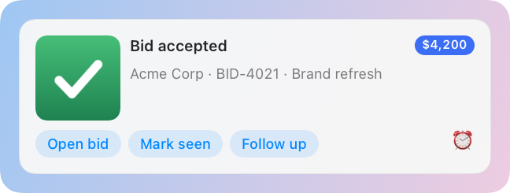
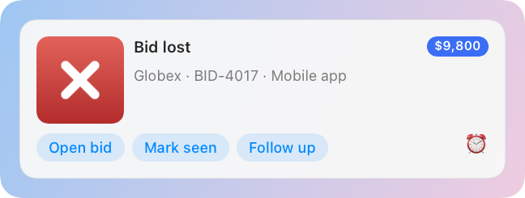
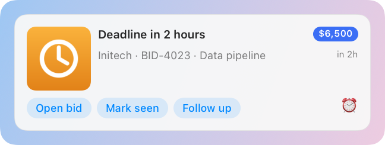

# BidBot: a worked example

BidBot is a small Python script that plays the part of an app Herald knows nothing about. In one run it teaches Herald
everything it needs to show that app's events well, then sends three of them. Follow it from start to finish to see
how an integration is put together: which request does what, and what you see on screen after each one.

## What it shows

1. **Register** the app: its name, icon and default sound.
2. Publish a **manifest**: the fields the app can send, with sample values, and the buttons it offers.
   [The manifest](#2-the-manifest-what-bidbot-can-send) lists the fields.
3. Publish a **default template**, a 3 x 4 grid that the manifest names as its default, so no notification has to ask for it.
4. Send three **events** (bid accepted, bid lost, deadline soon), each with a picture, buttons, a sound and a spoken line.
5. Give the user a button of their own on every banner: a **Shortcut-ready action** that the template owns, not BidBot.
6. Optionally **receive a callback** when someone presses a button.

The script uses only the Python standard library and [`clients/python/herald.py`](../../../clients/python/herald.py)
from this repository. It is registered as the app `example.bidbot`, and only when you run it.

## Before you start

- Herald is running. Its icon is in the menu bar.
- Python 3 is installed, and you are in a checkout of the Herald repository.
- Optional, to keep your own Herald quiet: a [second instance](../../TESTING.md#run-a-second-instance-of-herald) with its own
  support folder. Without one, the script talks to the Herald you use, shows three banners there and speaks the lines.

## Run it

1. Run the script from the repository root:

   ```sh
   python3 docs/examples/bidbot/bidbot_demo.py
   ```

   The script prints one line for each thing it did:

   ```text
   Herald 1.8.1 answers on port 48617
   1. registered 'example.bidbot'
   2. manifest saved: fields bid, amount, client, deadline, url, image
   3. template 'bid-card' saved (3 x 4 grid, default for example.bidbot)
      note: no Shortcut named 'Bid follow-up' yet; the Follow up button is wired and will work once you create one (README, "The Shortcut").
   4. sent accepted -> bid-4021
   4. sent lost     -> bid-4017
   4. sent deadline -> bid-4023
   Done. History: Herald menu > History > BidBot. Remove everything with --cleanup.
   ```

   The `note` line appears only while no Shortcut of that name is installed. The version and port are those of your
   Herald.

2. Look at the corner of the screen. Three banners stack there, each with a chime and a voice line. The voice is the one
   chosen in **Settings > Voice**.

3. Open the Herald menu, choose **History**, and pick BidBot. The three notifications are there, and the speaker button
   on each plays its line again.

### Options

| Flag | What it does |
|---|---|
| `--quiet` | Sends with no chime and no speech: banners only. |
| `--wait SECONDS` | Registers a callback address, adds a **Mark seen** button and serves it for that long, printing what Herald sends back. See [Mark seen](#mark-seen-a-callback). |
| `--delay SECONDS` | Pauses between events. Default `1.5`. |
| `--previews DIR` | Also draws each banner through [`POST /v1/preview`](../../reference/api/templates.md#post-v1preview), light and dark, into `DIR` as PNG files. |
| `--scale N` | The pixel scale of the previews, from `1` to `3`. Default `2`. |
| `--print manifest` or `--print template` | Prints that JSON and exits. Herald does not need to be running. |
| `--cleanup` | Dismisses BidBot's banners and removes its manifest, template and History. |

### Run it against a second instance

Give the script both variables on the same command line. It reads the second instance's `port` and `token` files from
`HERALD_SUPPORT_DIR`, and `HERALD_PORT` overrides the port:

```sh
HERALD_PORT=48715 HERALD_SUPPORT_DIR=/tmp/herald-dev python3 docs/examples/bidbot/bidbot_demo.py --quiet
```

If you set only one, the script talks to the installed Herald, shows the banners there and speaks the lines.

## What you get

The three banners, drawn by the same renderer the live banners use. They come from `POST /v1/preview` with the
command `python3 docs/examples/bidbot/bidbot_demo.py --quiet --scale 1.5 --previews docs/examples/bidbot/screenshots`.







The previews include **Mark seen**, which BidBot sends only while the script is listening (`--wait`). The clock icon at
the right is the snooze menu. Only the deadline banner has the countdown, "in 2h", at the right of its second line. The other
two events send no `deadline`, so that cell is empty and **collapses**: the template's `collapseEmpty` is on, and nothing
reserves room for it.

## How the script works

Each step below is one request. The code is in
[`bidbot_demo.py`](bidbot_demo.py), and every request goes through the
[Python client](../../../clients/README.md#python).

### 1. Register the app

```python
h.register("example.bidbot", appName="BidBot", icon="assets/icon.png",
           defaults={"sound": "Glass", "persistent": True})
```

[`POST /v1/register`](../../reference/api/apps.md#post-v1register) gives the banners BidBot's name and icon and sets the
app's defaults: a sound, and banners that stay until closed. Registering is optional, because the first notification
registers an unknown app, but without it the banners carry a generic icon. With `--wait` the script also passes a
`callbackURL`, the address Herald posts to when a callback button is pressed.

With `--quiet` the default sound is `none`.

### 2. The manifest: what BidBot can send

A manifest tells Herald what an app sends, so the Designer and previews can offer those values before the app has sent
anything. [`PUT /v1/manifest`](../../reference/api/manifests.md#put-v1manifest) replaces the manifest for
`example.bidbot`.

```json
{
  "app": "example.bidbot",
  "appName": "BidBot",
  "icon": "/path/to/icon.png",
  "version": 1,
  "fields": [
    {"key": "title", "type": "text", "required": true, "sample": "Bid accepted"},
    {"key": "bid", "type": "text", "sample": "BID-4021 · Brand refresh"},
    {"key": "amount", "type": "text", "sample": "$4,200"},
    {"key": "client", "type": "text", "sample": "Acme Corp"},
    {"key": "deadline", "type": "date", "sample": "2026-10-02T09:00:00Z"},
    {"key": "url", "type": "url", "sample": "https://example.com/bids/4021"},
    {"key": "image", "type": "image", "sample": "/path/to/won.png"}
  ],
  "actions": [
    {"id": "open", "label": "Open bid", "kind": "url", "url": "{url}"},
    {"id": "seen", "label": "Mark seen", "kind": "callback"}
  ],
  "defaultTemplate": "bid-card"
}
```

| Field | Type | What it holds |
|---|---|---|
| `title` | text, required | The headline: "Bid accepted". |
| `bid` | text | The reference and name: "BID-4021 · Brand refresh". |
| `amount` | text | The amount, already formatted ("$4,200"). The badge shows it as it is. |
| `client` | text | Who the bid is for. |
| `deadline` | date | An ISO 8601 date, shown as a relative time ("in 2h"). |
| `url` | url | The address opened when the banner is clicked and by **Open bid**. |
| `image` | image | A picture for each outcome: a check, a cross, a clock. The script draws them into `assets/`. |

The two `actions` are BidBot's own buttons, and `defaultTemplate` names the template used when a notification names none.
The `sample` values are what the Designer and `POST /v1/preview` with `"data": "sample"` draw. Every field in the table is
a **token** a template can bind as `{amount}`. The [manifest reference](../../reference/manifests.md) lists every manifest
field.

### 3. The default template

A template is the layout of a banner. [`PUT /v1/templates`](../../reference/api/templates.md#put-v1templates) saves
`bid-card`, a grid of 3 rows and 4 columns:

```text
          col 0 (72 pt)   col 1 (fill)              col 2 (fill)   col 3 (auto)
  row 0   image (rows     title (spans cols 1-2)                   amount badge
  row 1   0 and 1)        "client · bid" (spans cols 1-2)          deadline, relative
  row 2   actions: BidBot's buttons, the template's "Follow up", the snooze menu (spans all 4 columns)
```

```json
{
  "name": "bid-card",
  "app": "example.bidbot",
  "layoutVersion": 2,
  "collapseEmpty": true,
  "grid": {"rows": 3, "cols": 4, "rowSizes": ["auto", "auto", "auto"], "colSizes": ["72", "fill", "fill", "auto"], "gap": 8, "padding": 14, "width": 400},
  "cells": [
    {"id": "img", "row": 0, "col": 0, "rowSpan": 2, "align": "topLeading", "component": {"type": "image", "binding": "{image}", "fit": "cover", "cornerRadius": 10, "aspectRatio": 1}},
    {"id": "title", "row": 0, "col": 1, "colSpan": 2, "align": "topLeading", "component": {"type": "text", "binding": "{title}", "style": "title", "maxLines": 2}},
    {"id": "amount", "row": 0, "col": 3, "align": "topTrailing", "component": {"type": "badge", "binding": "{amount}", "color": "#3B6EF5"}},
    {"id": "who", "row": 1, "col": 1, "colSpan": 2, "align": "topLeading", "component": {"type": "text", "binding": "{client} · {bid}", "style": "subtitle", "maxLines": 2}},
    {"id": "due", "row": 1, "col": 3, "align": "topTrailing", "component": {"type": "timestamp", "binding": "{deadline}", "relative": true, "style": "caption"}},
    {"id": "acts", "row": 2, "col": 0, "colSpan": 4, "component": {"type": "actions", "source": "merged", "layout": "row", "maxVisible": 4}}
  ],
  "actionRules": [
    {"add": {"id": "followup", "label": "Follow up", "kind": "shortcut", "shortcut": "Bid follow-up", "input": "{client}: {bid} ({amount})\n{url}"}}
  ],
  "snooze": true,
  "persistent": true
}
```

- `collapseEmpty: true` means a component with nothing to show disappears together with its row or column and its gap.
  The first two events have no `deadline`, so they have no timestamp. Set `"collapseEmpty": false`, or
  `"emptyBehavior": "keep"` on one component, to hold the space instead.
- The `actions` component shows the **merged** list: BidBot's buttons first, then what the template adds. `layout: "row"`
  keeps them on one line and puts any that do not fit behind a "+N" menu, and `maxVisible` caps the count.
- `snooze: true` adds the clock menu to every banner, whoever sent it.
- `actionRules` adds a button the template owns. [The Shortcut](#the-shortcut) explains it.

The cells, the grid and the rules are described in the [grid and layout reference](../../reference/grid-and-layout.md).

### 4. The events

Each event is one [`POST /v1/notify`](../../reference/api/notifications.md#post-v1notify). The manifest's fields ride at
the top level, next to the usual keys:

```python
h.notify("example.bidbot", "Bid accepted",
         id="bid-4021",                          # a later event with this id replaces the banner in place
         bid="BID-4021 · Brand refresh", amount="$4,200", client="Acme Corp",
         url="https://example.com/bids/4021",
         image="/path/to/won.png",
         priority="high", sound="Glass",
         buttons=[{"label": "Open bid", "url": "https://example.com/bids/4021"}],
         speak={"text": "Bid accepted. Acme Corp signed off on forty two hundred dollars.", "speed": 1.05})
```

| Field | What it does here |
|---|---|
| `id` | Names the banner. Send "Deadline in 2 hours" for `bid-4021`, then "Bid accepted" with the same id, and the second banner replaces the first. |
| `bid`, `amount`, `client`, `url`, `image` | The manifest's fields. Any key that is not one of Herald's own lands in `metadata`, and bindings read both. |
| `priority` | `high` for the accepted and deadline events, `normal` for the lost one. |
| `sound` | `Glass`, `Basso` and `Ping` for the three events. `none` with `--quiet`. |
| `buttons` | BidBot's own buttons: **Open bid** opens the URL. |
| `speak` | Makes Herald say the line. The text also lands in History. Leave it out for a silent event. `--quiet` leaves it out. |

The deadline event also sends `deadline`, two hours ahead of when the script runs. Speech follows **Settings > Voice**,
and quiet hours and the mute switch apply. See [Voice](../../reference/voice.md) for the `speak` field.

### The Shortcut

The template, not BidBot, adds one more button through an `actionRules` entry. It exists on every BidBot banner and BidBot
never has to know:

```json
{"add": {"id": "followup", "label": "Follow up", "kind": "shortcut", "shortcut": "Bid follow-up",
         "input": "{client}: {bid} ({amount})\n{url}"}}
```

Pressing **Follow up** runs the shortcut named `Bid follow-up` with the filled-in `input` as text. For the first event
that text is `Acme Corp: BID-4021 · Brand refresh ($4,200)` and the bid address on a second line. If you drop `input`, the
shortcut receives the whole notification as JSON.

To make the button do something:

1. Open **Shortcuts.app** and create a shortcut named exactly **Bid follow-up**.
2. Let it accept text input: open its details and enable it as a Quick Action or Share Sheet shortcut that receives text.
   **Shortcut Input** then holds the line Herald sends.
3. Add the actions you want, such as **Add New Reminder** with Shortcut Input as the title, **Create Note** or **Send Message**.

The first time you press the button, Herald shows the shortcut's name and the exact input and asks you to confirm. It asks
again if either changes. Nothing runs on delivery, only when you press. See
[Apple Shortcuts](../../ACTIONS.md). The script lists installed shortcuts with
[`GET /v1/shortcuts`](../../reference/api/templates.md#get-v1shortcuts) and prints the `note` line above while yours is missing.

### Mark seen: a callback

```sh
python3 docs/examples/bidbot/bidbot_demo.py --wait 60
```

The script starts a small server on a loopback port, registers its address as `callbackURL`, and adds a **Mark seen**
button to each banner:

```json
{"label": "Mark seen", "callback": {"payload": {"bid": "bid-4021"}}}
```

Press it. Herald posts a JSON object with `notificationId`, `app`, `action` and `payload` to that server, the script
prints it, and the script answers `200`. A `2xx` answer tells Herald the action happened, so the banner goes away. The
console shows a line like this:

```text
  callback: 'Mark seen' on bid-4021 payload={"bid": "bid-4021"}
```

The request Herald sends is described in [the callback request](../../reference/api/replies.md#callback-request).

## Try changing it

- Open **Design Template** from the Herald menu, pick BidBot's `bid-card`, and change the grid: move the badge, swap the
  amount for a `progress` bar, add an `iconButton`. The manifest's samples fill the preview. An agent can do the same through
  the [MCP server](../../MCP.md) with `get_manifest`, `put_template` and `render_preview`.
- Add `{"match": "seen", "hide": true}` to `actionRules` to hide **Mark seen** without touching BidBot.
- Turn off **Speak** for BidBot under **Settings > Voice > Speak per app**. The events still arrive, silently.

## Files and cleanup

| File | What it holds |
|---|---|
| `bidbot_demo.py` | The script. |
| `assets/` | The four pictures it draws itself (`won`, `lost`, `deadline`, `icon`). They are recreated if missing. |
| `screenshots/` | The light and dark renders shown above. |

Run `python3 docs/examples/bidbot/bidbot_demo.py --cleanup` when you are done. It dismisses BidBot's banners and removes
its manifest, template and History. The app itself stays under **Settings > Apps** until you remove it there, or with
[`DELETE /v1/apps/{id}`](../../reference/api/apps.md#delete-v1appsid) (the MCP tool
[`delete_app`](../../reference/mcp/apps-and-settings.md#delete_app)), which also removes its History, template and manifest.

## Related

- [Python client](../../../clients/README.md#python): the module the script uses.
- [Manifests](../../reference/manifests.md): every manifest field.
- [Templates](../../TEMPLATES.md) and [Designing a banner](../../AUTHORING.md): change `bid-card` in the Designer.
- [Actions](../../ACTIONS.md): buttons, callbacks and Shortcuts.
- [Testing](../../TESTING.md): run the example on a second instance of Herald.
