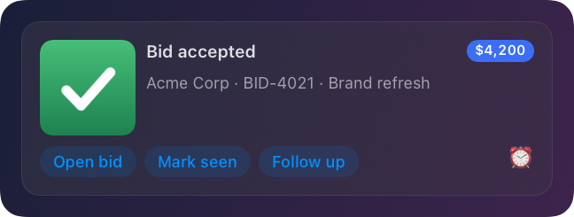
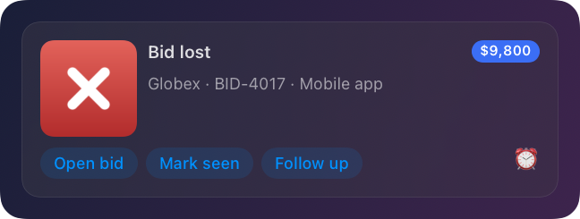
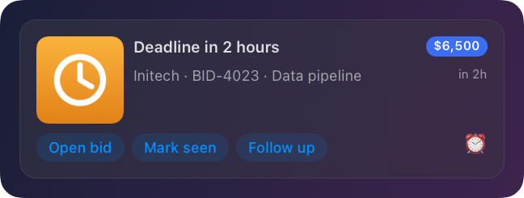

# BidBot: a worked example

A small Python script that plays the part of an app Herald knows nothing about, and teaches Herald everything it
needs to show that app's events well. It is the whole 1.1 story in one file you can run:

- **Register** the app (name, icon, default sound).
- Publish a **manifest**: the fields it can send (`bid`, `amount`, `client`, `deadline`, `url`, `image`), with sample
  values, and the buttons it offers.
- Publish a **default template**, a 3 x 4 grid that the manifest names as its default, so no notification has to ask for it.
- Send three **events** (bid accepted, bid lost, deadline soon), each with a picture, buttons, a sound and a **spoken
  line**.
- Give the user their own button on every banner: a **Shortcut-ready action**, owned by the template, not by BidBot.

Standard library only; the script uses [`clients/python/herald.py`](../../../clients/python/herald.py) from this repository.

## Run it

Herald 1.1 or later has to be running (the bell in the menu bar).

```sh
python3 docs/examples/bidbot/bidbot_demo.py
```

```
Herald 1.1.0 answers on port 48617
1. registered 'bidbot'
2. manifest saved: fields bid, amount, client, deadline, url, image
3. template 'bid-card' saved (3 x 4 grid, default for bidbot)
   note: no Shortcut named 'Bid follow-up' yet; the Follow up button is wired and will work once you create one (README, "The Shortcut").
4. sent accepted -> bid-4021
4. sent lost     -> bid-4017
4. sent deadline -> bid-4023
Done. History: Herald menu > History > BidBot. Remove everything with --cleanup.
```

Three banners stack in the corner of the screen, each with a chime and a voice line (Settings > Voice sets the engine;
the macOS system voice is the default).

| Flag | Effect |
|---|---|
| `--quiet` | No chime, no speech: banners only. |
| `--wait SECONDS` | Serve the **Mark seen** callback for that long and print what Herald sends back (see "Mark seen"). |
| `--delay SECONDS` | Pause between events (default 1.5). |
| `--previews DIR` | Also render each banner through `POST /v1/preview`, light and dark, into `DIR` as PNGs. `--scale 1` to `3` sets the pixel scale. |
| `--print manifest\|template` | Print that JSON and exit; Herald does not need to be running. |
| `--cleanup` | Dismiss BidBot's banners and remove its manifest, template and history. |

To try it on a development build without touching your installed Herald, give the script the same variables the CLI
reads: `HERALD_PORT=48715 HERALD_SUPPORT_DIR=/tmp/herald-dev python3 docs/examples/bidbot/bidbot_demo.py --quiet`.
**Always set both on the same command line.** Without them the script talks to whatever Herald is installed, shows the
banners and speaks the lines.

## What you get

Light and dark, drawn by the same `GridBannerView` the live banners use (these PNGs come from `POST /v1/preview` on a
Debug build: `python3 docs/examples/bidbot/bidbot_demo.py --quiet --scale 1.5 --previews docs/examples/bidbot/screenshots`):

| | Light | Dark |
|---|---|---|
| **Bid accepted** |  |  |
| **Bid lost** |  |  |
| **Deadline soon** |  |  |

The previews include **Mark seen**, which BidBot only sends while the script is listening (`--wait`); the clock icon at
the right is the snooze menu. The deadline banner has a "in 2h" countdown at the right of its second line. The other
two have no `deadline`, so that cell is empty and **collapses** (the template's `collapseEmpty` is on): nothing
reserves room for it.

## How it works

### 1. Register the app

```python
h.register("bidbot", appName="BidBot", icon="assets/icon.png", defaults={"sound": "Glass", "persistent": True})
```

`POST /v1/register`. Optional (the first notification registers an app implicitly), but this gives the banners BidBot's
name and icon. With `--wait` it also passes a `callbackURL`, the address Herald POSTs to when a callback button is pressed.

### 2. The manifest: what BidBot can send

`PUT /v1/manifest` replaces the manifest for `bidbot`; Herald stores it at `~/Library/Application Support/Herald/manifests/bidbot.json`.

```json
{
  "app": "bidbot",
  "appName": "BidBot",
  "icon": "/path/to/icon.png",
  "version": 1,
  "fields": [
    {"key": "title", "type": "text", "required": true, "sample": "Bid accepted"},
    {"key": "bid", "type": "text", "sample": "BID-4021 · Brand refresh"},
    {"key": "amount", "type": "text", "sample": "$4,200"},
    {"key": "client", "type": "text", "sample": "Acme Corp"},
    {"key": "deadline", "type": "date", "sample": "2026-10-02T09:00:00Z"},
    {"key": "url", "type": "url", "sample": "https://example.com/bids/4021"},
    {"key": "image", "type": "image", "sample": "/path/to/won.png"}
  ],
  "actions": [{"id": "open", "label": "Open bid", "kind": "url", "url": "{url}"}, {"id": "seen", "label": "Mark seen", "kind": "callback"}],
  "defaultTemplate": "bid-card"
}
```

| Field | Type | Where it goes |
|---|---|---|
| `title` | text, required | the headline: "Bid accepted" |
| `bid` | text | reference and name: "BID-4021 · Brand refresh" |
| `amount` | text | already formatted ("$4,200"); the badge shows it as is |
| `client` | text | who the bid is for |
| `deadline` | date | ISO 8601; bound to a **relative** timestamp ("in 2h") |
| `url` | url | opened when the banner is clicked, and by **Open bid** |
| `image` | image | a picture per outcome: a check, a cross, a clock (the script draws them, see `assets/`) |

The notification sends these as **top-level keys** (anything that is not one of Herald's own keys lands in `metadata`,
and bindings read both). `sample` values are what the Designer and `POST /v1/preview` with `"data": "sample"` draw, so
the user can design a template before BidBot has sent a single event. The two `actions` are BidBot's own buttons;
`defaultTemplate` is the template used when a notification names none.

### 3. The default template

`PUT /v1/templates`, stored at `~/Library/Application Support/Herald/templates/bidbot/bid-card.json`. A 3 x 4 grid:

```
            col 0 (72 pt)    col 1 (fill)             col 2 (fill)          col 3 (auto)
  row 0     image  (rows    title (spans cols 1-2)                          amount badge
  row 1     0 and 1)        "client · bid" (spans cols 1-2)                 deadline, relative
  row 2     actions: BidBot's buttons, the template's "Follow up", the snooze menu (spans all 4 columns)
```

```json
{
  "name": "bid-card",
  "app": "bidbot",
  "layoutVersion": 2,
  "collapseEmpty": true,
  "grid": {"rows": 3, "cols": 4, "rowSizes": ["auto", "auto", "auto"], "colSizes": ["72", "fill", "fill", "auto"], "gap": 8, "padding": 14, "width": 400},
  "cells": [
    {"id": "img", "row": 0, "col": 0, "rowSpan": 2, "align": "topLeading", "component": {"type": "image", "binding": "{image}", "fit": "cover", "cornerRadius": 10, "aspectRatio": 1}},
    {"id": "title", "row": 0, "col": 1, "colSpan": 2, "align": "topLeading", "component": {"type": "text", "binding": "{title}", "style": "title", "maxLines": 2}},
    {"id": "amount", "row": 0, "col": 3, "align": "topTrailing", "component": {"type": "badge", "binding": "{amount}", "color": "#3B6EF5"}},
    {"id": "who", "row": 1, "col": 1, "colSpan": 2, "align": "topLeading", "component": {"type": "text", "binding": "{client} · {bid}", "style": "subtitle", "maxLines": 2}},
    {"id": "due", "row": 1, "col": 3, "align": "topTrailing", "component": {"type": "timestamp", "binding": "{deadline}", "relative": true, "style": "caption"}},
    {"id": "acts", "row": 2, "col": 0, "colSpan": 4, "component": {"type": "actions", "source": "merged", "layout": "row", "maxVisible": 4}}
  ],
  "actionRules": [{"add": {"id": "followup", "label": "Follow up", "kind": "shortcut", "shortcut": "Bid follow-up", "input": "{client}: {bid} ({amount})\n{url}"}}],
  "snooze": true,
  "persistent": true
}
```

- `collapseEmpty: true` means a component with nothing to show disappears together with its row or column, and its gap.
  Try the three events: the first two have no `deadline`, so there is no timestamp. Set `"collapseEmpty": false` (or
  `"emptyBehavior": "keep"` on one component) to hold the space instead.
- The `actions` component shows the **merged** list: BidBot's buttons first, then what the template adds. `layout: "row"`
  keeps them on one line and puts any that do not fit behind a "+N" menu; `maxVisible` caps the count.
- `snooze: true` adds the clock menu to every banner, whoever sent it.

### 4. The events

Each event is one `POST /v1/notify`. The fields ride at the top level, next to the usual keys:

```python
h.notify("bidbot", "Bid accepted",
         id="bid-4021",                                   # a later event with this id replaces the banner in place
         bid="BID-4021 \u00b7 Brand refresh", amount="$4,200", client="Acme Corp",
         url="https://example.com/bids/4021",
         image="/path/to/won.png",
         priority="high", sound="Glass",
         buttons=[{"label": "Open bid", "url": "https://example.com/bids/4021"}],
         speak={"text": "Bid accepted. Acme Corp signed off on forty two hundred dollars.", "speed": 1.05})
```

- **`speak`** makes Herald say the line (Settings > Voice: Kokoro, the system voice, or off; quiet hours and the mute
  switch apply). The text also lands in History, where the speaker button replays it. Leave it out for a silent event.
- **`buttons`** are BidBot's: `Open bid` opens the URL. The names match the manifest's actions, so a template rule can
  address them by id (`open`, `seen`).
- **`id`** is how a story updates: send "Deadline in 2 hours" for `bid-4021`, then "Bid accepted" with the same id, and
  the second banner replaces the first.
- The deadline event adds `deadline="2026-10-01T21:21:00Z"` (two hours ahead of when the script runs).

### 5. The Shortcut

The template (not BidBot) adds one more button through an `actionRules` entry, so it exists on every BidBot banner and
BidBot never has to know:

```json
{"add": {"id": "followup", "label": "Follow up", "kind": "shortcut", "shortcut": "Bid follow-up",
         "input": "{client}: {bid} ({amount})\n{url}"}}
```

Pressing **Follow up** runs `shortcuts run "Bid follow-up"` with the filled-in `input` as text, for example
`Acme Corp: BID-4021 · Brand refresh ($4,200)` and the bid URL on a second line. To make it do something:

1. Open **Shortcuts.app** and create a shortcut named exactly **Bid follow-up**.
2. Let it accept text input (open its details and enable it as a Quick Action or Share Sheet shortcut that receives text), so
   **Shortcut Input** holds the line Herald sends.
3. Add the actions you want, for instance **Add New Reminder** with *Shortcut Input* as the title, or **Create Note**,
   or **Send Message**.

The first time you press the button Herald shows the shortcut's name and the exact input and asks you to confirm; it asks
again if either changes (see [ACTIONS.md](../../ACTIONS.md#apple-shortcuts)). Nothing runs on delivery, only when you
press. If you drop the `input` line, the shortcut receives the whole notification as JSON instead.
The script prints a note while no shortcut of that name is installed (`GET /v1/shortcuts`).

### 6. Mark seen (two-way)

```sh
python3 docs/examples/bidbot/bidbot_demo.py --wait 60
```

The script starts a loopback server, registers its address as `callbackURL` and adds a **Mark seen** button
(`{"label": "Mark seen", "callback": {"payload": {"bid": "bid-4021"}}}`) to each banner. Pressing it makes Herald POST
`{"notificationId", "app", "action", "payload"}` to that server; the script prints it and answers `200`, which tells
Herald the action happened, so the banner goes away.

## Ideas to try

- Open **Design Template** in Herald, pick BidBot's `bid-card`, and change the grid: move the badge, swap the amount for
  a `progress` bar, add an `iconButton`. The samples from the manifest fill the preview. Or ask an agent to do it
  through the MCP (`get_manifest`, `put_template`, `render_preview`, see [MCP.md](../../MCP.md)).
- Add `{"match": "seen", "hide": true}` to `actionRules` to hide **Mark seen** from the banner without touching BidBot.
- Turn off **Speak** for BidBot in Settings > Voice > Speak per app: the events still arrive, silently.

## Files

| File | |
|---|---|
| `bidbot_demo.py` | the script |
| `assets/` | the four pictures it draws itself (`won`, `lost`, `deadline`, `icon`); recreated if missing |
| `screenshots/` | the light and dark renders above |

Run `python3 docs/examples/bidbot/bidbot_demo.py --cleanup` when you are done. (An app cannot be removed through the
API, so "BidBot" stays in Settings > Apps until you delete it there.)
