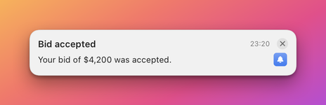
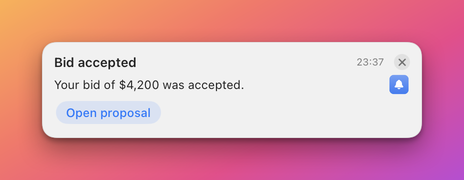

# Send your first notification

By the end of this page you will have shown a banner on your Mac, given it a button, changed it in place, and
dismissed it, first with curl and then with the `herald` command line tool, Python, Node and Swift. It is for anyone
who wants an app or a script to put a notification on screen.

## Before you start

- Herald is installed and running, so the bell is in the menu bar. See [Install Herald](install.md).
- You have a terminal.

The examples use a made-up app called BidBot, with the app id `example.bidbot`. You choose the id of your own app. Herald
registers an id the first time it sees it, so there is nothing to set up first.

## Steps

### Send a banner with curl

1. Define `$HERALD` and `$TOKEN`. `$HERALD` is the address of Herald's local API and `$TOKEN` is the secret that proves the
   caller runs as you. Both come from files in Herald's support folder. [Connect](reference/api/README.md#connect)
   explains them.

   ```sh
   D="$HOME/Library/Application Support/Herald"
   HERALD="http://127.0.0.1:$(cat "$D/port")"
   TOKEN="$(cat "$D/token")"
   ```

   The shell prints nothing.

2. Check that Herald answers. This one request needs no token.

   ```sh
   curl -s "$HERALD/v1/health"
   ```

   ```json
   {"ok": true, "pid": 4821, "version": "1.8.1"}
   ```

   `"ok": true` means Herald is running and the port is right.

3. Send a notification. `app` and `title` are required. `id` is yours to choose and lets you update or dismiss this banner
   later.

   ```sh
   curl -s -X POST "$HERALD/v1/notify" \
     -H "Authorization: Bearer $TOKEN" -H "Content-Type: application/json" \
     -d '{"app":"example.bidbot","id":"bid-42","title":"Bid accepted","body":"Your bid of $4,200 was accepted."}'
   ```

   ```json
   {"ok": true, "id": "bid-42"}
   ```

   A banner slides in at the top right of your screen and stays until you close it.

   

4. Add a button. A button is an entry in `buttons`. This one opens a web page when you press it. Sending the same `id`
   again replaces the banner that is on screen.

   ```sh
   curl -s -X POST "$HERALD/v1/notify" \
     -H "Authorization: Bearer $TOKEN" -H "Content-Type: application/json" \
     -d '{"app":"example.bidbot","id":"bid-42","title":"Bid accepted","body":"Your bid of $4,200 was accepted.",
          "buttons":[{"label":"Open proposal","url":"https://example.com/bids/42"}]}'
   ```

   The banner changes in place and now shows an **Open proposal** button. Pressing it opens the page in your browser and
   closes the banner.

   

5. Update the banner with new content, using the same `id`. Updating in place is how you show progress or a changing count
   without piling up banners.

   ```sh
   curl -s -X POST "$HERALD/v1/notify" \
     -H "Authorization: Bearer $TOKEN" -H "Content-Type: application/json" \
     -d '{"app":"example.bidbot","id":"bid-42","title":"Bid signed","body":"The contract for $4,200 is signed."}'
   ```

   The text changes and no second banner appears.

6. Dismiss the banner from code. Use this when the event behind a banner is over.

   ```sh
   curl -s -X POST "$HERALD/v1/dismiss" \
     -H "Authorization: Bearer $TOKEN" -H "Content-Type: application/json" \
     -d '{"app":"example.bidbot","id":"bid-42"}'
   ```

   ```json
   {"ok": true}
   ```

   The banner leaves the screen. The notification stays in History: choose **History...** in the bell menu to see it.

### Do the same with the command line tool

The `herald` tool reads the port and token itself, so the variables are not needed. Install it first with
[Install Herald](install.md#install-the-command-line-tool).

```sh
herald notify --app example.bidbot --id bid-42 --title "Bid accepted" \
  --body "Your bid of \$4,200 was accepted." --button "Open proposal=https://example.com/bids/42"
```

```text
{
  "id" : "bid-42",
  "ok" : true
}
```

Update it by running the command again with the same `--id`, and dismiss it with a second command.

```sh
herald dismiss --app example.bidbot --id bid-42
```

If Herald is not running, the tool prints `Herald is not running. Launch Herald.app first.` and exits with status `2`.
[Command line](reference/cli.md) lists every command.

### Do the same from Python

Copy `clients/python/herald.py` next to your script. It uses only the standard library.

```python
from herald import Herald, HeraldUnavailable

h = Herald()
try:
    h.notify("example.bidbot", "Bid accepted", id="bid-42",
             body="Your bid of $4,200 was accepted.",
             buttons=[{"label": "Open proposal", "url": "https://example.com/bids/42"}])
    h.notify("example.bidbot", "Bid signed", id="bid-42", body="The contract is signed.")
    h.dismiss("example.bidbot", "bid-42")
except HeraldUnavailable:
    print("Herald is not running")
```

### Do the same from Node

Copy `clients/node/herald.js` next to your script. It needs Node 18 or later and has no dependencies.

```js
const { Herald, HeraldUnavailable } = require('./herald');

(async () => {
  const h = new Herald();
  try {
    await h.notify('example.bidbot', 'Bid accepted', {
      id: 'bid-42',
      body: 'Your bid of $4,200 was accepted.',
      buttons: [{ label: 'Open proposal', url: 'https://example.com/bids/42' }],
    });
    await h.notify('example.bidbot', 'Bid signed', { id: 'bid-42', body: 'The contract is signed.' });
    await h.dismiss('example.bidbot', 'bid-42');
  } catch (e) {
    if (e instanceof HeraldUnavailable) console.log('Herald is not running');
    else throw e;
  }
})();
```

### Do the same from Swift

Add this repository as a Swift package dependency and use the `HeraldClient` product. It has no dependencies of its own.

```swift
import HeraldClient

let herald = HeraldClient.shared
if herald.isAvailable {
    _ = try await herald.notify(HeraldNotification(
        app: "example.bidbot", id: "bid-42", title: "Bid accepted",
        body: "Your bid of $4,200 was accepted.",
        buttons: [HeraldButton(label: "Open proposal", url: "https://example.com/bids/42")]))
    try await herald.dismiss(app: "example.bidbot", id: "bid-42")
}
```

`HeraldCallbackServer` receives the callback of a button that calls your app back. [Clients](../clients/README.md)
documents all three libraries.

## Check that it works

Open **History...** from the bell menu. `example.bidbot` is in the list on the left with its notification, whether you sent it from
curl or from code. The line under the notification says how it left the screen, for example **Dismissed** or **Used Open proposal**.

## If it does not work

| Symptom | Cause | Fix |
|---|---|---|
| `curl: (7) Failed to connect`. | Herald is not running, or `$HERALD` holds an old port. | Open Herald and run step 1 again. |
| `{"error":"unauthorized"}`. | `$TOKEN` is empty or out of date. | Run step 1 again. The token file is read once per shell. |
| `{"error":"missing field: title"}`. | The request has no `title` and names no template. | Add `title`. The reply names any other missing field the same way. |
| `{"ok": true}` but no banner. | The app's banners are muted, or quiet hours silence banners. | Open **Settings > Apps**, select the app and turn off **Mute banners**. See [Troubleshooting](troubleshooting.md). |
| The button does nothing. | Only `http`, `https` and `mailto` links open. Another scheme is refused and the banner shows "Action failed". | Use an `https` link. |

## Next steps

- [Design a banner](AUTHORING.md): lay out your own banner in the Designer.
- [Buttons and actions](ACTIONS.md): run commands, call your app back, ask for a reply.
- [The Herald app](APP.md): the menu, History and Settings.
- [How banners behave](reference/banners.md): what a click, a timeout and a stack do.
- [Notifications API](reference/api/notifications.md): every field a notification can carry.
- [Agent quick start](AGENT-QUICKSTART.md): let an AI agent send notifications.

## Related

- [Integrate Herald into your app](integrate.md): the starting page for an app developer.
- [Install Herald](install.md)
- [HTTP API](reference/api/README.md)
- [Clients](../clients/README.md)
