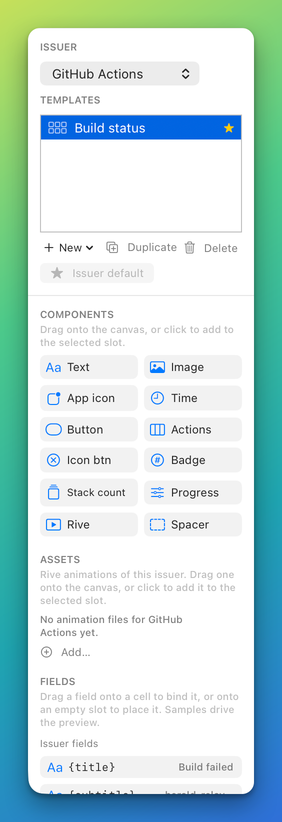
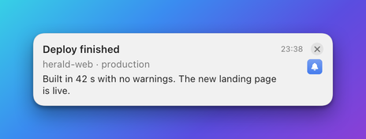
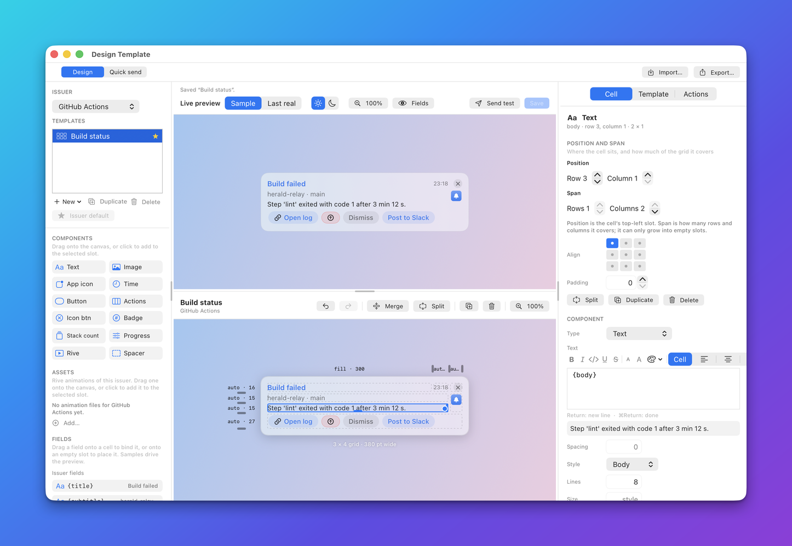
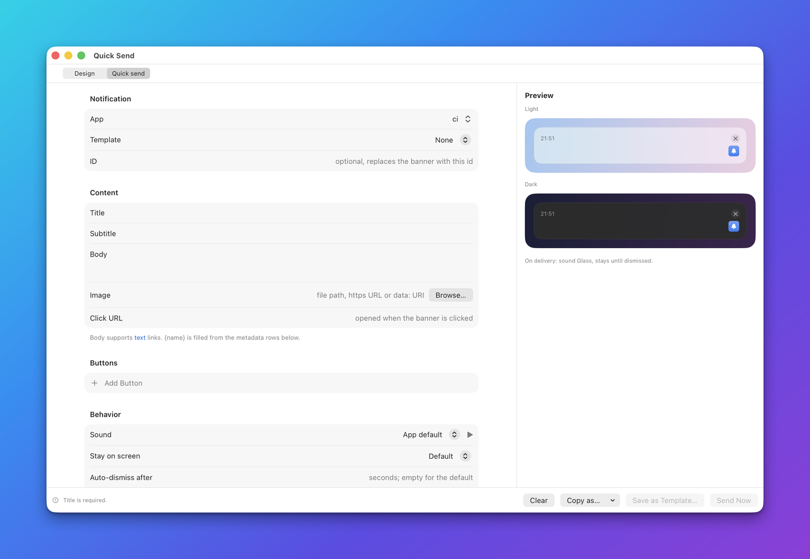

# Integrate Herald into your app

This is the starting page for a developer who wants a Mac app or a script to put its notifications on screen through
Herald. By the end you will have an app that finds Herald, registers a manifest, sends notifications with buttons,
reads the answers and ships a default look, and a list of what to check before you release it.

Integration here means one thing: your app posts JSON to Herald's local API on this Mac. Herald draws the banner. The
user designs how it looks in the Designer, with your app's fields and buttons in the palette. There is nothing to
embed, no framework to link and no notification permission to ask for. Herald is a separate app that the user installs,
so your app has to cope with Herald being absent.

## Before you start

- Herald is installed and running on the Mac you test on, so the bell is in the menu bar. See [Install Herald](install.md).
- You choose an app id for your app, such as `example.bidbot`. Herald registers an id the first time it sees it.
- You can make an HTTP request to `127.0.0.1`, with curl or from Swift, Python or Node. The
  [clients](../clients/README.md) wrap the requests for you.

## Steps

### Step 1: find Herald

Herald listens on the loopback address only. It writes its port and its bearer token to two files in its support
folder, and your app reads them each time it starts. The token proves the caller runs as the same user.

| File | Holds |
|---|---|
| `~/Library/Application Support/Herald/port` | The port Herald listens on. The default is `48617`. |
| `~/Library/Application Support/Herald/token` | The bearer token for every request except `GET /v1/health`. |

Read them again after an error. The user can change the port in **Settings > General**, and the token can be
regenerated, so never copy either value into your own settings.


Each client does the same lookup:

| Client | How it finds Herald | Check before use |
|---|---|---|
| Swift `HeraldClient.shared` | Reads both files from the default support folder. | `isAvailable` |
| Python `Herald()` | Reads both files on each call, so a new token is picked up. | `is_available()` |
| Node `new Herald()` | Reads both files on each call. | `await isAvailable()` |
| curl and shell | You read the files, as in [Connect](reference/api/README.md#connect). | `GET /v1/health` |

Setting the environment variable `HERALD_SUPPORT_DIR` points the Swift client and the `herald` tool at another support
folder, which is how you develop against a [second instance](TESTING.md#run-a-second-instance-of-herald).

**Detect that Herald is not installed or not running.** Three cases look the same from your app, and one check
covers them:

- Herald was never installed: the files do not exist.
- Herald is installed but quit: the files may remain, but nothing answers on the port.
- The token is wrong: Herald answers `401`.

[`GET /v1/health`](reference/api/diagnostics.md#get-v1health) needs no token and answers
`{"ok": true, "pid": 4821, "version": "1.8.1"}` when Herald is up.

**The clients do not fall back.** When Herald is missing, the Swift client throws `HeraldError.notRunning`, the Python
client raises `HeraldUnavailable` and the Node client rejects with `HeraldUnavailable`. None of them shows a notification
by itself. Decide in your app what the user sees instead. A short fallback in Swift sends an ordinary Apple
notification:

```swift
import HeraldClient
import UserNotifications

func notify(title: String, body: String) async {
    do {
        guard HeraldClient.shared.isAvailable else { throw HeraldError.notRunning }
        _ = try await HeraldClient.shared.notify(
            HeraldNotification(app: "example.bidbot", title: title, body: body))
    } catch {
        let center = UNUserNotificationCenter.current()
        _ = try? await center.requestAuthorization(options: [.alert, .sound])
        let content = UNMutableNotificationContent()
        content.title = title
        content.body = body
        try? await center.add(UNNotificationRequest(
            identifier: UUID().uuidString, content: content, trigger: nil))
    }
}
```

The fallback has no buttons that call back and no custom design. Keep it for plain text.

### Step 2: register your app and its manifest

A manifest is what your app tells Herald about itself: the fields it sends, the buttons it offers and the files it
ships. Without one Herald still shows every notification. With one, the Designer lists your fields in its palette,
fills the preview with your sample values, warns when a template binds something you never send, and offers your
buttons by name. Send it every time your app starts: it is one request, and it keeps Herald in step with your code.



Registration and the manifest are separate. [Registering the app](reference/api/apps.md#post-v1register) carries the
app's name, icon, callback address and command request. [Saving the manifest](reference/api/manifests.md#put-v1manifest)
carries the fields, actions, assets and default template. Both are optional, and a registration wins over the manifest
for the name and icon.

| Manifest field | What it is for |
|---|---|
| `app` | Required. The app id you send notifications with. |
| `appName`, `icon` | The name and icon on banners, in History and in Settings. |
| `fields` | The values you send, each with a `key`, a `type` and a `sample`. The key is the token a template binds. |
| `actions` | Buttons you offer by id, such as `accept`. A notification names them with `actionIds`. |
| `assets` | Rive files your template uses. Herald copies them in. |
| `defaultTemplate` | The template used when a notification names none. |
| `appBundleId`, `appPath` | Which application an `openApp` button brings to the front. |

Every field, limit and rule is in the [manifest reference](reference/manifests.md).

**A minimal valid manifest**

```json
{"app": "example.bidbot"}
```

**A realistic manifest**

```json
{
  "app": "example.bidbot",
  "appName": "BidBot",
  "version": 3,
  "defaultTemplate": "bid-update",
  "appBundleId": "com.example.bidbot",
  "fields": [
    {"key": "title", "type": "text", "required": true, "sample": "Bid accepted"},
    {"key": "customer", "type": "text", "sample": "Acme"},
    {"key": "amount", "type": "number", "sample": 4200},
    {"key": "link", "type": "url", "sample": "https://example.com/bids/42"}
  ],
  "actions": [
    {"id": "accept", "label": "Accept", "kind": "callback"},
    {"id": "decline", "label": "Decline", "kind": "callback", "style": "destructive"},
    {"id": "open-link", "label": "Open bid", "kind": "url", "url": "{link}"}
  ]
}
```

Send it with curl:

```sh
D="$HOME/Library/Application Support/Herald"
HERALD="http://127.0.0.1:$(cat "$D/port")"
TOKEN="$(cat "$D/token")"

curl -s -X PUT "$HERALD/v1/manifest" \
  -H "Authorization: Bearer $TOKEN" -H "Content-Type: application/json" \
  -d '{"app":"example.bidbot","appName":"BidBot","fields":[{"key":"title","sample":"Bid accepted"}]}'
```

```json
{"ok": true}
```

In Swift, decode the manifest and call `putManifest`. The Python and Node clients have no manifest function, so they
call the route directly. Both are shown in [Registering a manifest](../clients/README.md#registering-a-manifest).

### Step 3: send a notification

`app` and `title` are the only required fields. Everything else is optional, and a top-level key that is not a known
field is kept as a template field you declared in the manifest.

**A minimal notification**

```sh
curl -s -X POST "$HERALD/v1/notify" \
  -H "Authorization: Bearer $TOKEN" -H "Content-Type: application/json" \
  -d '{"app":"example.bidbot","title":"Bid accepted"}'
```

```json
{"ok": true, "id": "4F2B7C1E-0D55-4B2E-9B5C-1A7E6D0C8F31"}
```

A banner slides in at the top right of the screen and stays until the user closes it.



**A realistic notification**

Four ideas matter for a real app:

- **Ids and updating.** Your `id` names the banner. Sending the same `id` again replaces the banner in place, so a
  progress value or a count never piles up banners. Herald makes an id when you send none. Use a stable id for the
  thing the banner is about (`bid-42`), and the same id to dismiss it.
- **Grouping.** `group` stacks the banners of one app that share a key into one folded banner with a count.
- **Persistence.** `persistent: true` keeps the banner until it is dismissed. Without it the app's own setting applies,
  and `timeout` closes the banner after that many seconds.
- **Speech.** `speak: true` says the title and body aloud, and `presentation: "voice"` speaks without a banner. The Swift `HeraldNotification` has no speech field, so send `speak` with `notify(payload:)`, the Python or Node client, or curl.

Swift:

```swift
import HeraldClient

let id = try await HeraldClient.shared.notify(HeraldNotification(
    app: "example.bidbot", id: "bid-42", title: "Counter-offer from Acme",
    subtitle: "Bid 42", body: "They offer $3,900. Accept?",
    persistent: true, actionIds: ["accept", "decline"], group: "acme"))
```

Python:

```python
from herald import Herald

Herald().notify("example.bidbot", "Counter-offer from Acme", id="bid-42",
                subtitle="Bid 42", body="They offer $3,900. Accept?",
                persistent=True, group="acme", actionIds=["accept", "decline"])
```

Node:

```js
const { Herald } = require('./herald');

await new Herald().notify('example.bidbot', 'Counter-offer from Acme', {
  id: 'bid-42', subtitle: 'Bid 42', body: 'They offer $3,900. Accept?',
  persistent: true, group: 'acme', actionIds: ['accept', 'decline'],
});
```

curl:

```sh
curl -s -X POST "$HERALD/v1/notify" \
  -H "Authorization: Bearer $TOKEN" -H "Content-Type: application/json" \
  -d '{"app":"example.bidbot","id":"bid-42","title":"Counter-offer from Acme",
       "subtitle":"Bid 42","body":"They offer $3,900. Accept?",
       "persistent":true,"group":"acme","actionIds":["accept","decline"],"speak":true}'
```

The fields, limits and errors are in [`POST /v1/notify`](reference/api/notifications.md#post-v1notify). Banner timing,
stacking and quiet hours are explained in [How banners behave](reference/banners.md), [Stacking](reference/stacking.md)
and [Quiet hours](reference/quiet-hours.md).

### Step 4: add buttons

A button has a label and one thing it does. Send buttons in full in `buttons`, or declare them in the manifest and name
them with `actionIds`.


| Kind | What a press does | Needs |
|---|---|---|
| `url` | Opens a link in the browser and closes the banner. | Nothing. Only `http`, `https` and `mailto` open. |
| `callback` | Sends a request to your app and closes the banner when your app answers `2xx`. | A callback address. |
| `openApp` | Brings an application to the front. | `appBundleId` or `appPath`, or the button names one. |
| `reply` | Shows a text field in the banner, and the typed text is the answer. | Nothing for the queue, or a callback to hear it at once. |
| `command` | Runs a shell command as the user. | The user allows commands for your app. |

**Callbacks.** Register a callback address, or give each button its own. In Swift, `HeraldCallbackServer` listens on a
loopback port that the system picks and calls your handler with each press:

```swift
let callbacks = HeraldCallbackServer(handler: { event in
    print("\(event.notificationId): \(event.action) \(String(describing: event.payload))")
})
try callbacks.start()
try await HeraldClient.shared.register(HeraldAppRegistration(
    app: "example.bidbot", appName: "BidBot", callbackURL: callbacks.callbackURL))
```

Herald sends `POST` with a JSON body, and the same body in every language:

```json
{"notificationId": "bid-42", "app": "example.bidbot", "action": "Accept", "payload": {"decision": "accept"}}
```

Answer `2xx` only after the action happened. Herald waits 5 seconds, retries once after a network error or a `408`,
`429` or `5xx` answer, and never follows a redirect. The retry carries the same `notificationId` and `action`, so
use them to ignore a press you already handled. A loopback address needs no approval. Any other host is approved by the
user in the banner the first time. The full rules are in [Callbacks](reference/actions.md#callbacks) and the
[callback request](reference/api/replies.md#callback-request), and a complete server is in
[Two-way notifications](ACTIONS.md#add-a-button-that-calls-your-server).

**Replies.** A `reply` button replaces the buttons with a text field.


Read the answer in one of two ways. If the button has a callback, the text arrives in the callback as `payload.reply`. If
your app runs no server, ask for it: [reading the reply queue](reference/api/replies.md#get-v1replies) returns the replies
waiting, and [waiting for one reply](reference/api/replies.md#get-v1replieswait) holds the request open until the
user answers one notification.

```sh
curl -s "$HERALD/v1/replies/wait?app=example.bidbot&notificationId=bid-42&timeoutSeconds=30" \
  -H "Authorization: Bearer $TOKEN"
```

**Commands.** A `command` button runs only when the user allows commands for your app, once with **Run once** and
**Always allow** in the banner, or with the **Allow this app to run commands** switch in **Settings > Apps**. Register
with `allowCommands: true` to ask for it. Until the user agrees, the press fails with
`commands are not allowed for APP`. Prefer a callback to a command: your app can do the work itself.


Script and Shortcut actions and follow-up actions are described in [Actions](reference/actions.md); this page covers the
five kinds above.

### Step 5: ship a default template and Rive assets (optional)

Without a template, Herald draws the built-in layout. A template is a grid of components that you can ship so the
banner looks like your app, and the user can change it later.

1. Design it in the Designer: **Design Template** in the menu, choose your app, and bind the components to your fields.
   See [Design a banner](AUTHORING.md).

   

2. Save it and make it the app's default. Over HTTP, [saving a template](reference/api/templates.md#put-v1templates)
   stores it, and `defaultTemplate` in your manifest names it, or
   [setting the default](reference/api/templates.md#put-v1templatesdefault) does.
3. Ship it with the app. [Export a bundle](reference/api/templates.md#get-v1templatesexport) and import it on first
   launch, or send the template JSON with `PUT /v1/templates` when your app starts.
4. For a Rive animation, list it in the manifest's `assets` with a `path`, and Herald copies it. A template uses it by
   `id`. See [Rive](reference/rive.md) for how to prepare the file.

The default template is a starting point. The user can open the Designer, change any cell, and save their own, and
Herald keeps their version. A notification that names a `template` wins over the default.

### Step 6: test

Test without waiting for a real event.

- **Quick send.** **Compose...** in the menu opens the Designer in Quick send mode. It sends one notification by hand,
  with a live preview in light and dark. **Send Now** stays off until the title is filled.

  

- **`send_test`.** An agent calls [`send_test`](reference/mcp/notifications.md#send_test) to show a saved template with
  the sample values from your manifest, so nobody has to invent a payload.
- **Preview rendering.** [`POST /v1/preview`](reference/api/templates.md#post-v1preview) draws a template offscreen as a
  PNG, in light or dark, with long or missing values, and opens no window. See [Testing](TESTING.md).
- **A second instance.** Run a [second Herald](TESTING.md#run-a-second-instance-of-herald) so your tests never touch
  the user's History.

These are the errors a developer meets first:

| You see | What it means |
|---|---|
| `401` | The token is wrong. Read the `token` file again. |
| `400` with no title | `app` is missing, or there is no `title` and no template that supplies one. |
| `413` naming a field | A value is over its limit. The [limits](reference/api/README.md#limits) list each one. |
| `429` | The app id is new and 200 apps are already registered. |
| `invalid manifest:` and a path | The manifest is wrong at that path, for example `actions[1].kind`. |
| `'shortcut' actions are authored in templates, not declared by an issuer` | A manifest cannot declare `script`, `shortcut` or `snooze` actions. |
| `invalid template:` and a cell | The template is wrong in that cell. Every problem is listed. |
| `no callback URL` | A callback button has no address and the app registered none. |
| `timed out after 5 s` | Your callback server did not answer in time. |
| `commands are not allowed for APP` | The user has not allowed commands for your app. |

## Sandboxed and Mac App Store apps

Herald itself is not sandboxed, and your app talks to it over loopback HTTP using a token file. Whether that works from
a sandboxed app depends on macOS rules that this repository does not test.

What is established:

- Herald's own entitlements turn the App Sandbox off. The port and token are plain files in
  `~/Library/Application Support/Herald/`.
- The Swift client finds those files with the user's Application Support folder. In a sandboxed app that folder is the
  app's own container, so the client does not find Herald's files there and reports `notRunning`. You cannot point it
  at the real folder without a way to read outside the container.
- Herald offers no other way in: no XPC service, no URL scheme and no way for the user to hand a token to an app.

What macOS requires, which this documentation has not verified against a sandboxed build of an app:

- Reading the token file outside the container needs an entitlement that grants that path, or a folder the user chose
  in an open panel and your app kept with a security-scoped bookmark. The temporary-exception entitlements that grant a
  home-relative path are not accepted for the Mac App Store as a rule.
- Connecting to `127.0.0.1` needs the outgoing network entitlement, `com.apple.security.network.client`. A callback
  server also needs the incoming one, `com.apple.security.network.server`.

There is no supported path today for a Mac App Store app to use Herald. A sandboxed app distributed outside the Mac App
Store may work with the user's explicit folder grant, but that is untested. Use the fallback in Step 1 so your app still
notifies the user when Herald is out of reach.

## Check that it works

1. Run your app with Herald running. A banner appears with your title and body.
2. Send it again with the same `id`. The banner changes in place and does not stack.
3. Press a button. Your handler runs, and the banner closes after your `2xx`.
4. Quit Herald and run your app. It shows its fallback and does not crash.

## Checklist

- [ ] The app reads the `port` and `token` files each time, and handles a missing file and a refused connection.
- [ ] A fallback shows the notification when Herald is not running.
- [ ] The manifest is sent at every start, and it declares every field a template might bind.
- [ ] Every notification has a stable `id` for the thing it is about.
- [ ] Callback answers are `2xx` only after the work is done, and a repeated press is ignored.
- [ ] Buttons that need a command are optional, because the user may say no.
- [ ] A default template is shipped, and the app works without it.
- [ ] The app has been tried against a [second instance](TESTING.md#run-a-second-instance-of-herald).

## Related

- [Send your first notification](getting-started.md): the shortest path to a banner.
- [Connect](reference/api/README.md#connect), [`GET /v1/health`](reference/api/diagnostics.md#get-v1health): finding and checking Herald.
- [Register an app](reference/api/apps.md#post-v1register), [save a manifest](reference/api/manifests.md#put-v1manifest) and the [manifest reference](reference/manifests.md): registration and the manifest.
- [`POST /v1/notify`](reference/api/notifications.md#post-v1notify): every notification field.
- [Actions](reference/actions.md), [Two-way notifications](ACTIONS.md), [replies](reference/api/replies.md): buttons, callbacks and replies.
- [Templates](TEMPLATES.md), [`PUT /v1/templates`](reference/api/templates.md#put-v1templates) and [Rive](reference/rive.md): the default look.
- [Clients](../clients/README.md), [herald CLI](reference/cli.md) and [Testing](TESTING.md): libraries and tests.
- [Example: BidBot](examples/bidbot/README.md): a complete integration in Python.
