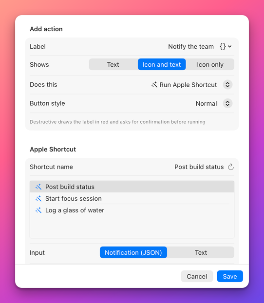

# Actions

An action is a button on a banner and the thing that happens when the user presses it. This page is the reference
for all of them: where they come from, the nine kinds, the fields each kind takes, the approvals Herald asks for
before it runs code, the rules a template uses to change buttons, the follow-up that runs one action when nobody
answers a banner, and the exact request Herald sends to your server when a callback button is pressed. If you want to add a button and see it work, start with
[Two-way notifications](../ACTIONS.md).

## Concepts

### What an action is

Every action has a label, a kind and the data its kind needs. The kind says what pressing the button does: open a
link, call your server, run a command, open an app, show a reply field. Herald runs the action when a person
presses the button, or when a [follow-up](#follow-ups) fires on a banner nobody answered. Nothing runs when a
notification arrives.

A successful action closes the banner and records the button in History. A failed action leaves the banner on
screen and shows **Action failed** with a short reason for four seconds. [Failures](#failures) lists the reasons.

### Where actions come from

A banner can offer actions from three places. Herald merges them into one list, in this order.

| Source | Who writes it | Where it is written | Example |
|---|---|---|---|
| The notification's buttons | The app that sends the notification. | `buttons` in [`POST /v1/notify`](api/notifications.md#button-object). | A **Mark done** button that calls the app back. |
| The manifest's actions | The app, once, ahead of time. | `actions` in the [manifest](manifests.md#actions), chosen per notification with `actionIds`. | **Archive** declared once, offered by name. |
| The template's action rules | You, in the Designer or through `put_template`. | `actionRules` in the template. | Hide **Archive**, add a **Follow up** Shortcut. |

The app that sends a notification is the **issuer**. Its buttons, whether they come from `buttons` or from the
manifest, are **issuer actions**. Actions you add in a template are **template actions**. The difference decides
what Herald asks before running one (see [Approvals](#approvals)).

The merge works like this:

1. Herald takes the issuer's actions. If the notification has `buttons` (or its alias `actions`), those are used,
   and an explicit empty list means no buttons. Otherwise Herald looks up each id in `actionIds` in the
   manifest, ignoring ids it does not know. Otherwise the issuer offers none.
2. Herald applies the template's `actionRules` in order. A rule can hide, relabel, restyle, move or add an action.
3. Herald adds any action written inline in a template component (a `button`, `iconButton` or `rive` cell that
   carries its own `action`).

The manifest's actions are never shown just because the manifest declares them. A notification has to send
`buttons` or name the actions with `actionIds`. A sample preview in the Designer stands in for an issuer that names
every declared action, and says so.

A button the notification sends with the same label as a manifest action takes that action's declared id, so a rule
can write `"match": "markRead"` for it.


### Action kinds

| Kind | What pressing it does | Issuer can send it | Needs approval |
|---|---|---|---|
| [`url`](#url-action) | Opens a link. | yes | no |
| [`callback`](#callback-action) | Sends an HTTP request to a server. | yes | Only for a host that is not this Mac. |
| [`command`](#command-action) | Runs a shell command. | yes | yes |
| [`script`](#script-action) | Runs a file from Herald's scripts folder. | yes | yes |
| [`shortcut`](#shortcut-action) | Runs an Apple Shortcut. | yes | yes |
| [`openApp`](#openapp-action) | Brings an application to the front. | yes | no |
| [`reply`](#reply-action) | Shows a text field in the banner. | yes | Only for a callback to a host that is not this Mac. |
| [`dismiss`](#dismiss-action) | Closes the banner. | yes | no |
| [`snooze`](#snooze-action) | Hides the banner and brings it back later. | no | no |

An issuer can send `script` and `shortcut` actions, in a manifest or in a notification's `buttons`. They run under the
same permission as an issuer's `command`: the app must be allowed to run commands, scripts and Shortcuts (see
[Approvals](#approvals)). An issuer cannot declare `snooze`, because it changes how the banner behaves, so only you
author it, in a template.

### Approvals

An action that runs code on your Mac, or sends data to another computer, asks first. Herald draws the question inside
the banner, replacing the buttons, and never opens a window or takes the keyboard from the app you are working in.
The question shows the exact command, script or address in a monospaced box.


| What | Who asks | What you see | How it is remembered |
|---|---|---|---|
| An issuer's `command`, `script` or `shortcut` | The app's permission to run commands, scripts and Shortcuts. | **Run this command for APP?** with **Run once** and **Always allow APP**. The box names the command, or the script with its SHA-256, or the Shortcut with its input. | **Always allow** turns on **Allow this app to run commands, scripts and Shortcuts** under **Settings > Apps**. |
| A template's `command`, `script` or `shortcut` | One confirmation per template. | **Run a command from the "TEMPLATE" template?** with **Run once** and **Always allow this template**. | Stored per template. Listed under **Settings > Actions**, where you can revoke it. |
| A callback to a host that is not this Mac | The app's callback host approval. | **Send APP's button action to HOST?** with **Send once** and **Always allow HOST**. | Stored on the app. The **Allow callbacks to HOST** switch under **Settings > Apps** shows it. |
| Any action styled `destructive` | The button itself. | **Run "LABEL"?** with the label in red and **Cancel**. | Never remembered. It asks every time. |

The rules behind the table:

- An issuer's command, script or Shortcut runs only when the app registered with `allowCommands: true` and you
  confirmed it. If the app never asked, the press fails with **commands are not allowed for APP**. See
  [`POST /v1/register`](api/apps.md#post-v1register).
- An issuer's script question shows the file name and the SHA-256 of the file as it is now, so a changed file is a
  different question. A Shortcut question shows the Shortcut's name and its input text.
- A template's approval is bound to exactly what you saw: the command text, the script's name and SHA-256, or the
  Shortcut's name and input. If any of them changes, Herald asks again. **Always allow this template** covers every
  piece of code in that template that was listed.
- When a template action has the same id as one of the issuer's own buttons, it replaces that button. The question
  says so and says that the issuer will not be told about the press.
- A destructive question comes before any approval the kind itself needs.
- Approvals can be read and revoked through the [API](api/apps.md#get-v1actionsapprovals), the CLI and MCP, but never
  granted. The program that holds the token is the one the approval protects you from.
- The MCP tool `send_notification` refuses `command` buttons unless `allowCommandButtons` is `true`. See
  [`send_notification`](mcp/notifications.md#send_notification).

The approvals you gave are listed on the **Actions** tab of Settings.


## Action object

Manifests and templates write an action as an object with a `kind`. A notification writes the same thing as a
**button**, where the kind is implied by which field is present
(see [Button object](api/notifications.md#button-object)). The fields below belong to the action object.

| Field | Type | Required | Description |
|---|---|---|---|
| `id` | string | no | Stable name that rules (`match`) and components (`actionRef`) use. Default: a slug of the label, so `"Mark as Read"` becomes `mark-as-read`. |
| `label` | string | no | The button text. `{tokens}` are filled from the notification. Falls back to `id`, so one of the two must be present. |
| `kind` | string | no | One of `url`, `callback`, `command`, `script`, `shortcut`, `openApp`, `reply`, `dismiss`, `snooze`. Inferred when omitted. |
| `style` | string | no | `normal`, `prominent`, `destructive` or `cancel`. Default `normal`. |
| `symbol` | string or object | no | An SF Symbol drawn on this button. See [Looks](#the-look-of-a-button). |

When `kind` is omitted, Herald infers it from the first of these fields that is present:

1. `reply`
2. `shortcut`
3. `script`
4. `command`
5. `callback`
6. `url`
7. `bundleId` or `path`

With none of them the action is rejected with `an action needs a 'kind'`.

The styles draw the button differently:

| Style | Look | Notes |
|---|---|---|
| `normal` | A tinted capsule. | The default. |
| `prominent` | A filled capsule. | Use it for the one action the banner exists for. |
| `destructive` | The label in red. | Asks for confirmation before it runs. |
| `cancel` | A quiet grey capsule. | The Designer calls it **Quiet**. |

**Minimal example**

```json
{"label": "Open", "url": "https://example.com/bids/42"}
```

**Realistic example**

```json
{
  "id": "followup",
  "label": "Follow up",
  "kind": "shortcut",
  "style": "prominent",
  "shortcut": "Create follow-up",
  "input": "{title}\n{url}",
  "symbol": "checkmark.circle"
}
```

## Fields by kind

Each kind adds its own fields to the action object. Fields a kind does not use are ignored.

### `url` action

Opens a link in the default browser or mail client. Only `http`, `https` and `mailto` links open.

| Field | Type | Required | Description |
|---|---|---|---|
| `url` | string | yes | The link. In a template action, `{tokens}` are filled in. |

In a template action each token is percent-encoded so a value cannot add query parameters. A token at the very start
whose value is itself an openable link, such as `{url}`, is kept whole. A link the issuer sent is used as written.

**Minimal example**

```json
{"label": "Open", "kind": "url", "url": "https://example.com/bids/42"}
```

**Realistic example**

```json
{
  "id": "open-bid",
  "label": "Open bid",
  "kind": "url",
  "style": "prominent",
  "url": "https://example.com/bids/{bidId}",
  "symbol": "arrow.up.right.square"
}
```

### `callback` action

Sends an HTTP request to a server, so the app that sent the notification hears which button was pressed. The full
request, timing and answer rules are in [Callbacks](#callbacks).

| Field | Type | Required | Description |
|---|---|---|---|
| `callback.url` | string | no | Where to send the request. Default: the app's registered `callbackURL`. |
| `callback.payload` | any JSON | no | Data your server receives back under `payload`. |

A bare `"kind": "callback"` means "call the app back with no extra data".

**Minimal example**

```json
{"label": "Accept", "kind": "callback"}
```

**Realistic example**

```json
{
  "id": "decline",
  "label": "Decline",
  "kind": "callback",
  "style": "destructive",
  "callback": {
    "url": "http://127.0.0.1:5123/herald",
    "payload": {"decision": "decline", "bidId": 42}
  }
}
```

### `command` action

Runs a shell command as you. The command text is never edited: the notification's data does not appear in it. The
data reaches the command on standard input and in environment variables, described in
[What a process receives](#what-a-process-receives).

| Field | Type | Required | Description |
|---|---|---|---|
| `command` | string | yes | A shell command line. Herald runs it with `/bin/zsh -lc` in your home folder. |

**Minimal example**

```json
{"label": "Open Notes", "kind": "command", "command": "open -a Notes"}
```

**Realistic example**

```json
{
  "id": "archive",
  "label": "Archive",
  "kind": "command",
  "command": "jq -r '.fields.subject' | xargs -I{} ~/bin/archive-mail {}",
  "symbol": "archivebox"
}
```

> [!TIP]
> Text from a sender can contain anything. When the action handles such text, use a [script](#script-action) that reads
> standard input instead of building a command line from it.

### `script` action

Runs a file from Herald's scripts folder, `~/Library/Application Support/Herald/scripts/`. Herald creates the folder at
launch. A template can add a script action, and so can an issuer, which runs only when the app is allowed to run
commands, scripts and Shortcuts. The script is always a plain file name: the issuer names a file, and you put it in the
folder.

| Field | Type | Required | Description |
|---|---|---|---|
| `script` | string | yes | The file name inside the scripts folder. A path that starts with `/` or `~`, or that contains `..`, is refused. |

How the file runs:

- A file with the executable bit runs directly, so its first line chooses the interpreter.
- A file without it runs through the interpreter its extension names, as the table shows.
- Any other file without the executable bit fails with `script is not executable (chmod +x, or use .sh, .py, .scpt)`.

| Extension | Runs with |
|---|---|
| `.sh`, `.zsh` | zsh. |
| `.bash` | bash. |
| `.py` | `/usr/bin/python3`. |
| `.rb` | Ruby. |
| `.pl` | Perl. |
| `.scpt`, `.applescript` | `osascript`, even when the file is executable. |

The working directory is the scripts folder. The data arrives as described in
[What a process receives](#what-a-process-receives).

In a manifest or a notification's `buttons`, the same action is written with the kind or without it. Herald infers
`script` from the field.

```json
{"id": "log", "label": "Log", "kind": "script", "script": "log.sh"}
```

**Minimal example**

```json
{"label": "Log it", "kind": "script", "script": "log-notification.sh"}
```

**Realistic example**

```json
{
  "id": "file-ticket",
  "label": "File ticket",
  "kind": "script",
  "script": "file-ticket.py",
  "symbol": {"name": "ticket", "placement": "leading"}
}
```

### `shortcut` action

Runs an Apple Shortcut with `shortcuts run`, which is headless, so Herald treats it as code and asks for approval.
A template can add one, and so can an issuer, which runs only when the app is allowed to run commands, scripts and
Shortcuts. The picker in the Designer and
[`GET /v1/shortcuts`](api/templates.md#get-v1shortcuts) list the installed Shortcuts.

| Field | Type | Required | Description |
|---|---|---|---|
| `shortcut` | string | yes | The name of an installed Shortcut. It may not start with `-`, be longer than 512 bytes, or contain control characters. |
| `input` | string | no | Text handed to the Shortcut, with `{tokens}` filled. Default: the full merged payload as JSON. |

Text input goes to the Shortcut's **Receive input from** action as a `.txt` file. Without `input`, the Shortcut gets
the merged payload as a `.json` file.

An issuer writes the same action in a manifest or a notification's `buttons`:

```json
{"id": "fwd", "label": "Forward", "kind": "shortcut", "shortcut": "Forward to phone", "input": "{title}"}
```

A `kind` of `shortcut` or `script` without its `shortcut` or `script` name is rejected.

**Minimal example**

```json
{"label": "Run", "kind": "shortcut", "shortcut": "Create follow-up"}
```

**Realistic example**

```json
{
  "id": "followup",
  "label": "Follow up",
  "kind": "shortcut",
  "shortcut": "Create follow-up",
  "input": "{title}\n{url}",
  "symbol": "checklist"
}
```

### `openApp` action

Brings an application to the front. It runs no code, so it needs no approval, and Herald itself stays in the
background. Herald uses the first of these that exists on this Mac:

1. The action's `bundleId`.
2. The action's `path`.
3. The manifest's `appBundleId`.
4. The manifest's `appPath`.
5. The bundle id the app registered with.
6. The application named like the manifest's `appName`, looked for as `NAME.app` in the folders listed below.

The folders searched in step 6 are `/Applications`, `/Applications/Utilities`, `/System/Applications`,
`/System/Applications/Utilities` and `~/Applications`, in that order.

With neither `bundleId` nor `path`, the action opens the app that sent the notification.

| Field | Type | Required | Description |
|---|---|---|---|
| `bundleId` | string | no | The application's bundle identifier, such as `com.apple.mail`. Tried first. |
| `path` | string | no | The application's path. Must end in `.app`. `~` is expanded. Tried when `bundleId` finds nothing. |

If no application resolves, nothing opens. The banner stays, shows **Action failed** with `no installed application
found`, and History keeps the note `LABEL: no installed application found`. The template validator reports this case
as a warning, not an error, because the template may be written for another Mac.

In a payload the same action is written `{"label": "Open", "openApp": {"bundleId": "com.apple.mail"}}`. A template
can also make a click on the banner open the issuing app with `"onClick": "openApp"`. See
[How banners behave](banners.md).

**Minimal example**

```json
{"label": "Open BidBot", "kind": "openApp"}
```

**Realistic example**

```json
{
  "id": "open-mail",
  "label": "Open Mail",
  "kind": "openApp",
  "bundleId": "com.apple.mail",
  "path": "/System/Applications/Mail.app"
}
```

### `reply` action

Replaces the buttons with a one-line text field inside the banner, so the user can answer without leaving what they
are doing. The text is stored on the notification in History and in the app's reply queue, and is sent to a callback
when the action has one. [Reading a reply](#reading-a-reply) shows how an app or an agent gets the answer.

| Field | Type | Required | Description |
|---|---|---|---|
| `reply.placeholder` | string | no | The hint shown in the empty field. Default `Reply…`. |
| `reply.callback` | object | no | A callback that also receives the reply. Fields as in the [callback action](#callback-action). |
| `reply.voice` | boolean | no | `true` shows a recording strip instead of a text field. Used by notifications that arrive through the cloud relay. |

In a manifest the same action is flat: `{"id": "reply", "kind": "reply", "placeholder": "Message", "callback": {}}`.

The field has a **Send** button, which stays off while the field is empty, and a close button (an x). The close
button brings the buttons back and stores nothing. A reply is trimmed and cut at 4000 bytes. After a send, the banner closes, once the callback
has been delivered when there is one.


With `voice: true` the banner shows a recording strip. **Stop** ends the recording and **Send** uploads it. Herald transcribes the recording on
this Mac and sends the audio and the text back to the sender through the relay. See
[Cloud](../CLOUD.md) and [Reply events](../cloud/reply-events.md).


**Minimal example**

```json
{"label": "Reply", "kind": "reply"}
```

**Realistic example**

```json
{
  "id": "reply",
  "label": "Reply",
  "kind": "reply",
  "reply": {
    "placeholder": "Message to Acme",
    "callback": {"url": "http://127.0.0.1:5123/herald", "payload": {"bidId": 42}}
  }
}
```

### `dismiss` action

Closes the banner. The notification stays in History. It has no fields. In a payload, a button with a label and no
other field is a `dismiss` button.

**Minimal example**

```json
{"label": "Got it", "kind": "dismiss"}
```

**Realistic example**

```json
{"id": "got-it", "label": "Got it", "kind": "dismiss", "style": "cancel", "symbol": "checkmark"}
```

### `snooze` action

Hides the banner and brings it back after a set time. Only a template can add one. A notification can also ask for
the clock menu with `snooze: true`; see [`POST /v1/notify`](api/notifications.md#post-v1notify).

| Field | Type | Required | Description |
|---|---|---|---|
| `snoozeMinutes` | integer | no | Minutes until the banner returns, from 1 to 10080. Default `15`. |

**Minimal example**

```json
{"label": "Later", "kind": "snooze"}
```

**Realistic example**

```json
{"id": "tomorrow", "label": "Tomorrow", "kind": "snooze", "snoozeMinutes": 1440, "symbol": "moon"}
```

## What a process receives

A `command`, `script` or `shortcut` action receives the **merged payload**: everything Herald knows about the
notification and the button. It is one JSON object.

```json
{
  "app": "example.bidbot",
  "id": "bid-42",
  "action": {"id": "followup", "label": "Follow up", "kind": "shortcut"},
  "fields": {"title": "Bid accepted", "amount": 4200, "customer.name": "Acme"},
  "extra": {"queue": "inbox"},
  "notification": {"app": "example.bidbot", "title": "Bid accepted", "metadata": {"amount": 4200}},
  "template": "bid-update",
  "imagePath": "/Users/you/Library/Application Support/Herald/history/images/bid-42.png",
  "herald": {"followUp": false, "unattendedSeconds": null}
}
```

| Part | What it holds |
|---|---|
| `fields` | The resolved tokens: the issuer's top-level fields and `metadata`. |
| `extra` | The template's own key and value pairs, from **Extra data** in the Designer. |
| `notification` | The full notification as it was sent. |
| `template`, `imagePath` | The template's name and the cached copy of the image, when there are any. |
| `herald` | `followUp`, which is `true` when a [follow-up](#follow-ups) runs the action, and `unattendedSeconds`, how long the banner went unanswered. A pressed button gets `false` and `null`. |

Where it goes:

| Kind | Delivery |
|---|---|
| `command` | The JSON on standard input, plus the environment variables below. |
| `script` | The JSON on standard input, plus the same environment variables. |
| `shortcut` | The `input` text, or else the JSON, in a temporary file passed with `--input-path`. The tokens `{herald.followUp}` and `{herald.unattendedSeconds}` work in `input`. |

The environment variables, at most 100 of them and 4 KB each:

| Variable | Value |
|---|---|
| `HERALD_APP` | The app id. |
| `HERALD_NOTIFICATION_ID` | The notification id. |
| `HERALD_ACTION` | The button label. |
| `HERALD_ACTION_ID` | The action id. |
| `HERALD_ACTION_KIND` | The action kind. |
| `HERALD_ORIGIN` | `issuer` or `template`. |
| `HERALD_FOLLOW_UP` | `1` when a follow-up runs the action. Not set for a pressed button. |
| `HERALD_UNATTENDED_SECONDS` | How many seconds the banner went unanswered. Set only for a follow-up. |
| `HERALD_TEMPLATE` | The template name, when there is one. |
| `HERALD_FIELD_NAME` | One per field. The name is the field key in upper case, with every character that is not a letter or digit written as `_`. |
| `HERALD_EXTRA_KEY` | One per `extra` value, named the same way. |

Every process has 30 seconds. After that Herald sends SIGTERM, and two seconds later SIGKILL. Output, up to 64 KB,
goes to `~/Library/Logs/Herald/actions.log`, which keeps one backup generation. **Show Log** on the **Actions** tab of
Settings reveals it. A second click on a banner whose action is still running is ignored. A process that exits
without an error closes the banner.

## Action rules

A template's `actionRules` change the list of actions after the issuer's actions are collected. Use them to hide a
button you do not want, rename one, give it an icon, or add your own, without asking the issuer to change anything.
Rules apply in order.

| Field | Type | Required | Description |
|---|---|---|---|
| `match` | string | no | Selects actions by id or label, ignoring case. `"*"` selects all. |
| `hide` | boolean | no | `true` removes the matched actions. |
| `relabel` | string | no | A new label for the matched actions. |
| `style` | string | no | A new style. An empty string clears it. |
| `symbol` | string or object | no | Gives the matched actions an SF Symbol. |
| `position` | integer | no | Moves the matched actions to this 0-based place in the list. Clamped to the list. |
| `add` | object | no | Adds a template action. Its position is `position` when the rule has no `match`, otherwise the end. |

Rules follow these points:

- A rule needs a `match` or an `add`.
- An `add` whose id already exists replaces that action and keeps its place unless `position` says otherwise.
- A `match` that matches nothing does nothing.
- `hide` makes `relabel`, `style` and `position` pointless, and the validator warns about it.

**Minimal example**

```json
{"match": "markRead", "hide": true}
```

**Realistic example**

```json
{
  "actionRules": [
    {"match": "markRead", "hide": true},
    {"match": "archive", "relabel": "Archive it", "style": "destructive", "position": 0},
    {"add": {"id": "followup", "label": "Follow up", "kind": "shortcut",
             "shortcut": "Create follow-up", "input": "{title}\n{url}"}}
  ]
}
```

The same rule can be added to a saved template with [`add_action_rule`](mcp/templates.md#add_action_rule). A rule also
works on buttons the notification sends, so you can relabel an issuer's button without touching the issuer.

When the callback button's label was changed by a rule, the issuer still hears its own label. The `action` field of the
request carries the label the issuer sent.

### Where actions appear

An action is drawn in one cell of a template at most. Cells are visited from top to bottom and left to right:

- A `button` bound by `actionRef` claims that action. See [`button`](components/button.md).
- An `actions` cell with `include` claims those ids, in that order. An `actions` cell without `include` shows
  what nothing else claimed. See [`actions`](components/actions.md).
- When two cells ask for the same action, the first in reading order draws it and the other renders empty. The
  validator warns and names both cells.

That is how one list is split across a banner: a prominent **Open** button on the left and a row of the rest beneath.

### The look of a button

Every action has its own look: its text, an icon with its text, or an icon only. The look belongs to the action, so two
buttons in the same cell can differ.

| Look | In the Designer | In JSON |
|---|---|---|
| Text | **Shows: Text** | No `symbol`. |
| Icon and text | **Shows: Icon and text** | A `symbol`, with `placement` `leading` (default) or `trailing`. |
| Icon only | **Shows: Icon only** | A `symbol` with `"placement": "only"`. The label is dropped from the button. |

An icon-only action needs no label. If it has one, Herald uses it as the tooltip and as what VoiceOver reads. For an
issuer's action the look is a rule with `match` and `symbol`. For an action you added, `symbol` goes on the action.

```json
{
  "actionRules": [
    {"match": "markRead", "symbol": {"name": "checkmark.circle", "placement": "only"}},
    {"add": {"id": "archive", "label": "Archive", "kind": "command",
             "command": "/usr/local/bin/archive",
             "symbol": {"name": "archivebox", "placement": "only"}}}
  ]
}
```

In the Designer, each row of the **Actions** tab has **Shows** and an icon picker with the full symbol styling.

- The reset arrow on a row puts an issuer's action back as the issuer sent it, which also undoes an icon change.
- The form for adding an action has the same **Shows** control.
- A symbol is a name, or an object with the keys described in [Symbols](symbols.md).
- An unknown symbol name is a warning, and the button simply has no icon.



## Callbacks

A callback is how a button talks back to the app that sent the notification. When the user presses a `callback`
button, Herald sends one HTTP request to a URL you control. Your server does the work and answers. Herald closes the
banner when your answer says it worked.

The URL is the action's `callback.url`, or else the app's registered `callbackURL`
([`POST /v1/register`](api/apps.md#post-v1register)). If neither exists the press fails with `no callback URL`.

### What Herald sends

Herald sends `POST` with a JSON body. The fields of the body are documented once, with an example, in
[the callback request](api/replies.md#callback-request). This page covers how the request behaves.

- The headers are `Content-Type: application/json` and `X-Herald-Attempt`, which is `1` for the first try and `2` for
  the retry.
- `action` is the label of the button as the issuer sent it, even if a template relabelled it on screen.
- `payload` is the button's `callback.payload`, and is absent when the button has none.
- When the template has `extra` values, Herald adds them under `payload.extra`. It does this when the payload is an
  object or absent, and only if the payload does not already use the key `extra`.
- A callback that comes from a [reply action](#reply-action) adds the typed text as `payload.reply`.

### What your server answers

| Answer | What Herald does |
|---|---|
| Any `2xx` status. | Treats the action as done and closes the banner. The body is ignored. |
| `408`, `429` or any `5xx` status. | Treats it as a temporary failure and retries once. |
| Any other status, such as `400` or `404`. | Treats it as final. The banner stays and shows `HTTP STATUS`. |
| A redirect (`3xx`). | Is never followed. The banner stays and shows the status. |

Answer with a `2xx` status only after the action has actually happened. If it failed, answer with an error status so
the user sees it and can press the button again.

### Timing, retries and where the URL may point

- Each attempt has 5 seconds in total, covering the connection, the request and the answer. A server that answers more
  slowly counts as `timed out after 5 s`.
- After a transport error (connection refused, reset, timed out) or a retryable status, Herald waits 0.75 seconds and
  tries once more. A second failure is final.
- The first attempt may reach your server even when its answer is lost. The retry carries the same `notificationId`
  and `action`, so use them to ignore a press you already handled.
- The URL must use `http` or `https`.
- A loopback address (`127.0.0.1`, `::1` or `localhost`) always works. Any other host needs your approval, asked in the
  banner the first time (see [Approvals](#approvals)). One approved host is kept per app.
- While a callback is in flight, a second press on the same banner is ignored.

A complete server you can run, with the registration and the notification that uses it, is in
[Add a button that calls your server](../ACTIONS.md#add-a-button-that-calls-your-server).

### Reading a reply

A reply goes to three places: the notification's record in History, the app's reply queue, and the reply's callback
when it has one. An app that runs no server reads the queue.

| How | Where |
|---|---|
| HTTP | [`GET /v1/replies`](api/replies.md#get-v1replies) and [`GET /v1/replies/wait`](api/replies.md#get-v1replieswait). |
| MCP | [`get_replies`](mcp/notifications.md#get_replies) and [`wait_for_reply`](mcp/notifications.md#wait_for_reply). |
| History | The item's `reply` and `repliedAt`. |

The queue keeps at most 200 replies per app. A second reply to the same notification replaces the first.

## Follow-ups

A follow-up runs one action when a notification is left unattended. Use it for a missed banner you still want to hear
about: forward it to your phone, send an email, post to a channel. The follow-up uses the same action kinds and the
same approvals as a button. It differs from a button in only one way: nobody presses it, so a timer does.

### The follow-up object

The object is the same in a manifest, in a notification and in a template, under the key `followUp`.

| Field | Type | Required | Description |
|---|---|---|---|
| `after` | number or string | yes | How long the banner must go unanswered, from 5 seconds to 604800 (7 days). A string such as `"90s"`, `"10m"` or `"2h"` is accepted and stored as seconds. |
| `actionRef` | string | no | The id, or the label, of an action the notification offers. Hidden actions count. |
| `action` | object | no | An action written inline, with the fields in [Action object](#action-object). |
| `enabled` | boolean | no | `false` switches the follow-up off. Default `true`. |

Give exactly one of `actionRef` and `action`.

**Minimal example**

```json
{"after": 600, "actionRef": "forward"}
```

**Realistic example**

```json
{
  "after": "10m",
  "action": {"id": "fwd", "label": "Forward", "kind": "shortcut",
             "shortcut": "Forward to phone", "input": "{title}"}
}
```

A template can switch off a follow-up that the issuer declares:

```json
{"enabled": false}
```

### Which actions can follow up

| Kind | Allowed | Why |
|---|---|---|
| `shortcut` | yes | It runs without anyone at the Mac. |
| `script` | yes | It runs without anyone at the Mac. |
| `command` | yes | It runs without anyone at the Mac. |
| `callback` | yes | Herald posts the usual [callback request](api/replies.md#callback-request) with an `unattended` event. |
| `url`, `openApp` | no | They open something on the screen of a person who is not there. |
| `reply`, `dismiss`, `snooze` | no | They need a person, or only change the banner. |

A follow-up that names one of the other kinds is refused with a message that says why.

### Which follow-up applies

A banner has one follow-up. When more than one place declares it, the nearest to you wins.

1. The template's `followUp`.
2. The notification's `followUp`.
3. The manifest's `followUp`.

A template that sets `"enabled": false` switches the issuer's follow-up off.

The origin of the action decides which approval applies. An action written inline takes the origin of the place that
declares it: the issuer for a manifest or a notification, the template for a template. An `actionRef` takes the
issuer's origin when the declaration is the issuer's or the named action is the issuer's, and the template's origin
otherwise. Origin and approval are explained under [Approvals](#approvals), and the next section says what Herald does
when approval is missing.

### When it runs

- The timer starts when the banner is on screen. Quiet hours and mute hold the banner back, and the timer waits with
  it.
- Dismissing the banner, pressing any button, replying and opening the banner cancel the timer.
- Snoozing drops the timer. When the banner returns, a new timer starts.
- A follow-up runs at most once per notification.
- Timers live in memory. When Herald quits, they are gone and the follow-up does not run.
- A banner whose auto-dismiss timeout is not longer than `after` closes first, so it never follows up. Validation
  warns about it.

### What the action receives

The action gets what a pressed button gets (see [What a process receives](#what-a-process-receives)), plus the
`herald` key in the merged payload, the environment variables `HERALD_FOLLOW_UP` and `HERALD_UNATTENDED_SECONDS`, and
the tokens `{herald.followUp}` and `{herald.unattendedSeconds}` in a Shortcut's `input`. One script or Shortcut can
serve a button and a follow-up by branching on `herald.followUp`.

A callback follow-up posts the usual request with two more fields:

```json
{"notificationId": "bid-42", "app": "example.bidbot", "action": "Forward",
 "event": "unattended", "unattendedSeconds": 612}
```

### Approval and what you see

A follow-up runs under the gates of a pressed button of its origin. An issuer follow-up that runs code needs the app's
**Allow this app to run commands, scripts and Shortcuts** switch. A template follow-up needs the template's one-time
approval, and **Always allow this template** covers an inline follow-up action, because it is part of the template's own
actions.

When approval is missing at the moment the timer ends, nothing runs. The usual question appears on the banner, History
records the outcome `waitingForApproval`, and the log says `follow-up waiting for approval`. Herald never opens a
window or takes the keyboard for it.

After the action runs, the banner stays. A line under the buttons reads **Follow-up ran: LABEL · TIME**, or
**Follow-up failed: REASON**. The log at `~/Library/Logs/Herald/actions.log` gets a `follow-up ran`,
`follow-up failed` or `follow-up waiting for approval` entry. History keeps the
[`followUp` record](api/history.md#the-history-record).

### Setting a follow-up

| Where | How |
|---|---|
| The Designer | The **Follow-up** block of the **Actions** tab. See [Forward a notification you missed](../FORWARD-MISSED.md). |
| A manifest | `followUp` in the [manifest](manifests.md#follow-up). |
| A notification | `followUp` in [`POST /v1/notify`](api/notifications.md#follow-up-object), or `herald notify --follow-up-after`. |
| A template, from an agent | [`set_follow_up`](mcp/templates.md#set_follow_up) or [`PUT /v1/templates/follow-up`](api/templates.md#put-v1templatesfollow-up). |
| A template, from a terminal | [`herald template follow-up`](cli.md#herald-template-follow-up). |

## Failures

A failed action leaves the banner on screen. It shows `Action failed` followed by a short reason for four seconds, and
Herald beeps unless sounds are muted. History is not changed, except for the note an `openApp` failure leaves. The
reason is cut at 100 characters.

| Reason shown | Cause | Fix |
|---|---|---|
| `commands are not allowed for APP` | The app did not register with `allowCommands`. | Register with `allowCommands: true`, then confirm it. |
| `no callback URL` | The action and the app have no callback address. | Set `callback.url` or the app's `callbackURL`. |
| `HTTP 500` or another status | Your server answered with a non-`2xx` status. | Answer `2xx` once the action has happened. |
| `timed out after 5 s` | Your server did not answer within 5 seconds. | Answer first and do slow work afterwards. |
| `connection refused` | Nothing is listening at the callback address. | Start the server, or correct the address. |
| `this link type is not allowed` | A `url` action used a scheme other than `http`, `https` or `mailto`. | Use one of those schemes. |
| `script not found: NAME` | The file is not in the scripts folder. | Put the file there, or correct the name. |
| `script must be a file inside the scripts folder` | The name is a path outside the folder. | Use a plain file name. |
| `script is not executable (chmod +x, or use .sh, .py, .scpt)` | The file has no executable bit and no known extension. | Run `chmod +x`, or rename it. |
| `timed out after 30 s` | A command, script or Shortcut ran longer than 30 seconds. | Make it finish sooner, or start long work in the background. |
| `exit 1: MESSAGE` | The process failed. The first line of its output is shown. | Read `~/Library/Logs/Herald/actions.log`. |
| `no installed application found` | An `openApp` action matched no application. | Set `bundleId` or `path`, or the manifest's `appBundleId`. |
| `the banner is not on screen to reply on` | A reply was started for a banner that has closed. | Send the notification again. |

## Common mistakes

| Mistake | What happens | Fix |
|---|---|---|
| An issuer sends `"kind": "shortcut"` without a `shortcut` name. | The manifest or notification is rejected. | Add the `shortcut` field, or the `script` field for a script. |
| An issuer sends `"kind": "snooze"`. | The manifest is rejected. | Add a snooze action in a template with an `add` rule. |
| A follow-up with kind `url` or `reply`. | Validation refuses it. | Use a Shortcut, a script, a command or a callback. |
| A follow-up on a banner with a 5-second auto-dismiss and `after` of `"10m"`. | The banner closes first and never follows up. | Raise the timeout or lower `after`. |
| Expecting `{title}` inside `command` to be filled. | The text is not edited, so the braces stay. | Read `$HERALD_FIELD_TITLE`, or parse the JSON on standard input. |
| A script named `../x.sh` or `/tmp/x.sh`. | Refused. | Put the file in the scripts folder and use its name. |
| `snoozeMinutes` of `0` or `20000`. | Validation error. | Use 1 to 10080. |
| Two `add` rules with one id. | The later one replaces the earlier. | Give each its own id. |
| `hide` and `relabel` in one rule. | The relabel does nothing. | Use two rules. |
| Answering a callback `200` before the work is done. | The banner closes even if the work fails. | Answer after the work, with an error status on failure. |

## Accepted older forms

| Older form | Current form |
|---|---|
| `"style": "default"` | `"style": "normal"` |
| `actions` in a notification payload. | `buttons`. When both are sent, `buttons` is used. |
| `"destructive": true` on a `button` cell. | `"style": "destructive"`. |
| `actionId` on a `button` cell. | `actionRef`. |
| A template-level `buttons` list. | `actionRules` with `add`. |

## Related

- [Two-way notifications](../ACTIONS.md): add a link button, a callback button, a reply field and a command button.
- [Notifications API](api/notifications.md#button-object): the button object a notification sends.
- [Manifests](manifests.md): declare an app's actions once.
- [Replies API](api/replies.md): read what the user typed, and the callback request.
- [Forward a notification you missed](../FORWARD-MISSED.md): a follow-up that forwards a banner with a Shortcut.
- [`actions`](components/actions.md) and [`button`](components/button.md): draw actions in a template.
- [Symbols](symbols.md): icons for buttons.
- [`add_action_rule`](mcp/templates.md#add_action_rule): add a rule from an agent.
