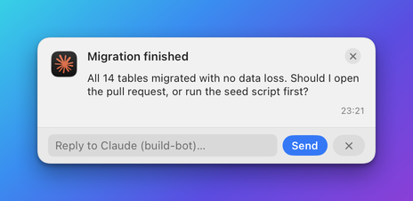

# Replies API

These endpoints let your program read what the user typed into a banner, and this page also documents the
request Herald sends to your server when a callback button is pressed. Together they are the two ways a
notification becomes a conversation. The examples use the `$HERALD` and `$TOKEN` variables from
[Connect](README.md#connect).

## Two ways to hear back

A banner can carry buttons, and the user's choice has to reach your program somehow. Herald offers two paths,
and which one you use depends on whether your program can receive HTTP requests.

| Path | How it works | Use it when |
|---|---|---|
| **Replies queue** | The user types into a reply field. Herald stores the text, and you ask for it. | Your program cannot run a server: a script, an agent, a CLI tool. |
| **Callback** | The user presses a button. Herald sends an HTTP request to your server. | Your program runs a server and wants to be told at once. |

A **reply** comes from a button of kind `reply`, which swaps the banner's buttons for a text field. The text
is kept on the notification's History record and added to a queue for the app. The queue holds the 200 most
recent replies of each app.



## Endpoints

| Endpoint | Purpose |
|---|---|
| [`GET /v1/replies`](#get-v1replies) | Read the replies waiting in the queue. |
| [`GET /v1/replies/wait`](#get-v1replieswait) | Wait for the reply to one notification. |

### `GET /v1/replies`

Returns the replies waiting in the queue, oldest first. Use it to poll for answers to several notifications
at once.

**Request**

| Name | In | Type | Required | Description |
|---|---|---|---|---|
| `app` | query | string | no | Return only replies to this app's notifications. Default: every app. |
| `since` | query | string | no | Return only replies after this time: an ISO 8601 date or epoch seconds. |
| `consume` | query | boolean | no | `true` removes the returned replies from the queue. Default `false`. |

**Example request**

```sh
curl -s "$HERALD/v1/replies?app=example.bidbot&consume=true" -H "Authorization: Bearer $TOKEN"
```

**Example response**

```json
{
  "count": 1,
  "replies": [
    {
      "notificationId": "bid-42",
      "app": "example.bidbot",
      "title": "Counter-offer from Acme",
      "text": "Accept if they include delivery.",
      "repliedAt": "2026-10-02T13:04:41.526Z"
    }
  ]
}
```

**Response fields**

| Field | Type | Description |
|---|---|---|
| `count` | integer | How many replies are in `replies`. |
| `replies[].notificationId` | string | The id of the notification that was answered. |
| `replies[].app` | string | The app that sent that notification. |
| `replies[].title` | string | The notification's title, so you can tell which question it was. |
| `replies[].text` | string | What the user typed. |
| `replies[].repliedAt` | string | When the user replied, as an ISO 8601 date. |

**Errors**

| Status | When |
|---|---|
| `400` | `since` is neither an ISO 8601 date nor a number. |

**Notes**

- Without `consume=true` a reply stays in the queue and is returned again by the next request.
- A reply removed from the queue is still on its [History record](history.md#the-history-record).

### `GET /v1/replies/wait`

Waits until one notification has been answered, then returns the reply. The request stays open for up to the
timeout you give, so you do not have to poll. Use it right after sending a question.

**Request**

| Name | In | Type | Required | Description |
|---|---|---|---|---|
| `id` | query | string | yes | The id of the notification you are waiting on. |
| `app` | query | string | no | The app that sent it. Give it so that a reply already in History is found too. |
| `timeout` | query | number | no | Seconds to wait, from 1 to 300. Default `60`. |
| `consume` | query | boolean | no | `false` leaves the reply in the queue. Default `true`. |

**Example request**

```sh
curl -s "$HERALD/v1/replies/wait?id=bid-42&app=example.bidbot&timeout=120" \
  -H "Authorization: Bearer $TOKEN"
```

**Example response**

```json
{
  "replied": true,
  "reply": {
    "notificationId": "bid-42",
    "app": "example.bidbot",
    "title": "Counter-offer from Acme",
    "text": "Accept if they include delivery.",
    "repliedAt": "2026-10-02T13:04:41.526Z"
  }
}
```

When the timeout passes with no reply, the status is still `200`:

```json
{"replied": false, "timedOut": true, "waitedSeconds": 120}
```

**Response fields**

| Field | Type | Description |
|---|---|---|
| `replied` | boolean | `true` when the user answered. |
| `reply` | object | The reply, in the shape of [`GET /v1/replies`](#get-v1replies). Present when `replied` is `true`. |
| `timedOut` | boolean | `true` when the wait ended without a reply. |
| `waitedSeconds` | number | How long the request waited. Present when it timed out. |

**Errors**

| Status | When |
|---|---|
| `400` | `id` is missing. |

**Notes**

- A reply that already exists is returned at once.
- Set your HTTP client's own timeout above the `timeout` you send, or the client gives up first.

## Callback request

This is not an endpoint you call. It is the request Herald sends to **your** server when the user presses a
button of kind `callback`, or sends a reply from a reply button that has a callback.

Herald posts to the `url` of the button's callback, or to the `callbackURL` the app registered with
[`POST /v1/register`](apps.md#post-v1register) when the button names none.

**Request**

| Name | In | Type | Required | Description |
|---|---|---|---|---|
| `X-Herald-Attempt` | header | string | yes | `1` for the first attempt, `2` for the retry. |
| `notificationId` | body | string | yes | The id of the notification whose button was pressed. |
| `app` | body | string | yes | The app that sent the notification. |
| `action` | body | string | yes | The label of the button. |
| `payload` | body | any | no | The `payload` you attached to the button. |

**Example request**

```http
POST /herald HTTP/1.1
Host: 127.0.0.1:5123
Content-Type: application/json
X-Herald-Attempt: 1

{"notificationId": "bid-42", "app": "example.bidbot", "action": "Accept", "payload": {"decision": "accept"}}
```

**Example response**

Answer with any `2xx` status once the action has happened. The body is ignored.

```http
HTTP/1.1 204 No Content
```

**Notes**

- Herald adds two things to `payload` when they apply: the text of a reply as `payload.reply`, and the values
  a template attached to the button as `payload.extra`.
- A `2xx` answer dismisses the banner. Any other outcome leaves the banner up and shows that the action
  failed.
- Each attempt may take 5 seconds. Herald retries once after a network error or a `408`, `429` or `5xx`
  status. Use `notificationId` and
  `action` to ignore a repeat.
- Redirects are never followed.
- A callback URL on this Mac (`127.0.0.1`, `localhost`, `::1`) needs no approval. Any other host must be
  approved by the user the first time.

How callbacks fit with the other action kinds, and what the user is asked, is in the
[actions reference](../actions.md#callbacks).

## Related

- [Two-way notifications](../../ACTIONS.md): build a banner that asks a question and act on the answer.
- [Actions reference](../actions.md): every action kind, including `reply` and `callback`.
- [Notifications API](notifications.md#button-object): the button object.
- [MCP tools for notifications](../mcp/notifications.md#wait_for_reply): `get_replies` and `wait_for_reply` for an agent.
