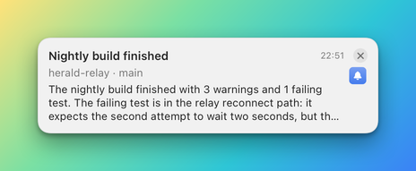
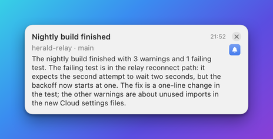
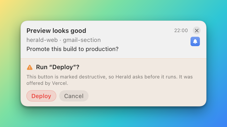
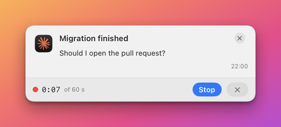
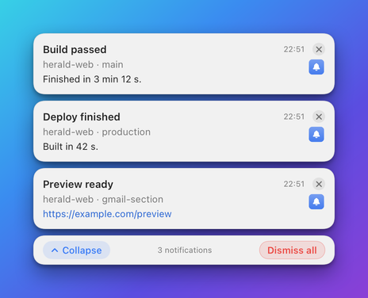

# How banners behave

A banner is what Herald draws for a notification. This page follows one banner through its life: where it appears,
how long it stays, what a click on it does, what its buttons, questions, reply field and snooze menu do, how banners
stack, and what Herald keeps in History after the banner is gone. It is for anyone designing a banner or wondering why
one behaved as it did.

## Concepts

- A **banner** is a small window that floats above other windows and never takes the keyboard from the app you are
  working in. Herald draws it from the notification's [template](grid-and-layout.md), or from a built-in layout when
  there is no template.
- A **notification** is what an app sent. The banner is its on-screen form, and History is its permanent record.
  Closing a banner never deletes the notification.
- An app's **settings** decide the defaults: the screen corner, the display, whether the banner stays, and whether it is
  muted. They live under **Settings > Apps**, described in [The Herald app](../APP.md#apps).

## Where a banner appears

A banner slides in at the top right corner of your main display. Each app can choose another display and another
corner under **Settings > Apps > Banners**: **Display** and **Screen corner**. Banners of every app that picks the same
display and corner share one column.

The newest banner is nearest the corner and older banners sit below it. When a banner is replaced, closed or snoozed, the
others move up.

## How long a banner stays

By default a banner stays until you close it. Two notification fields change that, and an app can set defaults for both
under **Settings > Apps > Defaults**.

| `persistent` | `timeout` | The banner |
|---|---|---|
| not set, or `true` | not set, or `0` | Stays until it is closed, a button is pressed or the sender dismisses it. |
| `false` | not set, or `0` | Closes itself after 8 seconds. |
| any | a number above `0` | Closes itself after that many seconds. |

Hovering the pointer over a banner pauses its countdown, and it resumes when the pointer leaves. The countdown also
waits while the banner shows an inline question, a reply field or a recording strip, and starts again from the full
time once that is answered. Sending the same `id` again restarts it.

A banner that closes by timeout is recorded in History as **Timed out**. [Notifications API](api/notifications.md#post-v1notify)
documents the two fields.

## The close button

The cross at the banner's top right is the close button. Pressing it closes the banner and records it in History as
dismissed. The built-in layouts include it. A template draws its own: it is an [`iconButton`](components/iconButton.md)
whose action has the kind `dismiss`, so a template without one has no close button.

On the top card of a closed [stack](#stacks) the close button closes every notification in the stack.

## Clicking the body

A click on the body of a banner, away from its buttons and links, does one of four things. It never closes a banner that
has nothing to open: only the close button does that. The click first lifts the line limits, so text that was cut short
is shown in full. Herald then compares the banner's height a fifth of a second later. If the banner grew, text had been
cut and the banner stays open. If it did not grow, there was nothing more to read and the click goes on to what it would
otherwise do.

A banner has something to open when its notification has a `url`, or when its template sets `onClick` to `openApp`. A
registered `bundleId` alone does not make a click open the app.

| The banner is | A click on its body | What you see |
|---|---|---|
| Folded, and text was cut short. | Shows the whole text and keeps it open. | The banner grows. A second click folds it back when there is nothing to open. |
| Open, with nothing to open. | Folds the text back. | The banner returns to its short form. |
| Folded, nothing was cut, with a `url`. | Opens the link and closes the banner. | History shows **Opened**. |
| Folded, nothing was cut, with `onClick: "openApp"`. | Brings the app to the front and closes the banner. | History shows **Used Open app**. |
| Open, with a `url` or `onClick: "openApp"`. | Opens it, as in the two rows above. | The banner closes. |
| Folded, nothing was cut, nothing to open. | Nothing. | The banner stays exactly as it was. |
| The top card of a closed stack, with no `url`. | Opens the stack in place. | The card grows into a list. |
| The top card of a closed stack, with a `url`. | Opens that link. | That notification leaves the stack. |

The folded banner above shows the first lines of a long body. After one click it shows all of it.

A link only opens when its scheme is `http`, `https` or `mailto`. Any other link, such as `file:` or a custom scheme, is
refused and the banner shows an **Action failed** line. A click on a button, or on a Markdown link inside the body, acts on that button or
link and is not a click on the body.

The number of lines before the text is cut comes from the template, or from `maxBodyLines` in the notification. It is
between 1 and 30.

## Buttons

A banner can carry buttons: ones the app sent, and ones you added in the template. They open links, run commands, scripts and Shortcuts, call
the app back, open an app, start a reply or snooze. [Buttons and actions](../ACTIONS.md) explains how to make them and
[Actions](actions.md) lists every kind.

A banner can also run one action by itself when nobody answers it, a [follow-up](actions.md#follow-ups). The banner
stays on screen. A quiet line under its content reads **Follow-up ran: LABEL · TIME** or **Follow-up failed: REASON**.
When the action needs your approval, the banner shows the question instead and the line appears once it has run.

What pressing a button does to the banner depends on the kind:

- A link, a dismiss and a snooze act at once.
- A callback, a command, a script or a Shortcut closes the banner only after it succeeds.
- If one fails, the banner stays, shows an **Action failed** line with the reason, and the button can be pressed again.
- A banner with a `reminder` has an **Add to Reminders** button. It shows a working state, then added or failed. Herald
  asks macOS for access to Reminders only when you press it.

## Questions inside a banner

Before Herald runs code on your Mac or sends a button's data to another computer, it asks. The question is drawn inside
the banner, in place of the buttons. It is never a window, so it does not take the keyboard from the app you are using.

The answers are **Run once** or **Send once**, which remember nothing, **Always allow** with the name of the app, template
or host, which remembers, and **Cancel**. [Actions](actions.md#approvals) lists every question and where Herald stores
the approvals. A button that is marked destructive asks before it runs, with a red button named after the action.

A cloud connector asks to connect in the same way, with **Approve** and **Deny**.

## Reply and record

A button of the kind `reply` turns the banner into a place to answer. Pressing **Reply** swaps the buttons for a text
field and two controls.

...")

- Type the answer and press **Send** or Return. **Send** stays off while the field is empty.
- Press the cross, or Escape, to cancel and get the buttons back.
- The text is stored with the notification in History, kept in the reply queue that an app can read, and sent to the
  action's callback address when it has one.

A reply action marked as a voice reply shows **Record** instead. Pressing it asks macOS for the microphone the first time,
then records.

1. While recording the strip shows a red dot, the elapsed time and **Stop**. The cross cancels.
2. After **Stop** it shows how long the recording is, with **Send** and the cross.
3. After **Send** it says it is transcribing on this Mac and sending. The audio is turned into text on your Mac.

Recording only starts from the **Record** button, never by itself. [Replies API](api/replies.md) shows how an app reads
the answers, and [Voice](voice.md) covers speech in general.

## Speech replay

A notification that was spoken can be played again. A banner with speech shows a small speaker icon beside the time, or
on a thin row under the banner when its template draws no time.

Pressing it plays the saved audio again, or speaks the text again when the file has been cleaned up. It plays even when
**Mute Sounds** is on, because you asked for it. The History window has the same control on each spoken row.

## The snooze menu

A notification sent with `snooze` set to `true` has a clock menu on its banner. Choosing a time hides the banner and
brings it back later.

| Choice | The banner returns |
|---|---|
| **5 minutes** | 5 minutes from now. |
| **15 minutes** | 15 minutes from now. |
| **1 hour** | An hour from now. |
| **Tomorrow 9:00** | At 9:00 the next morning, whatever the time now. |

While it is hidden the notification stays in History, where its row reads **Snoozed until** the time. When the time
comes the banner returns with its sound. A snooze survives quitting Herald: a banner whose time passed while Herald was
not running returns at the next launch.

An app can snooze and wake banners itself:

- [`POST /v1/snooze`](api/notifications.md#post-v1snooze) snoozes a banner for any number of minutes up to 30 days.
- [`POST /v1/unsnooze`](api/notifications.md#post-v1unsnooze) brings a snoozed banner back early.

On the top card of a stack, the menu snoozes the whole stack, and it comes back as the same stack.

## Stacks

Notifications that share a key fold into one banner so a busy sender does not cover the screen. The newest notification is
on top, a count badge shows how many there are, and the edges of the cards behind it show. [Stacking](stacking.md)
explains the key and the **Stack Notifications** levels.

- Pressing the badge, or the body of a card that has no `url`, opens the stack in place.
- The close button closes every notification in the stack, and the snooze menu snoozes all of them.

An open stack lists each notification as its own banner, with its own buttons, six rows before it scrolls. **Collapse**
folds it again and **Dismiss all** closes every notification in it. Clicking a row's body opens that notification's link.
Opening a stack never takes the keyboard from the app you are in.

## When there are too many banners

The banners of one corner share the visible height of the display. The newest banner is always shown. When the next one
would run past the bottom of the visible screen, it and every older banner stay hidden, and a pill takes their place:
**+N more**, where N is how many are hidden, next to **Dismiss All**.

- **+N more** opens History, where every hidden notification is waiting.
- **Dismiss All** closes every banner.
- When a visible banner goes away, the oldest hidden one takes its place.

A hidden banner is still an unread notification: History counts it, and nothing is lost. The number that fit depends on
the height of your screen and of the banners. At launch Herald puts back the 6 newest banners that were never dismissed,
and the rest wait under the pill.

## What goes to History

Every notification is kept in History, whatever happens to its banner.

| What happened | What History shows |
|---|---|
| The banner is still on screen. | A dot and **Active**. |
| You pressed the close button. | **Dismissed**. |
| The banner timed out. | **Timed out**. |
| You clicked it and it opened a link or an app. | **Opened**, or **Used Open app** for an app. |
| You pressed a button. | **Used** and the button's label. |
| It is snoozed. | A clock and **Snoozed until** the time. |
| Its app is muted under **Settings > Apps**. | A row that was never shown as a banner, counted as not dismissed. |
| It was sent for speech only. | A row with the spoken text and a replay button. |

History keeps the newest 1000 notifications of each app unless you change **Settings > General > Keep per app**.
[The Herald app](../APP.md#history) describes the History window.

## Common mistakes

| Mistake | What happens | Fix |
|---|---|---|
| A template with no close button. | A click on the body never closes the banner, and only a timeout, a button or the sender does. | Add an `iconButton` with a `dismiss` action. |
| Expecting a registered `bundleId` to open the app on a click. | The click folds or does nothing. | Set `onClick` to `openApp` in the template, or send a `url`. |
| Sending a `file:` or custom scheme link. | The banner shows **Action failed**. | Use `http`, `https` or `mailto`. |
| Sending every update under a new `id`. | Each one is a new banner and they pile up. | Send the same `id` to update a banner in place. |

## Related

- [The Herald app](../APP.md): the menu, History and Settings.
- [Send your first notification](../getting-started.md): show, update and dismiss a banner.
- [Notifications API](api/notifications.md): the fields that control a banner.
- [Stacking](stacking.md), [Actions](actions.md), [Quiet hours](quiet-hours.md) and [Voice](voice.md): the behaviours this page summarises.
