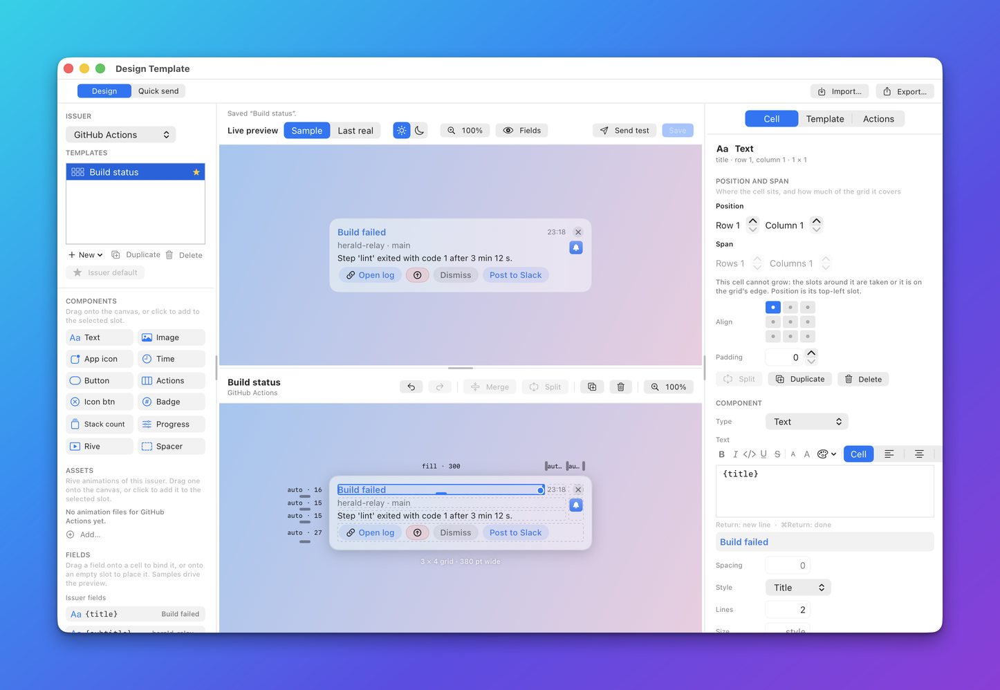

# Components

A component is one piece of a banner: a line of text, a picture, a button, a progress bar. A template builds a banner by
placing components in the cells of a grid, and each cell holds exactly one. This page explains what every component has
in common. The twelve component pages that follow it list the properties each one accepts. It is for anyone who writes a
template by hand, through the API or through an agent. The [Designer](../../AUTHORING.md) writes the same JSON for you.

## What a component is

On the wire a component is one flat JSON object. Its `type` says which kind it is, and the other keys are that kind's
properties. A component sits inside a cell, and the cell decides where it goes. This is a complete cell holding a `text`
component:

```json
{"id":"title","row":0,"col":1,"colSpan":2,"align":"topLeading",
 "component":{"type":"text","binding":"{title}","style":"title"}}
```

The cell's own fields and the grid around them are described in [The grid, cells and layout](../grid-and-layout.md). This page covers what a component adds on top of that.

In the Designer you add a component by dragging it from the palette onto a cell, then edit its properties in the
inspector. The palette uses short names that differ a little from the `type` values.


Select a cell and the inspector on the right shows its properties:



## The components

| `type` | Designer name | What it draws |
|---|---|---|
| [`text`](text.md) | Text | Bound text in one of five styles, with optional rich text and Markdown links. |
| [`image`](image.md) | Image | A picture from a field: a file path, a `data:` URI or an https URL. |
| [`issuerIcon`](issuerIcon.md) | App icon | The icon of the app that sent the notification, round or rounded. |
| [`timestamp`](timestamp.md) | Time | A date field or the delivery time, as a clock time or "3 min. ago". |
| [`button`](button.md) | Button | One action as a capsule button. |
| [`actions`](actions.md) | Actions | Every action of the banner as a row of buttons, with an overflow menu. |
| [`iconButton`](iconButton.md) | Icon btn | A round button with an SF Symbol: close, snooze, mark done. |
| [`badge`](badge.md) | Badge | A small pill holding a value, such as an unread count. |
| [`stackBadge`](stackBadge.md) | Stack count | The pill that counts the notifications folded into a stack. |
| [`progress`](progress.md) | Progress | A thin progress bar. |
| [`rive`](rive.md) | Rive | A Rive animation driven by fields and the pointer. |
| [`spacer`](spacer.md) | Spacer | Empty space that fills its cell. |

`GET /v1/components` and the MCP tool `component_schema` return the machine-readable form of these pages. See
[Templates API](../api/templates.md) and [MCP template tools](../mcp/templates.md).

## What every component shares

### Binding to fields

Most components show something that changes from one notification to the next. They do that with a `binding`: a piece of text with `{token}` placeholders, such as `"{title}"` or `"{count} new from {sender}"`.

- Herald replaces each token with the value of the field of the same name from the notification, the manifest or the template's `extra` values.
- A token is made of letters, digits, `_`, `.` and `-`.
- Text in an action's `label`, `url` and `input` takes tokens too.
- A component whose properties are fixed, such as `spacer` or `issuerIcon`, has no binding.

Where values come from is described in [Bindings and tokens](../bindings.md).

### Empty components and `emptyBehavior`

A component that has tokens and finds every one of them absent or blank has nothing to show. It is **empty**. What
happens next is the choice of `emptyBehavior`, which every component except `spacer` accepts:

| Value | What happens to an empty component |
|---|---|
| `collapse` | It disappears, and a row or column left with nothing in it shrinks to zero size, gap included. |
| `keep` | It stays as a blank cell that holds its size, so banners from one app keep one shape. |
| omitted | The template's `collapseEmpty` decides. It is `true` by default, which means `collapse`. |

Each component page says what makes that component empty. How rows and columns collapse is described in
[the collapse planner](../grid-and-layout.md#how-sizes-are-solved).

A question that a banner asks inline, such as "Run this command?", takes the place of the action buttons. While it is
shown, every `actions` and `button` cell counts as collapsed whatever its `emptyBehavior` says. `iconButton` cells stay,
so the banner can always be dismissed.

### Alignment inside the cell

A cell can be larger than its component. The cell's `align` places the component inside it. It has nine values:

```text
topLeading     top      topTrailing
leading        center   trailing
bottomLeading  bottom   bottomTrailing
```

The default is `topLeading`. In the Designer `align` is a 3 by 3 pad in the inspector. Two details matter:

- The horizontal part also sets how the lines of a `text` component are aligned when the component has no `alignment` of its own.
- A component that fills its cell's width (`image`, `progress`, `actions`) is affected only in the vertical direction.

### Colours

Colour properties (`color`, `textColor`) take one of two kinds of value:

- A hex colour: `#RGB`, `#RGBA`, `#RRGGBB` or `#RRGGBBAA`.
- A keyword: `accent` (the template's `accentColor`, else the system accent), `primary` or `secondary`.

Keywords follow the system appearance. Hex colours on text, icons and progress bars are adjusted until they are legible
on the current light or dark appearance, so one hex value works in both. Badge pills are the exception and are drawn
exactly as written. Nothing in a template depends on the appearance, so you do not write separate light and dark
versions.

### Symbols

Five components can carry an SF Symbol: `button`, `actions`, `iconButton`, `issuerIcon` and `badge`. A symbol is either a plain name such as `"bell.badge"` or an object that adds weight, scale, rendering mode, colours and an effect. The full format is in [SF Symbols](../symbols.md).

### Actions

Four components work with actions. Actions are described in [Actions](../actions.md).

| Component | What it does with actions |
|---|---|
| `button` | Shows one action, written inline in an `action` object or named by an `actionRef`. |
| `iconButton` | Shows one action in the same two ways. |
| `actions` | Shows the whole list of resolved actions: the issuer's actions plus the template's, after the template's `actionRules`. |
| `rive` | Runs one action when the animation is clicked. |

An action is drawn in at most one cell of a template, which lets you split one list across several cells:

- A `button` with an `actionRef` claims that action.
- An `actions` cell with `include` claims the ids it lists.
- An `actions` cell without `include` shows what is left.

[The actions component](actions.md#one-action-one-cell) explains the rules.

### Static previews

A preview that is drawn without a window cannot draw menus or animations. The preview endpoint, the MCP tool
`render_preview` and History thumbnails draw menus (the snooze clock, the "+N" overflow) as static labels, symbol
effects as still symbols, and a `rive` component as a dashed placeholder box of the right size. To test a Rive component
without a window, see [Testing without a window](../rive.md#testing-without-a-window).

## Related

- [The grid, cells and layout](../grid-and-layout.md): the cell fields, sizing and the collapse planner.
- [Designing a banner](../../AUTHORING.md): build a template in the Designer.
- [Templates](../../TEMPLATES.md): what a template is and how a notification picks one.
- [Bindings and tokens](../bindings.md): where `{token}` values come from.
- [Actions](../actions.md): action kinds, rules and confirmation.
