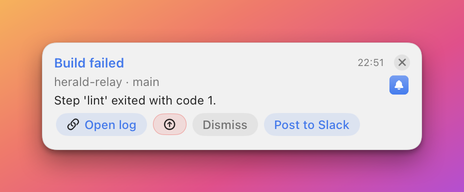
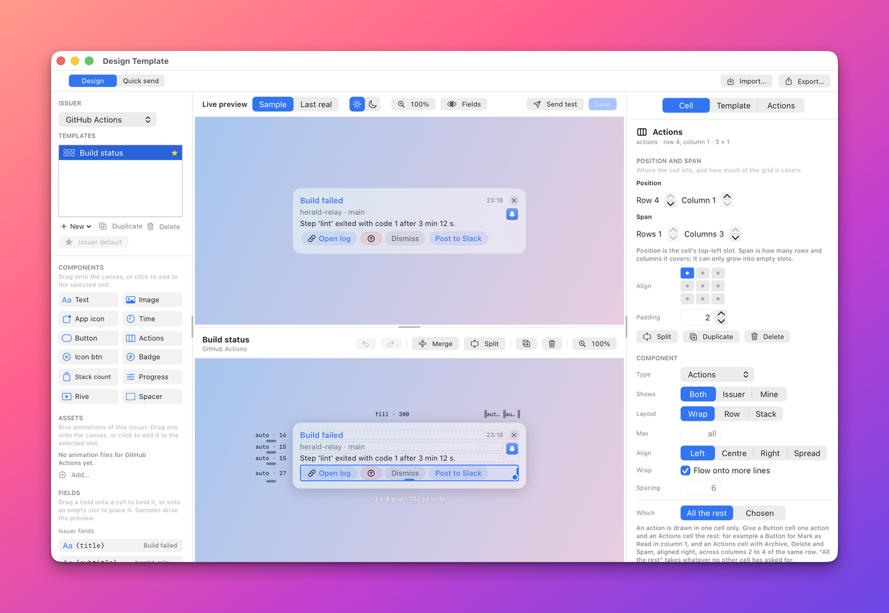
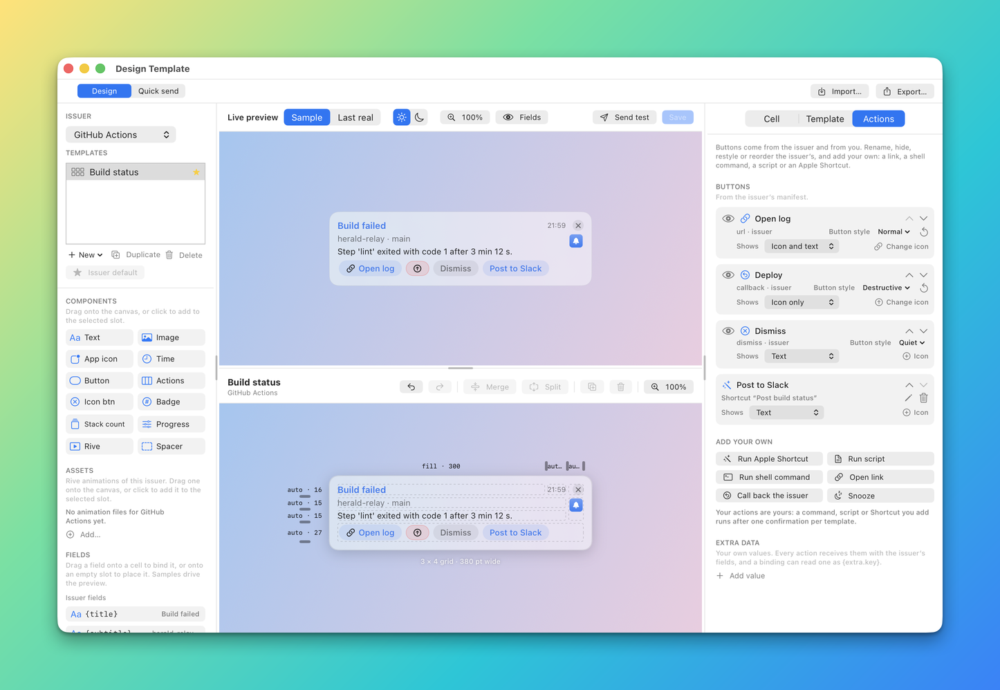
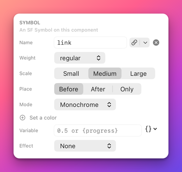
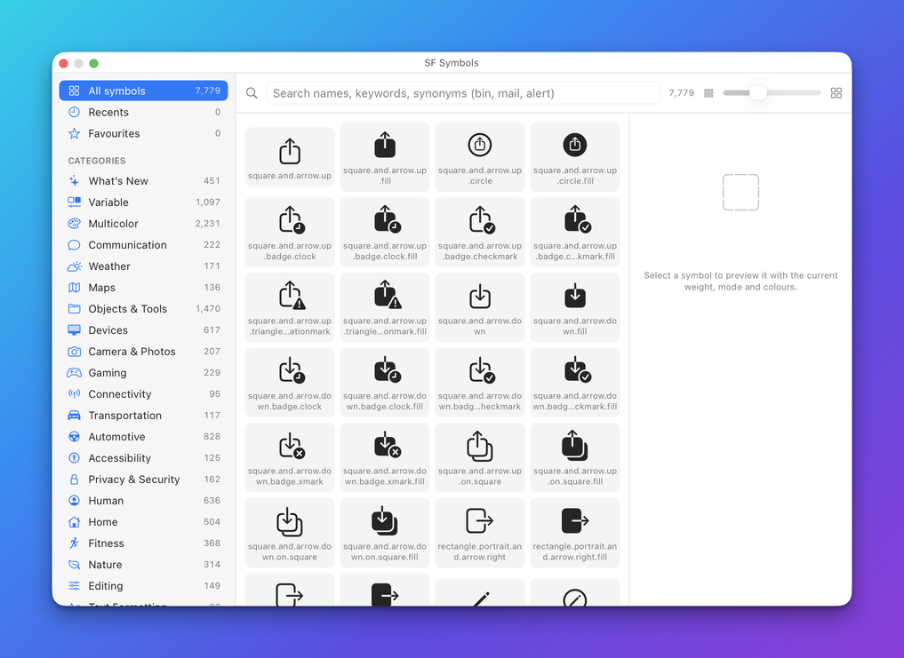
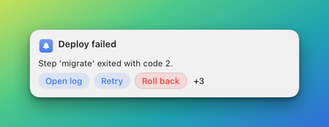

# Actions component

The `actions` component draws the banner's action buttons as one row: every action in the resolved list, or a chosen
subset. The Designer calls it **Actions**. Use it when a banner has more than one action and you want Herald to lay the
buttons out for you, wrapping onto more lines, hiding the overflow behind a "+N" menu, or aligning them to one side. The
row also holds the snooze clock and the **Add to Reminders** button when a notification asks for them.

To draw one action in a place of its own, use [`button`](button.md) or [`iconButton`](iconButton.md). An action is drawn
in at most one cell of a template, so one list can be split across several cells. See
[One action, one cell](#one-action-one-cell).

**Minimal example**

```json
{"type":"actions"}
```

This lists every resolved action, merged from the issuer and the template, and wraps the buttons onto more lines when
they do not fit.

**Realistic example**

A title and a full-width action row. The template's rules relabel one issuer action, give it an icon, hide another, and
add a Shortcut of its own. The row shows at most four buttons.

```json
{"name":"actions-demo","app":"example.bidbot","layoutVersion":2,"collapseEmpty":true,
 "grid":{"rows":2,"cols":1,"rowSizes":["auto","auto"],"colSizes":["fill"],"gap":8,"padding":12,"width":380},
 "cells":[
  {"id":"title","row":0,"col":0,"component":{"type":"text","binding":"{title}","style":"title"}},
  {"id":"acts","row":1,"col":0,"component":{"type":"actions","source":"merged","layout":"wrap","maxVisible":4}}],
 "actionRules":[
  {"match":"markRead","relabel":"Mark as read","position":0},
  {"match":"markRead","symbol":"checkmark"},
  {"match":"archive","hide":true},
  {"add":{"id":"followup","label":"Follow up","kind":"shortcut","shortcut":"Create follow-up","input":"{title}\n{url}"}}]}
```



**Properties**

| Property | Type | Default | Description |
|---|---|---|---|
| `type` | string | required | Always `"actions"`. |
| `source` | string | `merged` | Which actions the row may show: `issuer`, `template` or `merged`. See [Which actions](#which-actions). |
| `layout` | string | `wrap` | How the buttons are arranged: `row`, `wrap` or `stack`. See [Layouts](#layouts). |
| `maxVisible` | integer | all | The most buttons shown outright, at least 1. The rest sit behind a "+N" menu. It applies in every layout. |
| `include` | array of strings | none | The ids of the actions this cell shows, in this order. When it is empty or absent the cell shows every action of `source` that no other cell claimed. |
| `align` | string | `leading` | Where the buttons sit across the cell: `leading`, `center`, `trailing` or `spaceBetween`. See [Alignment, wrapping and spacing](#alignment-wrapping-and-spacing). |
| `wrap` | boolean | follows `layout` | Whether the buttons flow onto more lines when they do not fit. |
| `spacing` | number | `6` | The gap between buttons in points, from 0 to 64. |
| `symbol` | name or object | none | A symbol that every button of the row gets, unless its action has its own `symbol`. See [The look of each button](#the-look-of-each-button). |
| `emptyBehavior` | string | template default | `collapse` or `keep`. See [Empty rows](#empty-rows). |

## What the row contains

The row holds, in this order:

1. The resolved actions it is assigned, as capsule buttons 24 points high.
2. A "+N" menu with the actions that did not fit or that `maxVisible` cut, when there are any.
3. The **Add to Reminders** button, when the notification has a `reminder` and `source` is not `template`. It shows its
   working, added and failed states.

A `snooze` action without `snoozeMinutes` is not a button. It is Herald's snooze menu, drawn as a clock (the ⏰ symbol) pinned to the trailing edge of the row.

- Its choices are **5 minutes**, **15 minutes**, **1 hour** and **Tomorrow 9:00**.
- A notification with `"snooze": true` adds this action.
- A rule can add it too with `{"add":{"id":"snooze","label":"Snooze","kind":"snooze"}}`.

The sample data of a preview stands in for an app that names every action its manifest declares. A real notification
shows only the actions it sends.

## Which actions

The resolved list has two kinds of action. The issuer's are the buttons the sending app sends. The template's are the
ones its `actionRules` add. `source` filters them:



| `source` | The row may show |
|---|---|
| `issuer` | Only the issuer's actions, after the template's rules have hidden, relabelled or reordered them. |
| `template` | Only the actions that `actionRules[].add` adds. |
| `merged` | Both, in resolved order. |

`include` narrows the row further to the ids you list, for example `["archive","delete","spam"]`. An id that no action
has shows nothing, and the validator warns about it when a manifest is available. An id whose action `source` filters out
shows nothing either.

## Layouts

| `layout` | What it does |
|---|---|
| `wrap` | The buttons flow onto further lines when they do not fit. This is the default. |
| `row` | One line. The first arrangement that fits the width wins: all the buttons, else one fewer plus "+1", and so on. |
| `stack` | One button per line. |

The `wrap` property decides whether a `row` or `wrap` layout flows onto more lines. It is ignored for `stack`.

- `"layout":"row"` with `"wrap":true` flows onto more lines.
- `"layout":"wrap"` with `"wrap":false` stays on one line.

## Alignment, wrapping and spacing

`align` places the buttons across the width of the cell. When it is omitted, the horizontal part of the cell's own
`align` is used, so a cell aligned `topTrailing` puts the buttons against the trailing edge.

| `align` | Placement |
|---|---|
| `leading` | At the leading edge. |
| `center` | In the middle. |
| `trailing` | At the trailing edge. |
| `spaceBetween` | The first button at the leading edge, the last at the trailing edge, and the rest spread evenly between them. |

When the row wraps, `align` applies to each line. The snooze clock is always on the trailing edge. A row with an `align`
other than `leading` fills the width of its cell, so the buttons can reach the trailing edge or the middle.

In the Designer these are the **Align** control (**Left**, **Centre**, **Right**, **Spread**), the **Wrap** checkbox
(**Flow onto more lines**) and the **Spacing** field. The **Layout** control offers **Wrap**, **Row** and **Stack**, and
**Max** sets `maxVisible`. The **Shows** control of an Actions cell, with **Both**, **Issuer** and **Mine**, sets
`source`. It is not the per-action **Shows** control described below.

## One action, one cell

An action is drawn in at most one cell of a template. Cells are visited from top to bottom and from left to right:

1. A `button` bound to an action id (`actionRef`) claims that action.
2. An `actions` cell with `include` claims the ids it lists, in that order.
3. An `actions` cell with no `include` shows every action of its `source` that nobody claimed.

When two cells ask for the same action, the first one in reading order draws it and the other shows nothing for it. A
`button` in that position is empty. The validator reports a warning that names both cells. In the Designer the **Which**
control of an Actions cell has the choices **All the rest** and **Chosen**, and a chosen action that another cell already
draws is marked "Already drawn in cell".

This template splits the list by hand. It puts the app icon in the first column, a button for **Mark as Read** under it,
and **Archive**, **Delete** and **Spam** right-aligned in one merged cell across the other columns of the last row:

```json
{"name":"email-split","app":"example.bidbot","layoutVersion":2,"collapseEmpty":true,
 "grid":{"rows":4,"cols":4,"rowSizes":["auto","auto","auto","auto"],"colSizes":[104,"fill","fill","fill"],"gap":8,"padding":14,"width":400},
 "cells":[
  {"id":"icon","row":0,"col":0,"rowSpan":3,"component":{"type":"issuerIcon","size":56,"shape":"rounded"}},
  {"id":"title","row":0,"col":1,"colSpan":3,"component":{"type":"text","binding":"{title}","style":"title","maxLines":1}},
  {"id":"sender","row":1,"col":1,"colSpan":3,"component":{"type":"text","binding":"{sender}","style":"subtitle","maxLines":1}},
  {"id":"subject","row":2,"col":1,"colSpan":3,"component":{"type":"text","binding":"{subject}","style":"caption","maxLines":1}},
  {"id":"read","row":3,"col":0,"component":{"type":"button","actionRef":"markRead"}},
  {"id":"more","row":3,"col":1,"colSpan":3,"component":{"type":"actions","include":["archive","delete","spam"],"align":"trailing","wrap":false}}]}
```

## The look of each button

Each button draws its own action.

- Its label may contain `{tokens}`, which are filled from the notification's fields.
- A label that fills to nothing shows the action's id.
- A label over 40 characters is cut, with the full text in the tooltip.

The button's colours follow the action's `style`: `normal`, `prominent`, `destructive` or `cancel`. [Button style](button.md#style) shows each look.

What a button shows is chosen for each action on its own: its text, an icon with its text, or an icon alone. The choice is
the action's `symbol`:

- No symbol means text only.
- A symbol with the default `placement` means icon and text. `"placement":"trailing"` puts the icon after the text.
- A symbol with `"placement":"only"` means icon only, and the text is not drawn.

Which symbol an action shows is decided in this order:

1. The action's own `symbol`, which a `symbol` in an `actionRules` entry replaces.
2. The row's `symbol`, when the action has none. The row's `symbol` is therefore a default for buttons that have none.

An icon-only action keeps its label as the tooltip and the name VoiceOver reads, and it needs no label of its own in the Designer.

To give an action from the issuer an icon, add a rule. This one gives **Mark as Read** an icon alone and leaves the others
as they are:

```json
{"actionRules":[{"match":"markRead","symbol":{"name":"checkmark","placement":"only"}}]}
```

In the Designer, open the **Actions** tab of the inspector. Every action in the **Buttons** list has two controls:

- A **Shows** menu with **Text**, **Icon and text** and **Icon only**.
- An **Icon** button (**Change icon** once there is one) that opens a panel to pick the symbol, its weight and its colours.

A change to an issuer action is saved as a rule, so the issuer's action itself is never edited. A **Shows** choice for an action you added changes that action.



The **Icon** button opens a panel for that action's symbol:



The picker beside **Name** in that panel opens the symbol browser:



## Sizing and the overflow menu

The row fills the width of its cell. Its height is one button, which is 24 points. A `wrap` or `stack` row grows by one
button for each extra line. A kept empty row holds the height of one button.

The "+N" menu lists the actions that are not shown as buttons. Its entries run their actions as the buttons would, and a
destructive one is marked as destructive. In a static preview the menu and the snooze clock are drawn as plain labels.



## Empty rows

The row is empty when its assigned actions are empty. A notification with a `reminder` keeps the row alive, because the
**Add to Reminders** button lives in it, unless `source` is `template`. While an inline confirmation is pending, the
confirmation replaces the row, as described in [Components](README.md#empty-components-and-emptybehavior).

## Which action runs

Each button runs its action with the origin the action came from, issuer or template. The gates and confirmations are
described in [Confirmation gates](../actions.md#approvals).

## Common mistakes

| Mistake | What happens | Fix |
|---|---|---|
| Expecting the manifest's actions to show on a real notification. | Only the actions the notification sends appear. | Send `"actionIds":["markRead"]` or `buttons`. |
| `source: "template"` with no `add` rules. | The row is empty and collapses. | Add rules, or use `merged`. |
| `maxVisible: 0`. | It is treated as 1, so the row never shows only a menu, and the validator reports an error. | Use 1 or more. |
| Several `actions` rows in one template. | An action is drawn once. The first row in reading order takes what is left and the others are empty. | Give each row its own `include`. |
| The same id in two cells. | The first cell draws it, the other shows nothing, and the validator warns. | Name the id in one cell. |
| Setting a `symbol` on the row and expecting it to replace an action's own symbol. | The action's symbol wins. | Remove the action's symbol, or set it through a rule. |

## Related

- [Actions](../actions.md): action kinds, `actionRules`, confirmation gates and what an action receives.
- [Button component](button.md): one action in a cell of its own, and the button styles.
- [Icon button component](iconButton.md): a round icon-only button.
- [SF Symbols](../symbols.md): symbol names, weights, colours and effects.
- [Designing a banner](../../AUTHORING.md): the Actions tab of the Designer.
