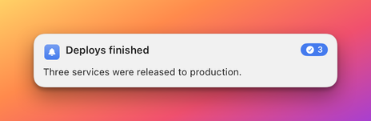

# Badge component

The `badge` component draws a small pill that holds a short value: an unread count, a status word, a price. The Designer
calls it **Badge**. Use it for a value that should stand out from the text around it, usually in the corner of a banner
next to the title. To count the notifications folded into a stack, use [`stackBadge`](stackBadge.md) instead.

**Minimal example**

```json
{"type":"badge","binding":"{count}"}
```

This draws the `count` field in a pill that uses the accent colour.

**Realistic example**

An unread count in a red pill at the top right of a banner, beside the app icon and the title.

```json
{"name":"badge-demo","app":"example.bidbot","layoutVersion":2,"collapseEmpty":true,
 "grid":{"rows":1,"cols":3,"rowSizes":["auto"],"colSizes":[40,"fill","auto"],"gap":8,"padding":12,"width":380},
 "cells":[
  {"id":"icon","row":0,"col":0,"component":{"type":"issuerIcon","size":32}},
  {"id":"title","row":0,"col":1,"component":{"type":"text","binding":"{title}","style":"title","maxLines":2}},
  {"id":"count","row":0,"col":2,"align":"topTrailing",
   "component":{"type":"badge","binding":"{count}","color":"#FF3B30"}}]}
```



**Properties**

| Property | Type | Default | Description |
|---|---|---|---|
| `type` | string | required | Always `"badge"`. |
| `binding` | string | required | The value, with `{token}` placeholders, for example `"{count}"` or `"{count} new"`. |
| `color` | string | `accent` | The colour of the pill: a hex colour, or `accent`, `primary` or `secondary`. |
| `textColor` | string | legible on the pill | The colour of the value: a hex colour, or `accent`, `primary` or `secondary`. |
| `symbol` | name or object | none | An SF Symbol drawn before the value. See [The symbol](#the-symbol). |
| `emptyBehavior` | string | template default | `collapse` or `keep`. See [Empty badges](#empty-badges). |

## The value

The value is the bound text on one line, in 10.5 point semibold type with digits of equal width.

- A number prints without a trailing `.0`.
- A number zero is a value like any other, so `{count}` with a count of `0` shows `0`.
- To hide the badge, leave the field out.

## The symbol

A `symbol` is drawn inside the pill, in the text colour. Its `placement` decides where:

| `placement` | Result |
|---|---|
| `leading` (default) | The symbol before the value. |
| `trailing` | The symbol after the value. |
| `only` | The symbol alone. The value is not drawn. |

A name that is not an SF Symbol on this Mac is ignored, and the pill shows the value alone. See
[SF Symbols](../symbols.md).

## Colours

A badge's pill colour is not adjusted for legibility. What you write is drawn in both light and dark appearance, so choose
a colour that reads on both. A saturated red or blue works. With no `textColor`, Herald picks black or white for contrast
with the pill. A pill lighter than about 62 percent luminance gets black text.

## Sizing and alignment

The pill hugs its text, with 6 points of padding at the sides and 1.5 points above and below, and it is at least 17 points
wide, so a single digit makes a nearly round pill. It never wraps or stretches. It usually sits at `topTrailing` next to a
title.

A badge has no action. The stack counter, which expands a stack when clicked, is [`stackBadge`](stackBadge.md).

## Empty badges

A badge is empty when every token in its `binding` is absent or blank. A kept empty badge is invisible but holds its size.

## Common mistakes

| Mistake | What happens | Fix |
|---|---|---|
| A very light `color` with no `textColor`. | Black text is chosen, which reads well, but on a light banner the pill itself disappears. | Use a mid-tone colour. |
| Binding `{count}` when the count is `0`. | The pill shows `0`. | Leave the field out when there is nothing to show, or bind a text field. |
| Using `badge` for the stack count. | It never shows the stack and has no click to expand. | Use `stackBadge`. |

## Related

- [Stack badge component](stackBadge.md): the pill that counts a stack and opens it.
- [Text component](text.md): longer text.
- [Bindings and tokens](../bindings.md): where `{count}` and the other fields come from.
- [SF Symbols](../symbols.md): the `symbol` value.
