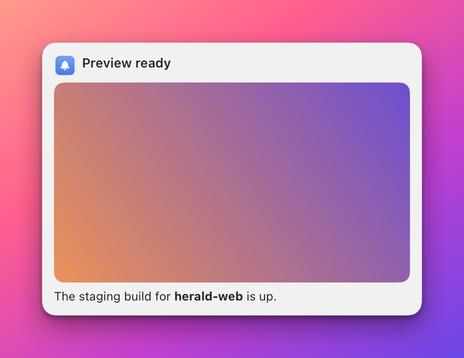

# Image component

The `image` component draws a picture that comes from a field: a preview thumbnail, a hero image across the top of a
banner, a logo. The Designer calls it **Image**. By default it shows the picture the sending app attached to the
notification, so the same template shows a different picture on every banner. For the sending app's own icon use
[`issuerIcon`](issuerIcon.md) instead.

**Minimal example**

```json
{"type":"image"}
```

With no properties the component binds `{image}`, fills the width of its cell and crops the picture to fill it.

**Realistic example**

A 16:9 hero picture across the top of a banner, with the title below it.

```json
{"name":"hero-demo","app":"example.bidbot","layoutVersion":2,"collapseEmpty":true,
 "grid":{"rows":2,"cols":1,"rowSizes":["auto","auto"],"colSizes":["fill"],"gap":8,"padding":0,"width":380},
 "cells":[
  {"id":"hero","row":0,"col":0,"component":{"type":"image","binding":"{image}","fit":"cover","aspectRatio":1.7778}},
  {"id":"text","row":1,"col":0,"padding":14,"component":{"type":"text","binding":"{title}","style":"title"}}]}
```



**Properties**

| Property | Type | Default | Description |
|---|---|---|---|
| `type` | string | required | Always `"image"`. |
| `binding` | string | `"{image}"` | Where the picture comes from. It must resolve to a file path (`~` is expanded), a `file:` URL, a `data:` URI or an http or https URL. |
| `fit` | string | `cover` | How the picture fills its box. The three values are explained under the table. |
| `cornerRadius` | number | `0` | The radius of the picture's corners in points. It must be 0 or more. |
| `aspectRatio` | number | the picture's own, else `1` | Width divided by height, above 0. `1` is square and `1.7778` is 16:9. |
| `height` | number | none | A fixed height in points, above 0. It wins over `aspectRatio`. |
| `emptyBehavior` | string | template default | `collapse` or `keep`. See [Empty images](#empty-images). |

The values of `fit`:

| `fit` | Result |
|---|---|
| `fit` | The whole picture shows, with empty bars where the shapes differ. |
| `fill` | The picture is stretched to the box and distorted. |
| `cover` | The picture fills the box and the overflow is cropped. |

## Where the picture comes from

The binding decides the source. In the Designer the **Source** menu of the Image inspector writes the binding for you.

| **Source** choice | Binding it writes | Meaning |
|---|---|---|
| **From issuer** | `"{image}"` | The picture the sending app attached to the notification. Nothing is drawn when it sent none. |
| **Fixed image** | A file path | A picture you choose, the same for every notification. It overrides the issuer's picture. |
| **Field** | `"{key}"` | Another field of type `image` that the app's manifest declares, for example `{thumbnail}`. |

A binding that mixes tokens and text, such as `https://cdn.example.com/{id}.png`, shows as a custom binding with its own
text field.

When you choose a fixed image, Herald copies the file into `~/Library/Application Support/Herald/template-images/<app>/`
so the template keeps working if the original moves. The file must be a PNG, JPEG, GIF, WebP, HEIC, AVIF, TIFF or BMP
of at most 10 MB. The copy's name carries a short hash of its content, so choosing the same file twice makes one copy and
a changed file never replaces a picture that other templates use.

How each source is loaded:

| Source | How it is loaded |
|---|---|
| The notification's `image` | A URL is downloaded once and checked. The checks are listed under the table. |
| Another binding that resolves to a local path or `data:` URI | It is read from disk and cached in memory, up to 64 pictures. |
| Another binding that resolves to an http or https URL | It is drawn while the banner is on screen and is not downloaded ahead of time. |

The checks for the notification's `image`:

- The bytes must be PNG, JPEG, GIF, WebP, HEIC, AVIF, TIFF or BMP, at most 10 MB.
- Herald keeps a copy in History.
- The `image` value itself is at most 256 KB.
- Anything that fails these checks is ignored.

## Sizing

The image fills the width of its cell. Its height comes from `height` when you set one. Otherwise it comes from the aspect
ratio: your `aspectRatio`, else the picture's own, else 1.

- In an `auto` column the ideal side is 48 points.
- In a row with `auto` height the picture decides the row's height, so a 72 point column with `aspectRatio` 1 gives a
  72 point square.
- A picture that spans two rows lends its extra height to the last row it covers that is not a fixed size.
- When the cell is taller than the picture needs, for example a fixed-height row, the cell's `align` positions the box
  vertically.

A click on the picture is a click on the banner. It opens the notification's `url`, or first expands text that was cut
short. See [How banners behave](../banners.md).

## Empty images

An image is empty in two cases. The first is that its binding's token is absent. The second is that the field names
something nothing can show, such as a missing file or a failed download. The second rule means a template with `collapse`
never leaves a blank square for a broken image path. A fixed image is never empty while its file exists. If the file is
removed the component is empty and follows `emptyBehavior`.

A kept empty image is a transparent box of the same size, so the layout holds.

An image is drawn as it is, so it looks the same in light and dark appearance.

## Common mistakes

| Mistake | What happens | Fix |
|---|---|---|
| Setting both `height` and `aspectRatio`. | `height` wins, and the ratio only sets the width. | Pick one. |
| Using `fill` to fill the cell. | The picture is stretched and distorted. | Use `cover`. |
| Binding a remote URL from a field other than `image` and checking it with `render_preview`. | A static preview draws nothing for it. | Check it on a live banner, or send the URL as the notification's `image`. |
| A picture over 10 MB or in an unsupported format. | It is ignored and the component collapses. | Resize it and use PNG or JPEG. |
| A fixed 72 point row for a square picture in an `auto` column. | The picture is cropped or letterboxed to the fixed size. | Use an `auto` row and let `aspectRatio` set the height. |

## Related

- [Notifications API](../api/notifications.md): the `image` field of a notification.
- [Manifests](../manifests.md): declaring fields of type `image`.
- [Designing a banner](../../AUTHORING.md): choosing a picture in the Designer.
- [Issuer icon component](issuerIcon.md): the sending app's icon.
