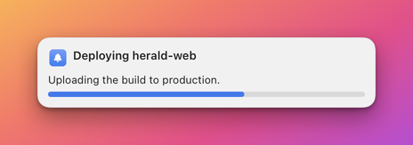

# Progress component

The `progress` component draws a thin bar that is filled in proportion to a number. The Designer calls it **Progress**.
Use it for something that advances, such as a download, a build or a sync, and update the banner by sending the same
notification `id` again with a new value.

**Minimal example**

```json
{"type":"progress","binding":"{percent}"}
```

**Realistic example**

A title that includes the percentage, and a thicker green bar under it. The bar collapses when the notification sends no
value.

```json
{"name":"progress-demo","app":"example.bidbot","layoutVersion":2,"collapseEmpty":true,
 "grid":{"rows":2,"cols":1,"rowSizes":["auto","auto"],"colSizes":["fill"],"gap":6,"padding":12,"width":380},
 "cells":[
  {"id":"title","row":0,"col":0,"component":{"type":"text","binding":"{title} {percent}%","style":"title"}},
  {"id":"bar","row":1,"col":0,
   "component":{"type":"progress","binding":"{percent}","color":"#34C759","height":6,"emptyBehavior":"collapse"}}]}
```



**Properties**

| Property | Type | Default | Description |
|---|---|---|---|
| `type` | string | required | Always `"progress"`. |
| `binding` | string | required | The value, usually one numeric field such as `"{percent}"`. |
| `color` | string | `accent` | The colour of the filled part: a hex colour, or `accent`, `primary` or `secondary`. A hex colour is adjusted until it is legible on the current appearance. |
| `height` | number | `4` | The thickness of the bar in points. It must be above 0, and the bar is at least 1 point thick. |
| `emptyBehavior` | string | template default | `collapse` or `keep`. See [Empty bars](#empty-bars). |

## How the value is read

The bound text is read as a number and turned into a fraction between 0 and 1:

- A number up to 1 is already a fraction.
- A number above 1, or text ending in `%`, is a percentage.
- The result is clamped to 0 through 1.

| Value | Bar filled to |
|---|---|
| `0.25` | 25 percent |
| `1` | 100 percent, because 1 is a fraction |
| `1.5` | 1.5 percent, because a value above 1 is a percentage |
| `40` | 40 percent |
| `"40%"` | 40 percent |
| `250` | 100 percent, because it is clamped |

If the value is present but is not a number, such as `"3 of 7"`, the bar is not drawn and its space is kept.

## Sizing and alignment

The bar fills the width of its cell, at least 40 points, and is exactly `height` points thick. In an `auto` column its
ideal width is 120 points. It is drawn as a rounded track with a faint tint of the primary colour behind the filled part,
so it follows the light or dark appearance. When the row is taller than the bar, the cell's `align` places it vertically.

A progress bar has no action.

## Empty bars

A bar is empty when every token in its `binding` is absent or blank. A kept empty bar is invisible and holds its height.

## Common mistakes

| Mistake | What happens | Fix |
|---|---|---|
| Sending `1` to mean 1 percent. | The bar shows 100 percent. | Send `0.01` or `"1%"`. |
| Binding a field that holds `"3 of 7"`. | It is not a number, so the bar is not drawn. | Send a fraction or a percentage. |
| A progress bar in an `auto` column. | The column is only about 120 points wide. | Put the bar in a `fill` column, or span several columns. |

## Related

- [Notifications API](../api/notifications.md): sending the same `id` again to update a banner in place.
- [Bindings and tokens](../bindings.md): where `{percent}` comes from.
- [Manifests](../manifests.md): declaring a numeric field.
- [Text component](text.md): showing the number as words beside the bar.
