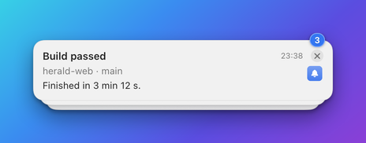

# Stack badge component

The `stackBadge` component draws a pill with the number of notifications folded into a banner's stack. The Designer calls
it **Stack count**. Several notifications from one app can pile up as a single stack, and this pill tells the reader how
many there are. Clicking it opens the stack. While a banner is alone the pill has nothing to show, so it is empty.

You do not have to add one. A template without a `stackBadge` gets the counter at the top right corner of the stacked card
by itself. Add one when you want to place the counter yourself. How stacking works is described in
[Stacking](../stacking.md).

**Minimal example**

```json
{"type":"stackBadge"}
```

**Realistic example**

A counter in the corner of a banner that looks the same alone and stacked, because the pill takes no room while the
banner is alone.

```json
{"name":"stack-demo","app":"example.bidbot","layoutVersion":2,"collapseEmpty":true,
 "grid":{"rows":1,"cols":2,"rowSizes":["auto"],"colSizes":["fill","auto"],"gap":8,"padding":12,"width":380},
 "cells":[
  {"id":"title","row":0,"col":0,"component":{"type":"text","binding":"{title}","style":"title"}},
  {"id":"stack","row":0,"col":1,"align":"topTrailing","component":{"type":"stackBadge","color":"#007AFF"}}]}
```



**Properties**

| Property | Type | Default | Description |
|---|---|---|---|
| `type` | string | required | Always `"stackBadge"`. |
| `color` | string | `accent` | The colour of the pill: a hex colour, or `accent`, `primary` or `secondary`. |
| `textColor` | string | legible on the pill | The colour of the number: a hex colour, or `accent`, `primary` or `secondary`. |
| `emptyBehavior` | string | template default | `collapse` or `keep`. See [Empty stack badges](#empty-stack-badges). |

A stack badge has no `binding`. It always shows `{stack.count}`.

## The count

`{stack.count}` is supplied by the banner while it is drawn, and only while two or more notifications are stacked. It is
absent for a lone banner. You can also use it in any text, for example `"+{stack.count} more"`. It is drawn exactly as a
[`badge`](badge.md) is, so its size, colours and alignment follow the same rules.

## Clicking the pill

On the top card of a stack, clicking the pill toggles the stack. It expands in place when it is closed. When it is open it
collapses again. An open stack is a scrollable list, newest first, with **Collapse** and **Dismiss all** controls. The
click never activates Herald and never takes focus from the app you are working in. On a lone banner the pill does nothing.
The tooltip reads "Show all" and the count.

## Empty stack badges

The pill is empty while the banner is alone, because the count is then below 2. With `collapse` the pill disappears, and
so does any row or column that only it kept alive. With `keep` it holds a blank cell of its own size.

## Common mistakes

| Mistake | What happens | Fix |
|---|---|---|
| Previewing a lone banner and seeing nothing. | That is correct, because the badge is empty below 2. | Preview with a stack count, for example `"stackCount":3` in `POST /v1/preview`. |
| Binding `{stack.count}` in a plain `badge`. | It shows the number but a click does nothing. | Use `stackBadge`. |

## Related

- [Stacking](../stacking.md): stacking levels, expanding a stack and the counter.
- [Badge component](badge.md): the pill this component is drawn as.
- [Templates API](../api/templates.md): previewing a template with a stack count.
- [How banners behave](../banners.md): clicking and closing banners.
