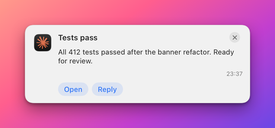

# MCP tools: notifications

These tools let an agent check that Herald is running, put a banner or a spoken message in front of the user, take a banner away again, and ask the user a question and wait for the answer. They are the part of the [MCP server](README.md) an agent uses while it works, as opposed to the tools that design how banners look ([templates](templates.md)) or change settings ([apps and settings](apps-and-settings.md)).

Every tool here is a thin wrapper over one call to Herald's [HTTP API](../api/notifications.md). The conventions shared by all tools (result format, errors, the `app` default of an agent) are in the [MCP server overview](README.md#conventions).

## How these tools fit together

A notification belongs to an **app**, identified by an id such as `example.bidbot`. An agent installed from **Settings > MCP** has an app of its own (`agent.claude-code`, for example) and the server sends as that app when a call leaves `app` out. See [Agent identity](README.md#agent-identity).

The usual order of calls:

1. `herald_status` once, to confirm Herald is running.
2. `send_notification` to tell the user something, or `speak` to say it without a banner.
3. `wait_for_reply` when the notification asked a question.
4. `dismiss` or `snooze` when the event behind a banner is over or can wait.

While you design a template, call `send_test` instead of `send_notification`: it fills the fields from the manifest's sample values, so you do not have to invent a payload.

## Tools

| Tool | What it does |
|---|---|
| [`herald_status`](#herald_status) | Reports whether Herald is running and what it holds. |
| [`send_notification`](#send_notification) | Shows a real banner. |
| [`send_test`](#send_test) | Shows a saved template with the manifest's sample values. |
| [`speak`](#speak) | Says a sentence aloud, with no banner. |
| [`dismiss`](#dismiss) | Closes one banner, a stack or every banner of an app. |
| [`snooze`](#snooze) | Hides a banner and brings it back later, or cancels a snooze. |
| [`list_stacks`](#list_stacks) | Lists the stacks of banners on screen. |
| [`expand_stack`](#expand_stack) | Opens or closes a stack. |
| [`get_replies`](#get_replies) | Reads the replies waiting in an app's queue. |
| [`wait_for_reply`](#wait_for_reply) | Waits for the user's answer to one notification. |

## Check that Herald is running

Call this first. Every other tool except `component_schema` and `validate_template` needs Herald running.

### `herald_status`

Reports whether Herald answers, which version it is, which port and support folder this server uses, how many apps, manifests, templates and Shortcuts exist, and which script files are in the scripts folder. It never fails: when Herald is down it says so and says how to start it.

**Arguments**

No arguments.

**Example call**

```json
{}
```

**Example result**

```json
{
  "server": "herald-mcp 1.1.0",
  "supportDirectory": "/Users/you/Library/Application Support/Herald",
  "port": 48617,
  "tokenFile": true,
  "running": true,
  "version": "1.8.1",
  "pid": 4821,
  "apps": ["example.bidbot", "herald"],
  "manifests": 1,
  "templates": 2,
  "shortcuts": 3,
  "scriptsDirectory": "/Users/you/Library/Application Support/Herald/scripts",
  "scripts": ["follow-up.sh"]
}
```

The fields of the result:

| Field | Type | Description |
|---|---|---|
| `server` | string | The name and version of this MCP server. |
| `supportDirectory` | string | The folder the server reads the `token` and `port` files from. |
| `port` | number | The port the server sends requests to. |
| `tokenFile` | boolean | Whether a token file was found. |
| `running` | boolean | Whether Herald answered. `false` comes with a `hint` that says what to do. |
| `version`, `pid` | string, number | Herald's version and process id. Present only when Herald answered. |
| `apps` | array of string | The ids of the registered apps. |
| `manifests`, `templates`, `shortcuts` | number | How many manifests, saved templates and installed Apple Shortcuts exist. |
| `scriptsDirectory`, `scripts` | string, array of string | The folder a `script` action reads from and the files in it. |
| `authorized`, `hint` | boolean, string | Present when Herald answers but the token is missing or refused. |

**HTTP route**

- [`GET /v1/health`](../api/diagnostics.md#get-v1health) reports whether Herald runs.
- [`GET /v1/apps`](../api/apps.md#get-v1apps) supplies the app ids.
- [`GET /v1/manifests`](../api/manifests.md#get-v1manifests) supplies the manifest count.
- [`GET /v1/templates`](../api/templates.md#get-v1templates) supplies the template count.
- [`GET /v1/shortcuts`](../api/templates.md#get-v1shortcuts) supplies the Shortcut count.

**Side effects**

None. Read-only.

## Show a banner

`send_notification` is the tool for real messages. `send_test` is the tool for checking a design.

### `send_notification`

Delivers a real notification: a banner appears on the user's screen and the notification is stored in History. The payload is the same as [`POST /v1/notify`](../api/notifications.md#post-v1notify), so every notification field described there can be passed as an extra argument. Fields the tool does not list in its own table are passed through unchanged.

Two rules protect the user:

- A button that carries a shell `command` is refused unless `allowCommandButtons` is `true`. Anyone can send as any app id, and a command button would run under the command permission the user gave that app.
- When the app is an agent app (its id starts with `agent.`) and the call names no buttons, Herald shows the agent's own buttons: Open, Reply and, when the notification has a `link`, Open link.



To ask a question, send with `persistent: true` and an `id`, then call [`wait_for_reply`](#wait_for_reply).

**Arguments**

| Name | Type | Required | Description |
|---|---|---|---|
| `app` | string | yes | The id of the sending app. Optional when the server runs with `--agent`; it then defaults to the agent's own app. |
| `title` | string | no | The headline. May be omitted when the template supplies one. |
| `subtitle` | string | no | A second line under the title. |
| `body` | string | no | The main text. Markdown links such as `[text](https://example.com)` work. |
| `id` | string | no | Your id for this notification. Sending the same id again overwrites the banner on screen. |
| `template` | string | no | The name of a saved template of this app. |
| `fields` | object | no | Manifest field values, such as `{"bids": 3}`. They are sent as top-level keys. |
| `buttons` | array | no | Buttons for this notification. Each is an object with a `label` and one of `url`, `command` or `callback`, and optionally a `style`. `actions` is accepted as another name. |
| `actionIds` | array of string | no | The ids of actions the app's manifest declares, instead of repeating the buttons. |
| `allowCommandButtons` | boolean | no | Allows buttons that carry a shell `command`. Default `false`. |
| `metadata` | object | no | Free-form values, readable as `{key}` in templates. |
| `speak` | boolean or object | no | Says the notification aloud. `true` speaks the title and then the body. An object sets the text and voice, as in [Voice](../voice.md). |
| `audio` | string | no | A voice message to play: a WAV, MP3 or M4A file path, an `https` URL or a `data:` URI, at most 20 MB. |
| `presentation` | string | no | `banner` (default), `voice` (spoken only, no banner) or `both`. |
| other fields | any | no | Any other key is passed through as a notification field. |

**Example call**

```json
{
  "app": "example.bidbot",
  "title": "Bid accepted",
  "body": "Your bid of $4,200 was accepted.",
  "id": "bid-42",
  "persistent": true,
  "buttons": [{"label": "Open", "url": "https://example.com/bids/42"}]
}
```

**Example result**

```json
{"sent": true, "id": "bid-42", "app": "example.bidbot"}
```

When a `command` button is refused, the result has `isError` set and the reason in `error`, and nothing is sent.

**HTTP route**

[`POST /v1/notify`](../api/notifications.md#post-v1notify).

**Side effects**

Shows a banner, plays the app's sound and adds a History entry. With `speak`, `audio` or `presentation` set it also speaks or plays. Quiet hours can hold back the sound and speech.

### `send_test`

Shows a saved template for real, so you can see the banner, its sound and its buttons on screen. Herald fills the template with the manifest's sample values and sends the manifest's actions as the issuer's buttons, so `actionRules` have something to act on. The template must be saved first with [`put_template`](templates.md#put_template). Use [`render_preview`](templates.md#render_preview) to look at a design without showing a banner.

The notification id is `mcp-test-<template>`, so calling the tool again overwrites the banner instead of stacking a new one. Manifest actions that run a shell command are left out unless `allowCommandButtons` is `true`. Pressing an issuer callback button calls the issuing app, so tell the user before they click.

**Arguments**

| Name | Type | Required | Description |
|---|---|---|---|
| `app` | string | yes | The app id. Optional when the server runs with `--agent`. |
| `template` | string | no | The saved template to show. Default: the manifest's `defaultTemplate`. |
| `data` | object | no | Field values that override the manifest's samples. |
| `id` | string | no | The notification id. Default `mcp-test-<template>`. |
| `includeIssuerActions` | boolean | no | Sends the manifest's actions as the issuer's buttons. Default `true`. |
| `allowCommandButtons` | boolean | no | Also sends manifest actions that run a shell command. Default `false`. |

**Example call**

```json
{"app": "example.bidbot", "template": "bid-won", "data": {"bids": 14}}
```

**Example result**

```json
{
  "sent": true,
  "id": "mcp-test-bid-won",
  "app": "example.bidbot",
  "template": "bid-won",
  "fields": ["bids", "item", "title"],
  "issuerActions": ["view", "withdraw"],
  "leftOutCommandActions": []
}
```

The reply has these parts:

- `fields` lists the field keys that were sent.
- `issuerActions` lists the manifest actions shown as buttons.
- `leftOutCommandActions` lists the command actions that were held back.

The tool fails in two cases. If the template does not exist, the error lists the saved and built-in names. If neither `template` nor the manifest's `defaultTemplate` is available, the error says so.

**HTTP route**

- [`POST /v1/notify`](../api/notifications.md#post-v1notify) shows the banner.
- [`GET /v1/manifest`](../api/manifests.md#get-v1manifest) is read first, for the sample values.
- [`GET /v1/templates`](../api/templates.md#get-v1templates) is read first, to check that the template exists.

**Side effects**

Shows a real banner on the user's screen with sample values, plays the app's sound and adds a History entry.

## Speak without a banner

### `speak`

Says `text` aloud on the Mac with Herald's local voice, with no banner. History keeps the text, so the log stays searchable. Use it to report that a long task finished or needs attention. Keep it to a sentence or two. Nothing leaves the Mac.

Quiet hours hold speech back; a held message is logged in History as suppressed. See [Quiet hours](../quiet-hours.md).

**Arguments**

| Name | Type | Required | Description |
|---|---|---|---|
| `app` | string | yes | The id of the sending app. Optional when the server runs with `--agent`. |
| `text` | string | yes | What to say. At most 2,000 characters. |
| `voice` | string | no | The voice name. Default `af_heart`. Others include `af_bella`, `am_michael` and `bf_emma`. |
| `speed` | number | no | The speaking speed, from 0.5 to 2.0. Default 1.0. |
| `lang` | string | no | A language code such as `en-us` or `en-gb`. |
| `id` | string | no | The notification id for the History entry. |

**Example call**

```json
{"app": "example.bidbot", "text": "The auction closed. You won the lot.", "id": "auction-7-done"}
```

**Example result**

```json
{"spoken": true, "id": "auction-7-done", "app": "example.bidbot"}
```

**HTTP route**

[`POST /v1/speak`](../api/notifications.md#post-v1speak). The voice fields are explained in [Voice](../voice.md).

**Side effects**

Speaks aloud on the user's Mac and adds a History entry. Shows no banner.

## Close or postpone a banner

### `dismiss`

Closes banners. The notification stays in History. The arguments choose what closes:

- `id` closes one banner.
- `group` closes every banner of the app that was sent with that group (a stack).
- `all: true` closes every banner of the app.

If you give more than one, `id` wins, then `group`.

**Arguments**

| Name | Type | Required | Description |
|---|---|---|---|
| `app` | string | yes | The app id. Optional when the server runs with `--agent`. |
| `id` | string | no | The notification id. See [`list_history`](apps-and-settings.md#list_history) for ids. |
| `group` | string | no | Closes every banner of the app sent with this group. Use instead of `id`. |
| `all` | boolean | no | Closes every banner of the app. Use instead of `id`. |

One of `id`, `group` or `all` is needed.

**Example call**

```json
{"app": "example.bidbot", "id": "bid-42"}
```

**Example result**

```json
{"dismissed": "bid-42", "app": "example.bidbot"}
```

The result depends on the argument used:

- With `group`: `{"dismissedGroup": "auction-7", "app": "example.bidbot"}`.
- With `all`: `{"dismissedAll": true, "app": "example.bidbot"}`.

**HTTP route**

- [`POST /v1/dismiss`](../api/notifications.md#post-v1dismiss) closes one banner, when you give an `id`.
- [`POST /v1/dismissAll`](../api/notifications.md#post-v1dismissall) closes a stack or every banner, when you give a `group` or `all`.

**Side effects**

Closes banners on screen. Changes no stored data.

### `snooze`

Hides a banner and shows it again after `minutes`, the same as the clock menu on the banner. With `cancel: true` it brings a snoozed banner back at once, without a new alert sound.

**Arguments**

| Name | Type | Required | Description |
|---|---|---|---|
| `app` | string | yes | The app id. |
| `id` | string | yes | The notification id. |
| `minutes` | number | no | Minutes until the banner returns, from 0.01 to 43,200. Needed unless `cancel` is `true`. |
| `cancel` | boolean | no | Cancels the snooze and shows the banner now. |

**Example call**

```json
{"app": "example.bidbot", "id": "bid-42", "minutes": 30}
```

**Example result**

```json
{"ok": true, "until": "2026-10-04T15:30:00Z"}
```

A cancel returns `{"ok": true}`.

**HTTP route**

- [`POST /v1/snooze`](../api/notifications.md#post-v1snooze) hides the banner.
- [`POST /v1/unsnooze`](../api/notifications.md#post-v1unsnooze) is used instead when `cancel` is `true`.

**Side effects**

Hides the banner now and shows it again later, or shows it at once on a cancel.

## Stacks

Herald folds notifications that share a stacking key into one banner with a counter. The user's stacking level decides the key:

| Level | The key is |
|---|---|
| `byApp` | Every issuer of one product family. |
| `byIssuer` | One app. |
| `bySender` | The notification's `group`, or the app id when none was sent. |

The levels are explained in [Stacking](../stacking.md).

### `list_stacks`

Lists the stacks on screen, each with its level, app, group, count, whether it is open and its notifications, newest first. Use the `app` and `group` it returns with [`expand_stack`](#expand_stack) and with [`dismiss`](#dismiss).

**Arguments**

| Name | Type | Required | Description |
|---|---|---|---|
| `app` | string | no | Only stacks that hold a notification of this app. Default: all stacks. Takes the agent's own app when the server runs with `--agent`. |

**Example call**

```json
{"app": "example.bidbot"}
```

**Example result**

```json
{
  "count": 1,
  "stacks": [
    {
      "level": "byIssuer",
      "app": "example.bidbot",
      "group": "auction-7",
      "count": 2,
      "expanded": false,
      "notifications": [
        {"app": "example.bidbot", "id": "bid-43", "title": "Outbid", "group": "auction-7", "deliveredAt": "2026-10-04T15:02:10Z"},
        {"app": "example.bidbot", "id": "bid-42", "title": "Bid accepted", "group": "auction-7", "deliveredAt": "2026-10-04T14:58:31Z"}
      ]
    }
  ]
}
```

**HTTP route**

[`GET /v1/stacks`](../api/stacks.md#get-v1stacks).

**Side effects**

None. Read-only.

### `expand_stack`

Opens a stack of banners as a list, or closes it again.

**Arguments**

| Name | Type | Required | Description |
|---|---|---|---|
| `app` | string | yes | The app id. |
| `group` | string | no | The stack's group, as `list_stacks` shows it. Default: the app id. |
| `expanded` | boolean | no | `true` opens the stack, `false` closes it. Default `true`. |

**Example call**

```json
{"app": "example.bidbot", "group": "auction-7", "expanded": true}
```

**Example result**

```json
{"ok": true}
```

**HTTP route**

[`POST /v1/stacks/expand`](../api/stacks.md#post-v1stacksexpand).

**Side effects**

Changes how a stack looks on screen. Changes no stored data.

## Ask the user a question

An agent has no web server of its own that Herald could call when the user presses a button, so answers come back through a queue. The sequence is: send a persistent notification with an `id` and `status: "question"`, then wait for the reply to that id. The Reply button of an agent banner opens a text field inside the banner; what the user types is stored on the notification and in the app's reply queue. See [How banners behave](../banners.md) for the Reply action.

```json
{"app": "agent.claude-code", "title": "Which branch?", "body": "main or release/2?", "status": "question", "persistent": true, "id": "q-branch"}
```

Send that with `send_notification`, then call `wait_for_reply` with `{"notificationId": "q-branch", "timeoutSeconds": 120}`.

### `get_replies`

Lists the answers the user typed into banners, oldest first, from a per-app queue. History keeps every reply on its notification whether or not the queue is cleared. Each reply has these fields:

| Field | Meaning |
|---|---|
| `notificationId` | The id of the notification the user answered. |
| `app` | The app id. |
| `text` | What the user typed. |
| `repliedAt` | When the reply was sent. |
| `title` | The title of the notification it answers. |

**Arguments**

| Name | Type | Required | Description |
|---|---|---|---|
| `app` | string | no | The app id. Defaults to the agent's own app when the server runs with `--agent`. |
| `since` | string | no | Only replies after this time: an ISO 8601 date or epoch seconds. |
| `consume` | boolean | no | Removes the returned replies from the queue. Default `false`. |

**Example call**

```json
{"app": "agent.claude-code", "consume": true}
```

**Example result**

```json
{
  "count": 1,
  "replies": [
    {
      "notificationId": "q-branch",
      "app": "agent.claude-code",
      "text": "release/2",
      "repliedAt": "2026-10-04T15:04:55Z",
      "title": "Which branch?"
    }
  ]
}
```

**HTTP route**

[`GET /v1/replies`](../api/replies.md#get-v1replies).

**Side effects**

With `consume: true`, removes the returned replies from the queue. Otherwise none.

### `wait_for_reply`

Waits until the user answers one notification, for at most `timeoutSeconds`.

- It answers at once when the reply is already there.
- When nothing arrives in time it returns `replied: false`. Call it again to keep waiting.
- A reply is taken out of the queue unless `consume` is `false`.

**Arguments**

| Name | Type | Required | Description |
|---|---|---|---|
| `notificationId` | string | yes | The id `send_notification` returned. |
| `app` | string | no | The app the notification was sent as. Defaults to the agent's own app when the server runs with `--agent`. |
| `timeoutSeconds` | number | no | How long to wait, from 1 to 300. Default 60. |
| `consume` | boolean | no | Removes the reply from the queue once read. Default `true`. |

**Example call**

```json
{"notificationId": "q-branch", "timeoutSeconds": 120}
```

**Example result**

```json
{
  "replied": true,
  "reply": {
    "notificationId": "q-branch",
    "app": "agent.claude-code",
    "text": "release/2",
    "repliedAt": "2026-10-04T15:04:55Z",
    "title": "Which branch?"
  }
}
```

When no answer came, the result is `{"replied": false, "timedOut": true, "waitedSeconds": 120}`.

**HTTP route**

[`GET /v1/replies/wait`](../api/replies.md#get-v1replieswait). The server allows the request the wait time plus 15 seconds.

**Side effects**

Blocks until a reply arrives or the time ends. Removes the reply from the queue unless `consume` is `false`.

## Related

- [MCP server overview](README.md) for the conventions and the index of every tool.
- [Notifications API](../api/notifications.md) for the fields a notification accepts.
- [Agent quick start](../../AGENT-QUICKSTART.md) to send a first notification as an agent.
- [How banners behave](../banners.md) for click, Reply, close and timeout.
